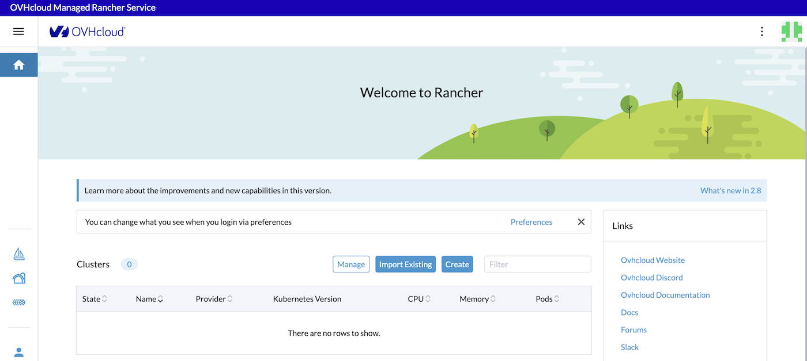
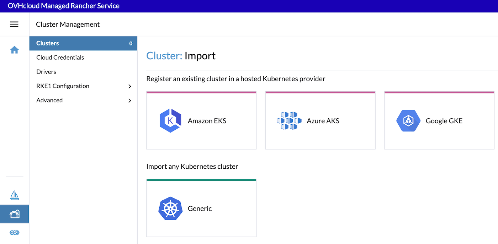
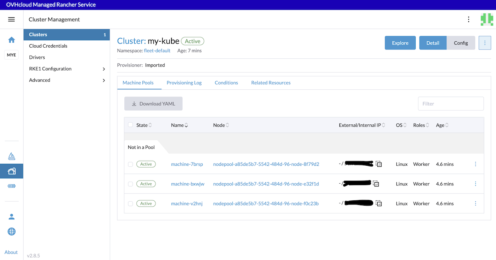

> [!warning]
>
> Usage of [Managed Rancher Service](https://labs.ovhcloud.com/en/managed-rancher-service/) is currently in Beta phase.
> This guide may be incomplete and will be extended during the beta phase. Our team remains available on our dedicated Discord Channel, do not hesitate to join and reach us : <https://discord.gg/ovhcloud>. Ask questions, provide feedback and interact directly with the team that builds our Container and Orchestration services.
>

## Objective

Managed Rancher Service by OVHcloud provides a powerful platform for orchestrating Kubernetes clusters seamlessly. In this guide we will explore how to import an existing Kubernetes cluster.

## Requirements

- A [Public Cloud project](https://www.ovhcloud.com/es/public-cloud/) in your OVHcloud account
An OVHcloud Managed Rancher Service (see the [creating a Managed Rancher Service](/pages/public_cloud/containers_orchestration/managed_rancher_service/create-update-rancher) guide for more information)
- An access to the Rancher UI to operate it (see the [connecting to the Rancher UI](/pages/public_cloud/containers_orchestration/managed_rancher_service/create-update-rancher) guide for more information)

## Instructions

##### Importing an existing OVHcloud Managed Kubernetes Service cluster

If you already use our [OVHcloud Managed Kubernetes Service](https://www.ovhcloud.com/es/public-cloud/kubernetes/), you can easily import an existing cluster.

Log in your Managed Rancher Service UI.

{.thumbnail}

Click on `Import Existing`{.action} button and then select **Generic** driver to import any Kubernetes cluster.

{.thumbnail}

Enter the Cluster Name (it is not mandatory to match the name of your existing MKS cluster), then click on `Create`{.action} button (at the bottom right of the screen).

{.thumbnail}

Follow the instructions provided on the **Registration** tab.

{.thumbnail}

Run the provided `kubectl` command on your existing Managed Kubernetes Service (MKS) cluster:

```shell
kubectl apply -f https://xxxxxx.xxxx.rancher.ovh.net/v3/import/xxxxxxxxxxxx/file.yaml
```

```shell
$ kubectl apply -f https://xxxxxx.p7mg.rancher.ovh.net/v3/import/b2n8xw5nxt8qhd4xxxxxxxxxxxxxxxxxxxxxxxxxxxxxxxxxxxxx_c-m-2brxmwcz.yaml

clusterrole.rbac.authorization.k8s.io/proxy-clusterrole-kubeapiserver created
clusterrolebinding.rbac.authorization.k8s.io/proxy-role-binding-kubernetes-master created
namespace/cattle-system created
serviceaccount/cattle created
clusterrolebinding.rbac.authorization.k8s.io/cattle-admin-binding created
secret/cattle-credentials-501b6e7 created
clusterrole.rbac.authorization.k8s.io/cattle-admin created
Warning: spec.template.spec.affinity.nodeAffinity.requiredDuringSchedulingIgnoredDuringExecution.nodeSelectorTerms[0].matchExpressions[0].key: beta.kubernetes.io/os is deprecated since v1.14; use "kubernetes.io/os" instead
deployment.apps/cattle-cluster-agent created
service/cattle-cluster-agent created
```

Wait until your cluster becomes **Active**:

{.thumbnail}

Your existing Kubernetes cluster is now federated on your Rancher.

Now you can click on the **Explore** button to manage your MKS cluster.

#### Importing an existing Kubernetes cluster

For organizations with pre-existing Kubernetes clusters, Rancher simplifies integration. Import your clusters seamlessly, wherever they are deployed, allowing Rancher to take over the management responsibilities. This process facilitates the transition to Rancher without disrupting your existing infrastructure.

You can refer to the official Rancher documentation on how to [Register Existing Cluster](https://ranchermanager.docs.rancher.com/how-to-guides/new-user-guides/kubernetes-clusters-in-rancher-setup/register-existing-clusters).

## Go further

- To have an overview of OVHcloud Managed Kubernetes service, you can go to the [OVHcloud Managed Kubernetes page](https://www.ovhcloud.com/es/public-cloud/kubernetes/).

- If you need training or technical assistance to implement our solutions, contact your sales representative or click on [this link](https://www.ovhcloud.com/es/professional-services/) to get a quote and ask our Professional Services experts for assisting you on your specific use case of your project.

- Join our community of users on <https://community.ovh.com/en/>.
