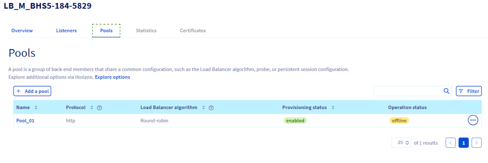
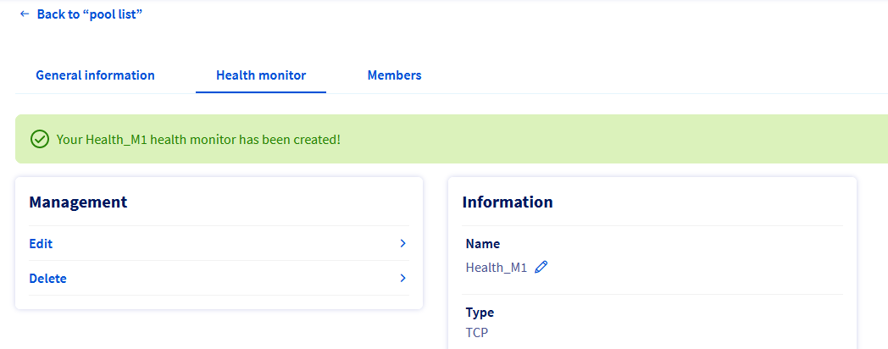

## Objectif

Apprenez à créer et à gérer un Health Monitor pour vos Load Balancers OVHcloud, en utilisant différentes interfaces telles que le Control Panel OVHcloud, la ligne de commande (CLI), Horizon, et Terraform.

## Prérequis

- Un compte OVHcloud actif.
- Comprendre les concepts d'un load balancer : voir [OVHcloud Load Balancer Concepts](https://help.ovhcloud.com/csm/en-gb-public-cloud-network-load-balancer-concepts?id=kb_article_view&sysparm_article=KB0059283)
- Un projet Public Cloud chez OVHcloud avec un accès fonctionnel.
- Un Load Balancer [déjà configuré](https://help.ovhcloud.com/csm/fr-public-cloud-network-getting-started-load-balancer?id=kb_article_view&sysparm_article=KB0050200) dans votre espace projet OVHcloud]

## En pratique
### Création d’un Health Monitor

Les Health Monitors jouent un rôle crucial dans la gestion de la disponibilité et des performances des services hébergés sur des infrastructures comme OVHcloud. Ils effectuent des vérifications régulières des serveurs pour garantir leur capacité à traiter les requêtes entrantes. Si un serveur ne répond pas aux critères de santé établis, il est temporairement retiré du pool, assurant ainsi que le trafic est dirigé uniquement vers les serveurs fonctionnels.

### Types de Health Monitors et Configurations

Différents types de Health Monitors répondent à divers besoins spécifiques :

#### HTTP/S
Effectue des requêtes HTTP ou HTTPS, idéal pour vérifier l'état de santé des applications web ou d'API REST
- **`url_path`**: Chemin d'accès ciblé pour la vérification, par défaut à `/`.
- **`http_method`**: Méthode HTTP utilisée pour la vérification, généralement `GET`.
- **`expected_codes`**: Codes de réponse indiquant un état sain, typiquement `200`.

#### PING
- Envoie des pings ICMP pour tester la disponibilité réseau d'un serveur.

#### TCP
- Tente d'établir une connexion TCP pour confirmer la disponibilité d'un service écoutant sur un port donné, sans transfert de données.

#### TLS-HELLO
- Initie une négociation SSL/TLS avec un message 'Client Hello', vérifiant la capacité de réponse SSL/TLS du serveur.

#### Utilisations et Points Clés

- Les vérifications **HTTP/S** et **TLS-HELLO** sont adaptées aux contextes sécurisés, particulièrement quand une authentification par certificat client est requise.
- Les types **PING** et **TCP** conviennent pour des vérifications basiques de la connectivité, sans nécessiter de réponses spécifiques des serveurs.

La configuration précise des Health Monitors, incluant la fréquence des vérifications (`delay`), le temps d'attente maximal pour une réponse (`timeout`), et le nombre d'essais avant de marquer un serveur comme défaillant (`max_retries`), est essentielle pour équilibrer efficacement une détection rapide des problèmes avec la minimisation des fausses alertes et la réduction de la charge sur les serveurs surveillés.

#### Options de Configuration Clés

- **`url_path`**: Spécifie le chemin d'accès pour les requêtes HTTP/S, permettant de cibler des endpoints spécifiques pour la vérification.
- **`http_method`**: Détermine la méthode HTTP (GET, POST, HEAD) à utiliser pour les vérifications HTTP/S.
- **`expected_codes`**: Configure les codes de réponse HTTP considérés comme valides, indiquant que le serveur est sain.
- **`delay`**: Interval en secondes entre chaque vérification de santé, permettant de contrôler la fréquence des tests.
- **`timeout`**: Temps d'attente maximum pour une réponse du serveur avant de le considérer comme défaillant.
- **`max_retries`**: Nombre de tentatives de vérification échouées avant que le serveur ne soit marqué comme défaillant.

##### Meilleures Pratiques pour la Configuration des Health Monitors

La mise en place efficace d’un Health Monitor est essentielle pour maintenir la haute disponibilité et la performance de vos services en ligne. Voici les meilleures pratiques pour optimiser votre configuration.

###### Conseils pour les Moniteurs de Santé HTTP

Lors de la configuration de Health Monitors pour des applications web, gardez à l'esprit les conseils suivants :

- **Chemin URL (`url_path`)** : Choisissez un chemin léger et rapide à charger pour les vérifications de santé, idéalement une page qui ne nécessite pas de traitement lourd ou d'authentification.
  
- **Méthode HTTP (`http_method`)** : Utilisez des méthodes moins gourmandes en ressources, comme `HEAD` ou `GET`, pour minimiser l'impact sur les performances du serveur.
  
- **Codes de réponse attendus (`expected_codes`)** : Configurez les codes de réponse HTTP qui indiquent qu'un serveur est sain, typiquement `200`.

#### Surveillance et Tests

- **Validation** : Testez la configuration en simulant des pannes de serveur pour vérifier que le Health Monitor réagit comme attendu.
  
- **Monitoring** : Utilisez les outils de surveillance d’OVHcloud pour suivre les performances et l'état de santé de votre Load Balancer et ajustez la configuration au besoin. voir [Mettre en place un monitoring du Load Balancer Public Cloud avec Prometheus](https://help.ovhcloud.com/csm/fr-public-cloud-network-loadbalancer-monitoring-prometheus?id=kb_article_view&sysparm_article=KB0061210) 

En intégrant ces meilleures pratiques dans votre processus de configuration, vous maximisez la disponibilité et la performance de vos applications hébergées, tout en assurant une expérience utilisateur optimale.

#### Surveillance et optimisation

**Ajustements et meilleures pratiques** : Pour maintenir une performance optimale, il est recommandé de :

- Surveiller régulièrement la santé de vos serveurs et l'efficacité de votre Load Balancer.
- Ajuster les paramètres du Health Monitor (délai, timeout, max-retries) selon les besoins et les performances observées.
- Explorer des stratégies d'optimisation basées sur les données de performance et les retours d'expérience.

### Configuration d'un Health Monitor via Diverses interfaces OVHcloud

Selon l'interface choisie, voici les étapes à suivre :

#### Espace client OVHcloud

## Configuration d'un Health Monitor sur OVHcloud Load Balancer

Suivez ces étapes pour ajouter un Health Monitor à un pool de votre Load Balancer OVHcloud, ce qui permet de surveiller l'état de santé des serveurs du pool :

1. **Connexion**
   - Connectez-vous à votre espace client OVHcloud.

2. **Sélection du projet**
   - Naviguez à la section "Public Cloud" et sélectionnez votre projet.

3. **Accès au Load Balancer**
   - Cliquez sur "Load Balancer" dans le menu de gauche. Sélectionnez le Load Balancer que vous souhaitez configurer.

4. **Accès aux Pools**
   - Allez dans l'onglet "Pools", puis cliquez sur le Pool pour lequel vous souhaitez créer un Health Monitor.
     


5. **Configuration du Health Monitor**
   - Cliquez sur l'onglet "Health Monitors" au sein du détail du Pool, puis sur "Ajouter un Health Monitor".


   - **Informations générales**:
     - **Nom**: Doit contenir uniquement des lettres, nombres, underscores, tirets ou points.
     - **Type**: Sélectionnez le type de Health Monitor (par exemple, HTTP, HTTPS, TCP, TLS-hello).
   
   - Pour les types **HTTP** et **HTTPS**:
     - **URL PATH**: Spécifiez le chemin d'accès utilisé pour le test.
     - **Code Attendu**: Indiquez les codes d'état HTTP attendus, pouvant être un seul chiffre, une liste de chiffres séparés par des virgules, ou un intervalle (deux chiffres séparés par un trait d'union).
   
   - **Paramètres de test**:
     - **Max Retries Down**: Nombre d'échecs de connexion autorisés avant de marquer le membre comme défaillant (entre 1 et 10, défaut 3).
     - **Delay**: Intervalle entre deux tests du Health Monitor (doit être supérieur au timeout).
     - **Max Retries**: Nombre total d'échecs de connexion autorisés avant de marquer le membre comme inactif (entre 1 et 10).
     - **Timeout**: Durée après laquelle un test s'arrête (doit être égal ou supérieur à la périodicité).

6. **Validation**
   - Une fois toutes les informations renseignées, cliquez sur "Ajouter" pour activer votre Health Monitor.
     


Ce processus crée un Health Monitor qui effectuera régulièrement des contrôles d'intégrité sur chaque membre du pool, utilisant les résultats pour déterminer si le membre doit recevoir de nouvelles connexions. Un seul Health Monitor peut être défini pour chaque pool.


#### CLI (OpenStack)

1. **Préparation** : Assurez-vous que l'outil CLI OpenStack est installé et configuré sur votre machine.
2. **Création du Health Monitor** : Utilisez la commande suivante pour créer un Health Monitor :
   ```bash
   openstack loadbalancer healthmonitor create --delay 5 --max-retries 4 --timeout 3 --type HTTP --http-method GET --url-path /healthcheck --expected-codes 200 <POOL_ID>
   ```
   Remplacez <POOL_ID> par l'ID de votre Pool.
3. Vérification : Confirmez la création du Health Monitor en listant les Health Monitors associés à votre Load Balancer avec :
   ```bash
   openstack loadbalancer healthmonitor list
   ```

#### Horizon (OpenStack)

1.  **Connexion** : Connectez-vous à l'interface Horizon de votre projet OpenStack. [Présentation de Horizon](https://help.ovhcloud.com/csm/fr-public-cloud-compute-horizon?id=kb_article_view&sysparm_article=KB0050895)   
2.  **Navigation** : Dans le menu de gauche, sous "Network", trouvez et sélectionnez "Load Balancers".
3.  **Sélection du Load Balancer** : Choisissez le Load Balancer que vous voulez configurer et cliquez sur l'onglet "Health Monitors".
4.  **Ajout d'un Health Monitor** : Cliquez sur "Create Health Monitor" et remplissez les champs requis comme le type, l'intervalle de vérification, le nombre maximal de tentatives, et le délai d'attente.
5.  **Sauvegarde** : Validez la création en cliquant sur "Create".

#### Terraform

- **Configuration du fichier Terraform** : Créez un fichier `.tf` et définissez votre Health Monitor comme une ressource. Par exemple :

```hcl
resource "openstack_lb_monitor_v2" "monitor_1" {
  pool_id     = "<POOL_ID>"
  type        = "HTTP"
  delay       = 5
  timeout     = 3
  max_retries = 4
  url_path    = "/healthcheck"
  http_method = "GET"
  expected_codes = "200"
}
```
Remplacez `<POOL_ID>` par l'ID de votre Pool.

- **Application de la configuration** : Exécutez `terraform init` pour initialiser Terraform, puis `terraform apply` pour appliquer la configuration.

- **Vérification** : Terraform confirmera la création du Health Monitor avec un résumé des ressources créées.

Chaque méthode offre des avantages spécifiques selon votre familiarité avec les outils et votre environnement de travail. Le choix de l'interface dépend de vos préférences personnelles et des exigences techniques de votre projet.

## Aller plus loin

Échangez avec notre communauté d'utilisateurs sur <https://community.ovh.com/>.
