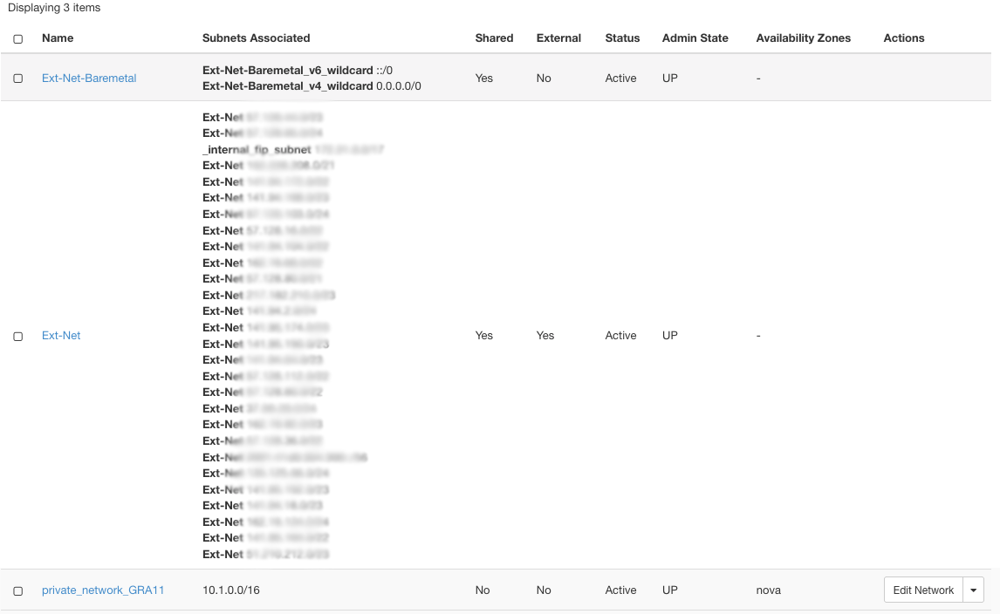
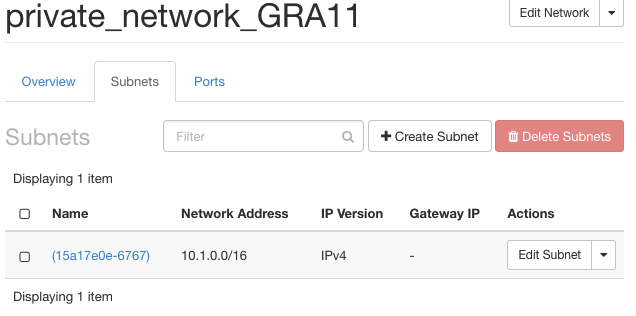

## Objective

This page explains how to update the properties of an existing subnet. This can be needed if you want to comply with the pre requisites to be able to use the Public Cloud Gateway : have a gateway IP defined in your subnet.

For this example, we will use a private network and a subnet with the following properties:

- CIDR 10.1.0.0/16
- DHCP enabled with allocation pool on the global range
- No gateway IP 

We will see how to update it to have a gateway IP set to `10.1.0.1` and remove that IP from the allocation pool. 

## Requirements

You shall have created a private network and a subnet as explained in [this guide](/pages/public_cloud/public_cloud_network_services/getting-started-07-creating-vrack).

## Instructions

### Using the OVHcloud Control Panel

It is currently not possible to update a subnet through this interface but you can use our Horizon interface instead (see the instructions below).

### Using Horizon

Connect to Horizon & choose the region where the subnet is defined as explained in that [guide](/pages/public_cloud/compute/introducing_horizon).

Click on `Project > Network > Networks`. The page will display the list of networks available which contain an OVHcloud managed network for public connectivity (`Ext-Net`) as well as your network.

{thumbnail}

In that list, click on your network name ("private_network_GRA11" in this example). The network detail page is then displayed.

{thumbnail}

Click the `Subnets` tab: the subnets from the private network are listed.

{thumbnail}

Click on your `Edit Subnet`. For this guide, our target is to add a gateway IP:

- Click untick the  `Disable Gateway`. The field `Gateway IP` will appear. Fill it in with an IP within your CIDR (usually the first IP of the range is used). In our case, `10.1.0.1`.

{thumbnail}

- Click on `Subnet Details`. Update the `Allocation Pools` to remove the gateway IP that you entered in the previous step. In our case, we need to update from `10.1.0.1,10.1.255.254` to `10.1.0.2,10.1.255.254`

{thumbnail}

Click on `Save` and your subnet is updated with a gateway IP !

### Using the OpenStack Command Line Interface

You need to have your [CLI environment set up](/pages/public_cloud/compute/prepare_the_environment_for_using_the_openstack_api) and your [variables defined](/pages/public_cloud/compute/loading_openstack_environment_variables).

Run the following command (replace `private_network_GRA11` by the name of your private network):

```bash 
❯ openstack  network show private_network_GRA11
+---------------------------+--------------------------------------+
| Field                     | Value                                |
+---------------------------+--------------------------------------+
| admin_state_up            | UP                                   |
| availability_zone_hints   |                                      |
| availability_zones        |                                      |
| created_at                | 2024-01-19T10:44:33Z                 |
| description               |                                      |
| dns_domain                | None                                 |
| id                        | 6b1a7c0c-58c5-427b-a21e-ba6a1485ace7 |
| ipv4_address_scope        | None                                 |
| ipv6_address_scope        | None                                 |
| is_default                | None                                 |
| is_vlan_transparent       | None                                 |
| l2_adjacency              | True                                 |
| mtu                       | 1500                                 |
| name                      | private_network_GRA11                |
| port_security_enabled     | True                                 |
| project_id                | REDACTED     |
| provider:network_type     | vrack                                |
| provider:physical_network | None                                 |
| provider:segmentation_id  | 1700                                 |
| qos_policy_id             | None                                 |
| revision_number           | 3                                    |
| router:external           | Internal                             |
| segments                  | None                                 |
| shared                    | False                                |
| status                    | ACTIVE                               |
| subnets                   | 15a17e0e-6767-42ea-a345-3f65ee73b47c |
| tags                      |                                      |
| tenant_id                 | REDACTED     |
| updated_at                | 2024-01-19T10:44:33Z                 |
+---------------------------+--------------------------------------+
```

In this output, the `subnets` line provides the UID of your subnet. 
You can check your subnet detail by running the following command (update the UID according to your value !):

```bash
❯ openstack subnet show 15a17e0e-6767-42ea-a345-3f65ee73b47c
+----------------------+--------------------------------------+
| Field                | Value                                |
+----------------------+--------------------------------------+
| allocation_pools     | 10.1.0.1-10.1.255.254                |
| cidr                 | 10.1.0.0/16                          |
| created_at           | 2024-01-19T10:44:33Z                 |
| description          |                                      |
| dns_nameservers      | 213.186.33.99                        |
| dns_publish_fixed_ip | None                                 |
| enable_dhcp          | True                                 |
| gateway_ip           | None                                 |
| host_routes          |                                      |
| id                   | 15a17e0e-6767-42ea-a345-3f65ee73b47c |
| ip_version           | 4                                    |
| ipv6_address_mode    | None                                 |
| ipv6_ra_mode         | None                                 |
| name                 |                                      |
| network_id           | 6b1a7c0c-58c5-427b-a21e-ba6a1485ace7 |
| project_id           | REDACTED     |
| revision_number      | 0                                    |
| segment_id           | None                                 |
| service_types        |                                      |
| subnetpool_id        | None                                 |
| tags                 |                                      |
| updated_at           | 2024-01-19T10:44:33Z                 |
+----------------------+--------------------------------------+
```

Now let's update the `gateway_ip` and the `allocation_pool`:

```bash
❯ openstack subnet set  --gateway 10.1.0.1 --no-allocation-pool --allocation-pool start=10.1.0.2,end=10.1.255.254  15a17e0e-6767-42ea-a345-3f65ee73b47c
```

You can check that the subnet has been updated:

```bash
❯ openstack subnet show 15a17e0e-6767-42ea-a345-3f65ee73b47c
+----------------------+--------------------------------------+
| Field                | Value                                |
+----------------------+--------------------------------------+
| allocation_pools     | 10.1.0.2-10.1.255.254                |
| cidr                 | 10.1.0.0/16                          |
| created_at           | 2024-01-19T10:44:33Z                 |
| description          |                                      |
| dns_nameservers      | 213.186.33.99                        |
| dns_publish_fixed_ip | None                                 |
| enable_dhcp          | True                                 |
| gateway_ip           | 10.1.0.1                             |
| host_routes          |                                      |
| id                   | 15a17e0e-6767-42ea-a345-3f65ee73b47c |
| ip_version           | 4                                    |
| ipv6_address_mode    | None                                 |
| ipv6_ra_mode         | None                                 |
| name                 |                                      |
| network_id           | 6b1a7c0c-58c5-427b-a21e-ba6a1485ace7 |
| project_id           | REDACTED     |
| revision_number      | 1                                    |
| segment_id           | None                                 |
| service_types        |                                      |
| subnetpool_id        | None                                 |
| tags                 |                                      |
| updated_at           | 2024-01-19T14:45:11Z                 |
+----------------------+--------------------------------------+
```

## Go further

If you need training or technical assistance to implement our solutions, contact your sales representative or click on [this link](https://www.ovhcloud.com/en-sg/professional-services/) to get a quote and ask our Professional Services experts for assisting you on your specific use case of your project.

Join our community of users on <https://community.ovh.com/en/>.
