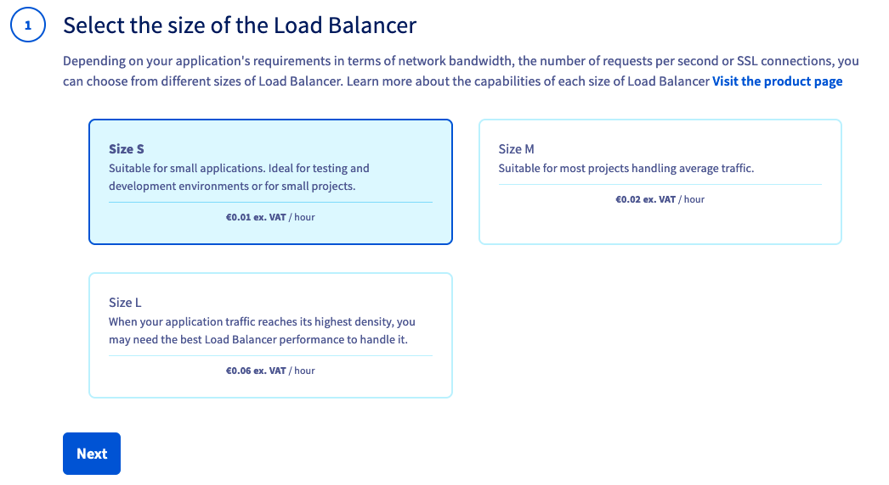
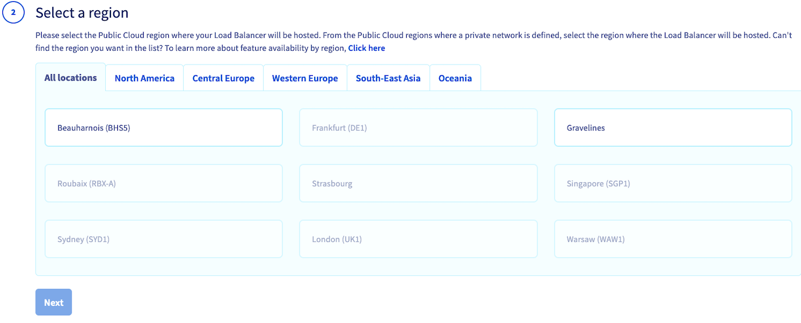
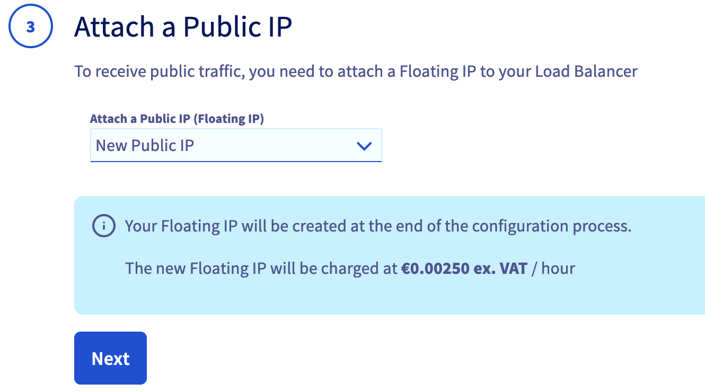
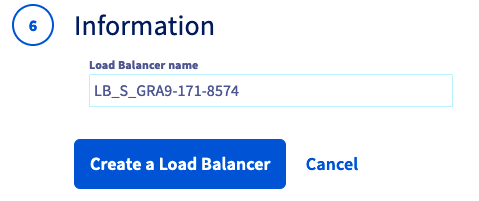

## Objectif

Notre Load Balancer Public Cloud est basé sur le service [Openstack Octavia](https://wiki.openstack.org/wiki/Octavia){.external} et est entièrement intégré dans l'univers Public Cloud.

**Découvrez comment débuter avec un Load Balancer sur le Public Cloud.**

## Prérequis

- Un [projet Public Cloud](https://www.ovhcloud.com/fr/public-cloud/)
- Comprendre les [concepts du Load Balancer](/pages/public_cloud/public_cloud_network_services/concepts-03-loadbalancer)
- Comprendre les [concepts de réseau Public Cloud](/pages/public_cloud/public_cloud_network_services/concepts-01-public-cloud-networking-concepts)
- Un Load Balancer nécessite un sous-réseau, lisez [ce guide](/pages/public_cloud/public_cloud_network_services/getting-started-07-creating-vrack) pour plus d'informations
- (Facultatif) : Ce guide explique la configuration du load balancer via l'interface graphique et l'interface en ligne de commande. Si vous souhaitez utiliser cette dernière, installez [l'environnement en ligne de commande OpenStack](/pages/public_cloud/compute/prepare_the_environment_for_using_the_openstack_api)


## En pratique

### Création du Load Balancer depuis votre espace client OVHcloud

Ouvrez votre projet Public Cloud et cliquez sur `Load Balancer`{.action} (sous `Network`) dans le menu de gauche, puis cliquez sur le bouton `Créer un Load Balancer`{.action}.

La page de configuration s'ouvre.

#### Étape 1 : Choix de la taille

{.thumbnail}

L'interface contient un lien vers notre site sur lequel les caractéristiques / benchmark de toutes tailles sont fournies. Une fois que vous avez choisi votre taille, cliquez sur `Suivant`{.action}.

#### Étape 2 : Choix de la région

{.thumbnail}

Seules les régions sur lesquelles vous avez un réseau privé et au moins un sous-réseau peuvent être sélectionnées. Sélectionnez la région et cliquez sur `Suivant`{.action}.

#### Étape 3 : attacher une IP publique (ou non)

{.thumbnail}

À ce stade, vous devez savoir si votre Load Balancer recevra du trafic public ou non (pour plus de détails, consultez notre page « [Concepts - Réseau Public Cloud](/pages/public_cloud/public_cloud_network_services/concepts-01-public-cloud-networking-concepts)) ». 

Si votre Load Balancer reçoit du trafic public, vous disposez de 2 options :

- `Nouvelle IP Publique` : cette option créera une nouvelle adresse Floating IP pour votre Load Balancer. 
- Si vous avez déjà une adresse Floating IP, l'interface vous proposera d'en choisir une.

Si votre Load Balancer ne doit recevoir que du trafic privé, choisissez « Aucune IP publique ».

#### Étape 4 : sélectionnez le réseau privé et le sous-réseau sur lesquels le Load Balancer sera créé

{.thumbnail}

L'interface vous informera si le réseau privé ou le sous-réseau ne sont pas conformes aux prérequis (voir notre page « [Concepts - Load Balancer](/pages/public_cloud/public_cloud_network_services/concepts-03-loadbalancer#network-prerequisites) »).

#### Étape 5 (facultatif) : définir le ou les listeners et les membres

{.thumbnail}

- Dans un premier temps, choisissez le protocole et le port du listener en fonction du trafic que vous allez recevoir. Notez qu'un listener spécifique appelé `Prometheus` est disponible pour monitorer votre Load Balancer. Dans ce cas, il n'est pas possible d'ajouter des membres. Pour plus d'informations sur ce listener, consultez [cette page](/pages/public_cloud/public_cloud_network_services/technical-resources-02-octavia-monitoring-prometheus).
- Choisissez ensuite le type de moniteur d'intégrité (Health Monitor). Notez que certains types de health monitors n'étant pas compatibles avec certains protocoles, l'interface utilisateur filtre ces types afin que vous puissiez uniquement choisir des éléments compatibles. Pour plus d'informations sur la compatibilité du health monitor, consultez [cette page](/pages/public_cloud/public_cloud_network_services/concepts-01-public-cloud-networking-concepts).
- Enfin, parmi les instances de votre région, choisissez l'IP et le port membre qui feront partie du pool. Notez que pour simplifier le processus de configuration, votre pool doit avoir le même protocole que le listener, et que le membre ne peut être choisi qu'à partir de l'instance. Ces limitations peuvent être contournées en ignorant cette partie de la configuration et en utilisant la configuration du pool/membre une fois le Load Balancer créé. 

#### Étape 6 : Définir le nom du Load Balancer 

{.thumbnail}

Vous pouvez définir un nom pour le Load Balancer et cliquer sur `Créer un Load Balancer`{.action}.

Vous allez être redirigé vers la page qui liste les Load Balancers. Parmi les attributs qui s'affichent, les `Operating status` et `Provisioning status` fournissent des informations sur l'état de votre load balancer. Retrouvez plus d'informations sur la [page Concepts du Load Balancer](/pages/public_cloud/public_cloud_network_services/concepts-03-loadbalancer#operating-provisioning-status).

### Création du Load Balancer via l'interface en ligne de commande (CLI) Openstack

Une autre façon de créer un Load Balance est d'utiliser l'interface de ligne de commande d'Openstack. Avant de commencer, consultez les guides suivants :

[Preparing an environment for using the OpenStack API](/pages/public_cloud/compute/prepare_the_environment_for_using_the_openstack_api).</br>
[Setting OpenStack environment variables](/pages/public_cloud/compute/loading_openstack_environment_variables).

#### Configurer votre réseau privé

Avant de commencer à utiliser un Load Balancer, il vous faut créer un réseau privé :

```bash
openstack network create my_network

openstack subnet create my_subnet --subnet-range <my_private_ip_range/mask> --network my_network --no-dhcp

openstack router create my_router

openstack router add subnet my_router my_subnet

openstack router set --external-gateway Ext-Net my_router
```

Vous pouvez maintenant attacher vos instances à ce nouveau réseau. Nous vous recommandons de suivre la documentation pour [attacher vos instances au vRack](/pages/public_cloud/public_cloud_network_services/getting-started-07-creating-vrack#instance-integration). 

Prenez note des adresses de vos instances dans votre réseau avec la commande suivante :

```bash
openstack server list
```

Vous devez maintenant configurer vos instances pour qu'elles aient leurs adresses IP configurées sur leur interfaces.

#### Créer votre Load Balancer

Vous pouvez consulter la liste des différents types de Load Balancer que nous offrons avec cette commande :

```bash
openstack loadbalancer flavor list
```

Vous pouvez maintenant créer votre Load Balancer avec la commande suivante. Dans cet exemple, nous allons faire un Load Balancer de type « Small ».

```bash
openstack loadbalancer create --name my_load_balancer --flavor small --vip-subnet-id my_subnet
```

Votre Load Balancer sera configuré avec une adresse IP dans le réseau privé. Si vous souhaitez avoir un accès depuis Internet, il vous faudra attacher une adresse Floating IP.

#### Attacher une adresse Floating IP à un Load Balancer

Voici comment attacher une adresse Floating IP à un Load Balancer.

```bash
openstack floating ip create Ext-Net
openstack floating ip set --port <my_load_balancer_vip_port_id> <floating_ip>
```

> [!primary]
>
> Pour récupérer l'identifiant du port VIP de votre Load Balancer, utilisez `openstack loadbalancer show my_load_balancer`.

#### Configurer votre Load Balancer

Dans cet exemple, nous ferons juste un Load Balancer HTTP. Pour ce faire, il faut tout d'abord créer un Listener qui permettra d'écouter sur le port 80 du Load Balancer, avec cette commande :

```bash
openstack loadbalancer listener create --name my_listener_http --protocol HTTP --protocol-port 80 my_loadbalancer
```

Une fois le Listener créé, il faut lui ajouter les différentes instances qui pourront répondre aux requêtes des clients. Pour ce faire, vous devez créer un Pool d'instances :

```bash
openstack loadbalancer pool create --name my_pool_http --lb-algorithm ROUND_ROBIN --listener my_listener --protocol HTTP
```

Ajoutez vos instances au Pool :

```bash
openstack loadbalancer member create --subnet-id my_subnet --address <private_ip_instance_1> --protocol-port 80 my_pool
openstack loadbalancer member create --subnet-id my_subnet --address <private_ip_instance_2> --protocol-port 80 my_pool
```

Vous pouvez maintenant accéder à votre Load Balancer via l'adresse Floating IP ou l'adresse IP privée depuis une instance dans votre réseau privé.

## Aller plus loin

[Documentation officielle d'Openstack Octavia](https://docs.openstack.org/octavia/latest/)

[Cookbook Openstack Octavia](https://docs.openstack.org/octavia/latest/user/guides/basic-cookbook.html)

Si vous avez besoin d'une formation ou d'une assistance technique pour la mise en oeuvre de nos solutions, contactez votre commercial ou cliquez sur [ce lien](https://www.ovhcloud.com/fr/professional-services/) pour obtenir un devis et demander une analyse personnalisée de votre projet à nos experts de l’équipe Professional Services. 

Échangez avec notre communauté d'utilisateurs sur <https://community.ovh.com>.
