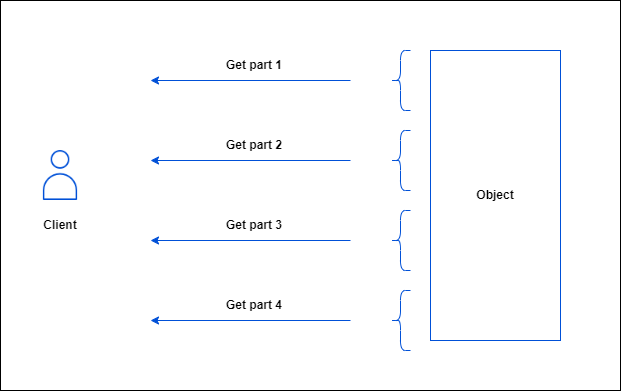

# Introduction

There are several ways you can use to optimize the performances of your buckets on OVHcloud Object Storage. The following guide will walk you through the different optimization methods.

# Using byte range fetch

OVHcloud Object Storage supports byte range fetch. The idea behind is to fetch an object chunk by chunk, each chunk being defined by a range of bytes. The main benefit is that it allows you to parallelize GET requests to download an object, each GET requesting a specific range of bytes: typical sizes for byte-range requests are 8 MB or 16 MB but you can specify any size.

To download part of an object, you must use additional parameters to specify which part of an object that you want to fetch. The following example dowloads the first part ranging from 0 to 500 bytes of an object named "filename" stored in the "test-bucket" bucket and writes the output as a file named "object_part" :

'''bash
user@host:~$ aws s3api get-object --bucket test-bucket --key filename --range bytes=0-500 object_part
'''
