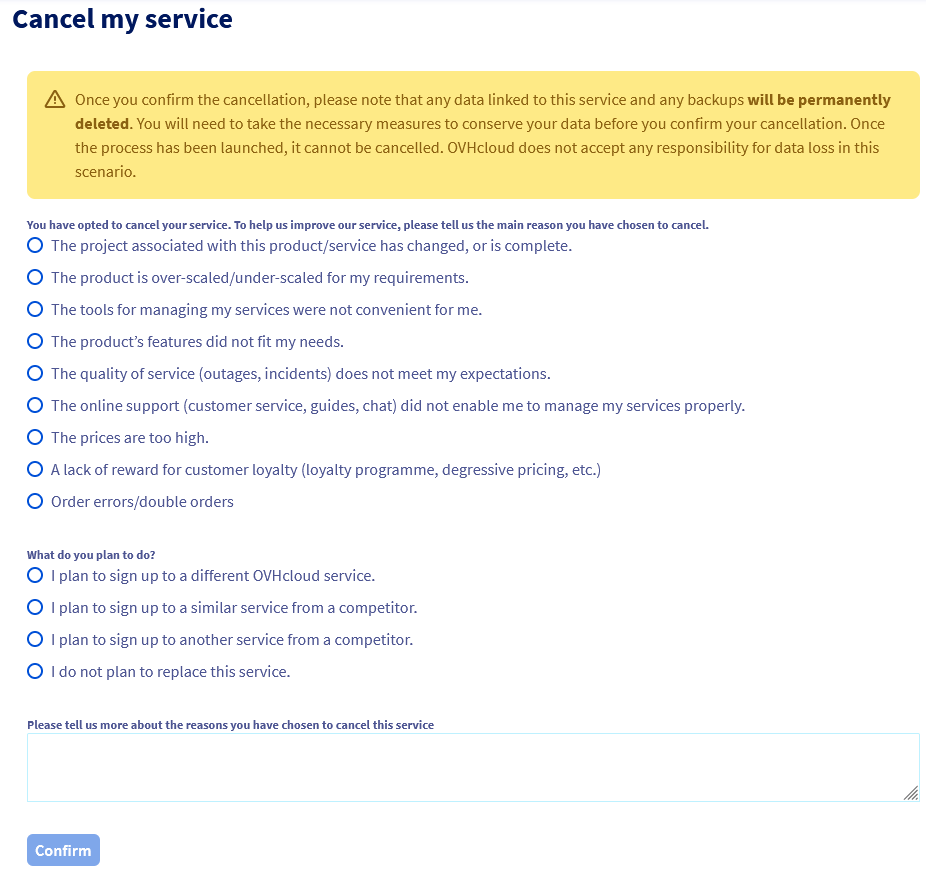

> [!primary]
> Esta traducción ha sido generada de forma automática por nuestro partner SYSTRAN. En algunos casos puede contener términos imprecisos, como en las etiquetas de los botones o los detalles técnicos. En caso de duda, le recomendamos que consulte la versión inglesa o francesa de la guía. Si quiere ayudarnos a mejorar esta traducción, por favor, utilice el botón "Contribuir" de esta página.
>

## Objetivo

La zona **D**omain **N**ame **S**ystem (**DNS**) de un dominio es su fichero de configuración. Consta de información técnica, denominada "registros DNS"*. La zona DNS es como un centro de reenvío.

Para más información sobre las zonas y los servidores DNS, consulte las siguientes guías: 

- [Crear una zona DNS de OVHcloud](/pages/web_cloud/domains/dns_zone_create).
- [Editar una zona DNS de OVHcloud](/pages/web_cloud/domains/dns_zone_edit).
- [Modificar los servidores DNS de un dominio de OVHcloud](/pages/web_cloud/domains/dns_server_edit).

Por ejemplo, es posible que necesite eliminar una zona DNS para su dominio en OVHcloud en los siguientes casos (no en todos los casos):

- Si utiliza una zona DNS activa para su dominio con un proveedor distinto de OVHcloud.
- Ya no utiliza el dominio asociado a la zona DNS presente en OVHcloud.
- Ha migrado sus servicios a otro proveedor y quiere dar de baja sus servicios de OVHcloud.

> [!primary]
>
> La creación, modificación o eliminación de una zona DNS en el [área de cliente de OVHcloud](/links/manager) es totalmente gratuita.
>

**Descubra cómo eliminar una zona DNS en OVHcloud para un dominio desde el área de cliente de OVHcloud.**

## Requisitos

- Estar conectado a su [área de cliente de OVHcloud](/links/manager).
- Tener una zona DNS en el área de cliente de OVHcloud.
- Disponer de los permisos necesarios sobre la zona DNS que quiera eliminar. Para más información, consulte nuestra guía "[Gestionar los contactos de sus servicios](/pages/account_and_service_management/account_information/managing_contacts)".

## Procedimiento

> [!warning]
>
> Antes de continuar, compruebe que el dominio no utiliza la zona DNS que desea eliminar.
>
> En efecto, si elimina la zona DNS activa para su dominio, se interrumpirán sus servicios en línea (sitio web, direcciones de correo, etc.).
>
> Efectúe un [WHOIS](/links/web/domains-whois) de su dominio para saber si la zona DNS activa de su dominio es la que tiene en OVHcloud o no.
>
> Si la zona DNS activa para su dominio es la que tiene en OVHcloud y desea sustituirla por una zona DNS alojada en otro proveedor, consulte nuestra guía "[Modificar los servidores DNS de un dominio en OVHcloud](/pages/web_cloud/domains/dns_server_edit)" antes de eliminar cualquier zona DNS.
>

### Etapa 1 - Iniciar la eliminación de una zona DNS de OVHcloud

Para iniciar la eliminación de una zona DNS de OVHcloud, lleve a cabo las siguientes acciones: 

1. Conéctese a su [área de cliente de OVHcloud](/links/manager).
2. En la línea situada en la parte superior del área de cliente, haga clic en la pestaña `Web Cloud`{.action}.
3. En la columna izquierda, haga clic en el menú desplegable `Dominios`{.action}.
4. Seleccione el dominio o la zona DNS correspondiente.
5. En la nueva página, haga clic en la pestaña `Zona DNS`{.action} para acceder a la tabla que muestra todos los registros DNS de la zona DNS.
6. En la parte derecha (o debajo de la tabla, en función de la resolución de la pantalla), haga clic en el botón `Eliminar la zona DNS`{.action}.

{.thumbnail}

En la nueva ventana, revise los mensajes que se muestran en el interior.

{.thumbnail}

Haga clic en el botón `Aceptar`{.action} para finalizar el primer paso de eliminación de la zona DNS.

### Etapa 2 - Confirmar la eliminación de una zona DNS de OVHcloud

Después del paso anterior, se envía un mensaje de correo electrónico para confirmar la eliminación de la zona DNS a la dirección de correo electrónico del contacto "[Administrador](/pages/account_and_service_management/account_information/managing_contacts)" de la zona DNS de OVHcloud.

> [!success]
>
> Si no recibe el mensaje de correo electrónico, compruebe si hay mensajes de correo electrónico no deseado.
>

Este mensaje de correo electrónico contiene dos enlaces válidos durante **72** horas desde el momento en que haya completado el paso 1 de esta guía.

Haga clic en el **enlace de validación** para continuar con la eliminación de la zona DNS de OVHcloud o en el **enlace de cancelación** para detener la eliminación de la zona DNS de OVHcloud.

> [!primary]
>
> Si la redirección de vínculos no funciona, haga un **copiar/pegar** del vínculo en la barra de direcciones URL de su navegador de Internet. Si es necesario, vuelva a conectarse a su [área de cliente de OVHcloud](/links/manager).
>

Si hace clic en el enlace de validación, será redirigido a una nueva página de OVHcloud en la que se le preguntará por qué quiere eliminar la zona DNS de OVHcloud.

{.thumbnail}

Una vez que haya completado el formulario y esté seguro de querer eliminar definitivamente la zona DNS de OVHcloud, haga clic en el botón `Aceptar`{.action} en la parte inferior de la página.

Para confirmar la eliminación, se enviará un último mensaje de confirmación a la dirección de correo electrónico del contacto "[Administrador](/pages/account_and_service_management/account_information/managing_contacts)" de la zona DNS de OVHcloud.

## Más información

[Gestionar los contactos de sus servicios](/pages/account_and_service_management/account_information/managing_contacts)

[Editar una zona DNS de OVHcloud](/pages/web_cloud/domains/dns_zone_edit)

[Modificar los servidores DNS de un dominio de OVHcloud](/pages/web_cloud/domains/dns_server_edit)

[Crear una zona DNS de OVHcloud](/pages/web_cloud/domains/dns_zone_create)

Para servicios especializados (posicionamiento, desarrollo, etc.), contacte con [partners de OVHcloud](/links/partner).

Si quiere disfrutar de ayuda para utilizar y configurar sus soluciones de OVHcloud, puede consultar nuestras distintas soluciones [pestañas de soporte](/links/support).

Interactúe con nuestra [comunidad de usuarios](/links/community).