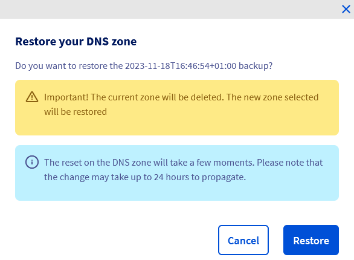
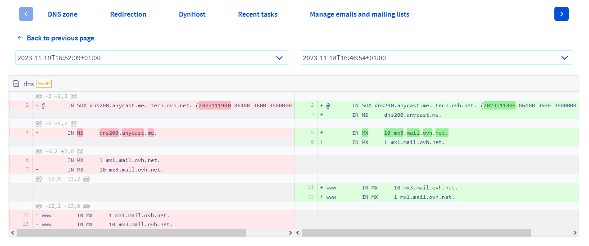

> [!primary]
> Questa traduzione è stata generata automaticamente dal nostro partner SYSTRAN. I contenuti potrebbero presentare imprecisioni, ad esempio la nomenclatura dei pulsanti o alcuni dettagli tecnici. In caso di dubbi consigliamo di fare riferimento alla versione inglese o francese della guida. Per aiutarci a migliorare questa traduzione, utilizza il pulsante "Contribuisci" di questa pagina.
>

## Obiettivo

La zona **D**omain **N**ame **S**ystem (**DNS**) di un dominio costituisce il file di configurazione di quest'ultimo. ed è composta da informazioni tecniche chiamate *record DNS*. La zona DNS è, in un certo senso, come un centro di scambi.

Ad esempio, è possibile specificare:

- l’indirizzo IP (record DNS di tipo *A* e *AAAA*) dell’hosting Web per visualizzare il sito Web con il dominio.
- I server di posta (record DNS di tipo *MX*) verso cui il tuo dominio deve reindirizzare le email che riceve. Questo ti permette di consultarle sul tuo o sui tuoi indirizzi email personalizzati con il tuo dominio.
- informazioni relative alla sicurezza/autenticazione dei servizi (hosting Web, server Web, server di posta, ecc...) associati al dominio (record DNS di tipo *SPF*, *DKIM*, *DMARC*, ecc...).

Per saperne di più, consulta la nostra documentazione relativa a [record DNS e modifica di una zona DNS](/pages/web_cloud/domains/dns_zone_edit) dallo [Spazio Cliente OVHcloud](https://www.ovh.com/auth/?action=gotomanager&from=https://www.ovh.it/&ovhSubsidiary=it).
Per diversi motivi, potresti aver bisogno di applicare una configurazione DNS precedente al tuo dominio.

Da questo momento, la gestione dei DNS è semplificata grazie alla cronologia delle zone DNS.

**Questa guida ti mostra come visualizzare, confrontare, scaricare e ripristinare i backup della zona DNS**

## Prerequisiti

- Disporre di una zona DNS per il dominio nello [Spazio Cliente OVHcloud](https://www.ovh.com/auth/?action=gotomanager&from=https://www.ovh.it/&ovhSubsidiary=it)
- Avere accesso allo [Spazio Cliente OVHcloud](https://www.ovh.com/auth/?action=gotomanager&from=https://www.ovh.it/&ovhSubsidiary=it)
- Avere accesso alla gestione del dominio

## Procedura

Per accedere a questa funzionalità, accedi al tuo [Spazio Cliente OVHcloud](https://www.ovh.com/auth/?action=gotomanager&from=https://www.ovh.it/&ovhSubsidiary=it) e clicca sulla sezione `Web Cloud`{.action} nella parte alta dell’interfaccia. Nella colonna di sinistra, clicca sulla scheda `Domini`{.action} e seleziona il dominio associato alla zona DNS che vuoi modificare.

Nella nuova pagina, se non sei già reindirizzato in questa scheda, clicca sulla scheda `Zona DNS`{.action}.

Visualizzi una tabella con la zona DNS del tuo dominio. Contiene infatti un elenco dei record DNS. Sulla destra della tabella sono disponibili diversi pulsanti che consentono di effettuare azioni sulla zona DNS. 

{.thumbnail}

Clicca su `Visualizza la cronologia della tua zona DNS`{.action}. 

Visualizzi una tabella con la cronologia dei backup della zona DNS, ordinata in base alla data più recente e meno recente. In cima alla tabella è riportata la versione corrente della zona DNS. In questa pagina è possibile eseguire le operazioni seguenti:

- [Visualizzare una zona DNS](#view)
- [Scaricare una zona DNS](#download)
- [Ripristinare una zona DNS](#restore)
- [Confronta due zone DNS](#compare)

### Visualizzare una zona DNS 

Per visualizzare la zona DNS scelta, identifica la riga corrispondente nella tabella e clicca sull’icona presente nella colonna `Visualizza`{.action}.

{.thumbnail}

Visualizzi i dati della zona DNS.

{.thumbnail}

Clicca su `Chiudere`{.action} per tornare alla pagina principale "Cronologia della zona DNS".

### Scarica una zona DNS 

Per scaricare la zona DNS scelta, identifica la riga corrispondente nella tabella e clicca sull’icona presente nella colonna `Scarica`{.action}.

{.thumbnail}

La zona DNS può essere scaricata in formato .txt.

### Ripristinare una zona DNS 

Per sostituire la zona DNS corrente con una diversa, è sufficiente ripristinare una zona DNS precedente. Nella tabella che contiene la cronologia delle zone DNS, identifica la riga corrispondente alla zona DNS che vuoi ripristinare (verifica la data a sinistra della riga) e clicca sull’icona presente nella colonna `Ripristinare`{.action}.

{.thumbnail}

Viene visualizzata la finestra successiva.

{.thumbnail}

Verificare che la data specificata nel messaggio corrisponda alla zona DNS da ripristinare. Come indica il banner giallo, è importante ricordare che la zona DNS corrente (presente in cima all'elenco della cronologia delle zone DNS) verrà eliminata e sostituita dalla zona DNS che si desidera ripristinare.

Clicca su `Ripristinare`{.action} per confermare il ripristino o su `Annullare`{.action}.

> [!primary]
>
> La modifica o il ripristino di una zona DNS comporta un tempo di propagazione che va da **4** a **24** ore per essere presa totalmente in carico dalla rete DNS.
>

### Confronta due zone DNS 

È possibile confrontare il contenuto di due zone DNS. Nella tabella che contiene la cronologia della zona DNS, identifica le due righe corrispondenti alle due zone DNS che vuoi confrontare (verifica la data a sinistra di ogni riga) e selezionale. Per confrontare queste due versioni di zona DNS, clicca in alto a sinistra su `Confrontare le versioni`{.action}.

{.thumbnail}

Viene visualizzata una nuova pagina con il contenuto delle due zone DNS. Sopra ogni versione viene visualizzata la data corrispondente. Di default, la versione della zona DNS più recente si trova a sinistra e la più vecchia a destra. Un codice a colori consente di identificare le differenze di contenuto. 
A sinistra, il contenuto evidenziato in rosso è stato modificato o eliminato nella versione più recente. 
A destra, il contenuto evidenziato in verde è stato modificato o aggiunto rispetto alla versione precedente. 

È inoltre possibile aggiornare le date delle versioni che si desidera confrontare utilizzando i due elenchi a discesa.

{.thumbnail}

Questa guida ti mostra come confrontare due zone DNS e come visualizzare, scaricare, ripristinare ed eliminare una zona DNS.

## Per saperne di più

[Accedi allo Spazio Cliente OVHcloud](/pages/account_and_service_management/account_information/ovhcloud-account-login)

[Creare una zona DNS in OVHcloud](/pages/web_cloud/domains/dns_zone_create)

Per prestazioni specializzate (referenziamento, sviluppo, ecc...), contatta i [partner OVHcloud](https://partner.ovhcloud.com/it/directory/).

Per usufruire di un supporto per l'utilizzo e la configurazione delle soluzioni OVHcloud, è possibile consultare le nostre soluzioni [offerte di supporto](https://www.ovhcloud.com/it/support-levels/).

Contatta la nostra Community di utenti all'indirizzo <https://community.ovh.com/en/>.