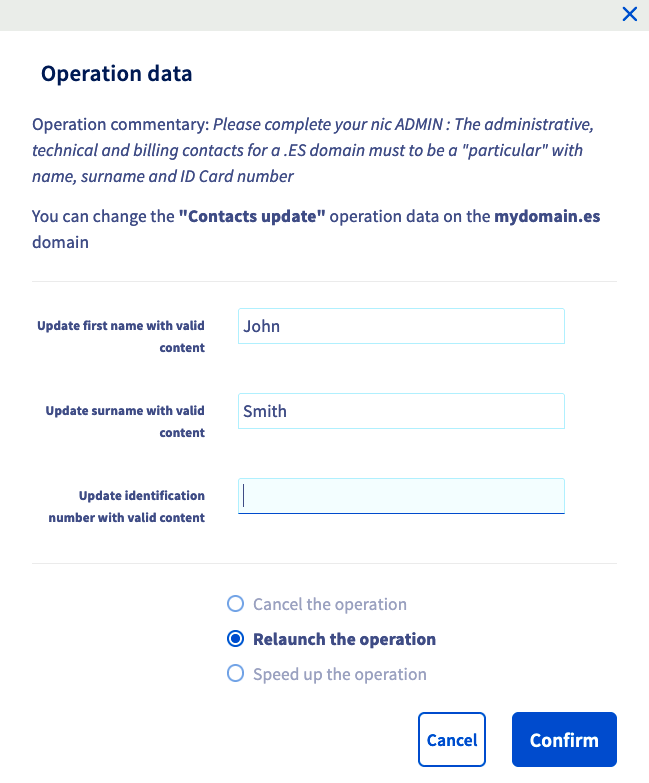

> [!primary]
> Tłumaczenie zostało wygenerowane automatycznie przez system naszego partnera SYSTRAN. W niektórych przypadkach mogą wystąpić nieprecyzyjne sformułowania, na przykład w tłumaczeniu nazw przycisków lub szczegółów technicznych. W przypadku jakichkolwiek wątpliwości zalecamy zapoznanie się z angielską/francuską wersją przewodnika. Jeśli chcesz przyczynić się do ulepszenia tłumaczenia, kliknij przycisk "Zgłoś propozycję modyfikacji" na tej stronie.
>

## Wprowadzenie

Rejestracja domeny, jej transfer, zmiana właściciela to operacje, w których może wystąpić błąd. Może zaistnieć konieczność interwencji z Twojej strony.

**Dowiedz się, jak postępować w przypadku wystąpienia błędu dla domeny.**

## Wymagania początkowe

- Posiadanie jednej lub kilku domen
- Zalogowanie do [Panelu klienta OVHcloud](/links/manager)
- Aktualizacja w [płatności](/pages/account_and_service_management/managing_billing_payments_and_services/invoice_management#pay-bills) i [odnowienie](/pages/account_and_service_management/managing_billing_payments_and_services/how_to_use_automatic_renewal#renewal-management) powiązanych usług (domena i hosting)
## W praktyce

W [Panelu klienta OVHcloud](/links/manager) przejdź do sekcji `Web Cloud`{.action}, a następnie nazwy `Domeny`{.action}. Kliknij `Operacje w toku`{.action} nad listą domen.

W tabeli możesz sprawdzić operacje związane z domenami w Twoim Panelu klienta.

{.thumbnail}

- `Domena`: Domena, której dotyczy operacja.
- `Operacja`: Trwa wykonywanie operacji dla domeny.
- `Komentarz`: Szczegóły operacji w trakcie. Instrukcje.
- `Data przetwarzania`: Data utworzenia operacji.
- `Data aktualizacji`:  Znacznik czasu aktualizacji operacji w trakcie.
- `Data zakończenia`: Data zakończenia operacji.
- `Status`: Obecny stan operacji.

Wszystkie operacje wymienione w tej tabeli nie wymagają interwencji, aby były przeprowadzane w normalnych warunkach. 
W niniejszym przewodniku przyjrzymy się operacjom **z błędem**, posługując się przykładami, które się powtarzają.

{.thumbnail}

### Przykłady

> [!primary]
>
> Poniższa lista przykładów nie jest wyczerpująca. Jeśli pojawi się błąd, który nie jest opisany w tym przewodniku:
>
> - Sprawdź, czy jesteś na bieżąco w [płatnościach](/pages/account_and_service_management/managing_billing_payments_and_services/invoice_management#pay-bills) i [odnowieniach](/pages/account_and_service_management/managing_billing_payments_and_services/how_to_use_automatic_renewal#renewal-management) Twoich domen.
> - Sprawdź, czy możesz działać klikając przycisk `...`{.action} znajdujący się po prawej stronie wybranej operacji.
> - Przeczytaj komunikat opisowy i sprawdź, czy pozwala on rozwiązać błąd.
>
> Jeśli mimo tych weryfikacji nie jesteś w stanie działać na domenę, prosimy o otwarcie zgłoszenia serwisowego w Panelu klienta.
>

#### Wniosek o dokumenty

Niektóre rozszerzenia domen muszą uzasadnić ich użycie udostępniając dokumenty. W takim przypadku należy przesłać dokumenty w oknie `Operacje w toku`{.action}.

{.thumbnail}

Aby dostarczyć niezbędne dokumenty, kliknij przycisk `...`{.action} po prawej stronie wybranej operacji. 
Pojawi się poniższe okno, w części "Opis" otrzymasz szczegółowe informacje na temat dokumentu, który ma być dostarczony, oraz przycisk do pobrania dokumentu.

{.thumbnail}

#### Brakujące informacje

Podczas rejestracji domeny konieczne jest czasem uzupełnienie danych kontaktowych. Jeśli nie odpowiadają kryteriom nazwy domeny, możesz otrzymać błąd.

{.thumbnail}

Kliknij przycisk `...`{.action} po prawej stronie operacji. 
Pojawi się poniższe okno. Wpisz pola informacjami dotyczącymi wybranego kontaktu.

{.thumbnail}

#### Nieprawidłowy kod transferu 

Po przeniesieniu domeny do OVHcloud należy wprowadzić kod transferu (**authInfo**) podczas składania zamówienia. Jeśli ten kod jest nieprawidłowy, operacja zostaje zawieszona, ale możesz wznowić operację, wprowadzając poprawny kod.

{.thumbnail}

Kliknij przycisk `...`{.action} po prawej stronie operacji. 
Pojawi się poniższe okno, wprowadź kod transferu (**authInfo**) i uruchom ponownie operację.

{.thumbnail}

#### Błąd związany z serwerami DNS

Błąd może wystąpić, jeśli serwery DNS przypisane do domeny nie działają. 
W poniższym przykładzie adres IP serwera DNS nie odpowiada.

{.thumbnail}

W sekcji `Domeny`{.action} wybierz odpowiednią domenę, a następnie kliknij zakładkę `Serwery DNS`{.action}. W tej zakładce [zmień serwery DNS](/pages/web_cloud/domains/dns_server_edit). 

#### Błąd dotyczący domeny **.ie**,.**de** lub **.it** po aktualizacji DNS

Kiedy modyfikujesz serwery DNS, registry może sprawdzić nowe serwery DNS i strefę DNS oraz zablokować domenę, jeśli jej konfiguracja jest nieprawidłowa.

> [!warning]
>
> Ten rodzaj blokady jest inicjowany przez registry, nie przez OVHcloud. Nawet jeśli domena jest zablokowana przez registry, jej serwery DNS wyświetlają się w Panelu klienta jako `aktywa`.

Aby sprawdzić, czy Twoja domena jest zablokowana, zapoznaj się z tabelą `Operacje w toku`{.action}.

{.thumbnail}

W celu sprawdzenia nazwy Twojej domeny zalecamy użycie narzędzia weryfikacyjnego dostarczonego przez registry:

- W przypadku nazwy domeny **.de**: <https://nast.denic.de/>.
- Dla domeny z rozszerzeniem.**it**: <https://dns-check.nic.it/>.

> [!primary]
>
> Jeśli Twój rejestr nie dostarcza narzędzia do weryfikacji serwerów DNS, możesz odpytywać nowe serwery DNS za pomocą polecenia `nslookup` sur na polecenie Windows lub za pomocą polecenia `dig` na "urządzeniu" Linux lub macOS. 
>
> Jeśli serwery DNS są dostępne, narzędzie zwraca adres IP.
>
> We wszystkich przypadkach upewnij się, że administrator serwera DNS jest ustawiony na serwerze DNS, aby pomieścić strefę DNS Twojej domeny.

Po wybraniu źródła błędu i jego poprawieniu kliknij przycisk `...`{.action} po prawej stronie wybranej operacji i uruchom ponownie operację weryfikacji DNS.

#### Błąd wewnętrzny OVHcloud

Może pojawić się błąd, którego szczegóły dotyczą "błąd wewnętrzny". Ten błąd nie pozwala na wykonywanie operacji po Twojej stronie. 
Sprawdź najpierw, czy Twoja domena i serwery DNS są aktywne. 

Jeśli zauważysz problem, który nie jest związany z konfiguracją serwerów DNS lub strefy DNS, skontaktuj się z pomocą OVHcloud, w celu zidentyfikowania źródła awarii.

{.thumbnail}

## Sprawdź również

[Transfer domeny do OVHcloud](/pages/web_cloud/domains/transfer_incoming_generic_domain)

[Transfer domeny do innego operatora](/pages/web_cloud/domains/transfer_outgoing_domain)

[Zmiana serwerów DNS domeny OVHcloud](/pages/web_cloud/domains/dns_server_edit)
 
W przypadku wyspecjalizowanych usług (pozycjonowanie, rozwój, etc.) skontaktuj się z [partnerami OVHcloud](/links/partner).

Jeśli chcesz otrzymywać wsparcie w zakresie konfiguracji i użytkowania Twoich rozwiązań OVHcloud, zapoznaj się z naszymi [ofertami pomocy](/links/support).

Dołącz do społeczności naszych użytkowników na stronie <https://community.ovh.com/en/>. 