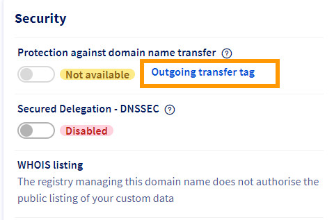

> [!primary]
> Esta traducción ha sido generada de forma automática por nuestro partner SYSTRAN. En algunos casos puede contener términos imprecisos, como en las etiquetas de los botones o los detalles técnicos. En caso de duda, le recomendamos que consulte la versión inglesa o francesa de la guía. Si quiere ayudarnos a mejorar esta traducción, por favor, utilice el botón «Contribuir» de esta página.
>

## Objetivo

El proceso de cambio de agente registrador (*registrador*) para los dominios de primer nivel (*top-level domain*, o **TLD**) del indicativo de país **UK** (**.uk**) difiere del descrito en nuestra [guía de transferencia de los TLD genéricos](/pages/web_cloud/domains/transfer_outgoing_domain). Las siguientes instrucciones se aplican a las siguientes extensiones:

- .uk
- .co.uk
- .ac.uk
- .gov.uk
- .me.uk
- .net.uk
- .org.uk
- .plc.uk
- .sch.uk

**Esta guía explica cómo iniciar una transferencia saliente para estas TLD desde el área de cliente de OVHcloud.**

> [!warning]
>
> Si el dominio en cuestión debe permanecer registrado en OVHcloud, pero modificado en sus modalidades de gestión o de propiedad, una transferencia saliente de dominio no es el procedimiento adecuado.
>
> Para transferir la gestión de su dominio a otra cuenta de cliente de OVHcloud, el método adecuado es un cambio de contactos. El procedimiento se describe en [esta guía](/pages/account_and_service_management/account_information/managing_contacts).
>
Si también debe cambiar el **propietario** del dominio, debe hacerlo **antes** de cambiar los contactos del dominio. Para ello, siga las indicaciones que le indicamos en la guía sobre el [cambio de propietario de los dominios](/pages/web_cloud/domains/trade_domain).
>

## Requisitos

- Tener un [dominio .uk](/links/web/domains) registrado con OVHcloud.
- Tienes acceso a tu [Panel de configuración de OVHcloud](/links/manager) y tener los permisos necesarios para gestionar el dominio (ser administrador del dominio).
- El dominio debe estar siempre activo, es decir, no debe haber expirado o haber sido bloqueado por OVHcloud.
- El nombre de dominio no debe ser objeto de un litigio en curso ante el [Registro Nominet](https://www.nominet.uk/)

> [!primary]
>
> Si el dominio ha expirado desde **menos de 90 días**, puede transferirse siempre. Por favor, contacte con nuestro equipo de soporte técnico creando una solicitud de soporte en su Panel de control de OVHcloud para desbloquear el dominio para la transferencia.
>
> Si usted es el **propietario** del dominio pero su gestión en el área de cliente de OVHcloud no está disponible, ya sea a través de su propio acceso o a través del contacto administrativo del dominio, consulte [esta guía](/pages/account_and_service_management/account_information/managing_contacts#caso-particular-de-un-propietario-de-dominio) antes de continuar.
>

## Procedimiento

Cada TLD correspondiente dispone de una etiqueta (*TAG*) correspondiente a su actual agente registrador de dominios, como OVHcloud. La transferencia se inicia sustituyendo el TAG por el identificador de su nuevo agente registrador.

Si todavía no conoce el TAG necesario, puede solicitarlo a su nuevo proveedor o consultar la [lista de agentes registradores Nominet](https://registrars.nominet.uk/uk-namespace/registrar-agreement/list-of-registrars/).

### Paso 1: comprobar la información necesaria

Conéctese al [Panel de configuración de OVHcloud](/links/manager) y seleccione `Web Cloud`{.action}. Haga clic en `Dominios`{.action} y seleccione el dominio correspondiente.

Recuerde que debe estar conectado como administrador.

En la pestaña `Información general`{.action}, puede comprobar que se cumplen los requisitos para el proceso de transferencia.

### Paso 2: modificar el TAG del dominio

Haga clic en el enlace `Etiqueta de transferencia saliente`{.action} en la sección titulada **Seguridad**.

{.thumbnail}

Se abrirá una ventana en la que deberá introducir el TAG del nuevo agente registrador y hacer clic en `Confirmar`{.action}.

{.thumbnail}

Si no puede cambiar el TAG de su dominio desde el área de cliente, puede solicitarlo al Registro Nominet. Más información en la [web oficial de Nominet](https://www.nominet.uk/domain-support/).

### Paso 3: seguir el proceso de transferencia a su nuevo agente registrador

La modificación de la etiqueta TAG activa el proceso de transferencia.

Contacte con su nuevo proveedor para más información y para conocer cualquier duda relativa al seguimiento de la transferencia.

## Más información

[Transferir un dominio a otro agente registrador](/pages/web_cloud/domains/transfer_outgoing_domain)

Para servicios especializados (posicionamiento, desarrollo, etc.), contacte con [partners de OVHcloud](/links/partner).

Interactúe con nuestra comunidad de usuarios en <https://community.ovh.com/en/>.