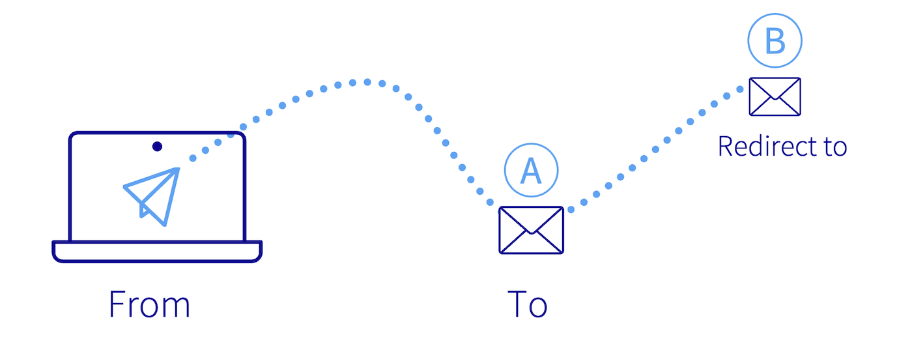
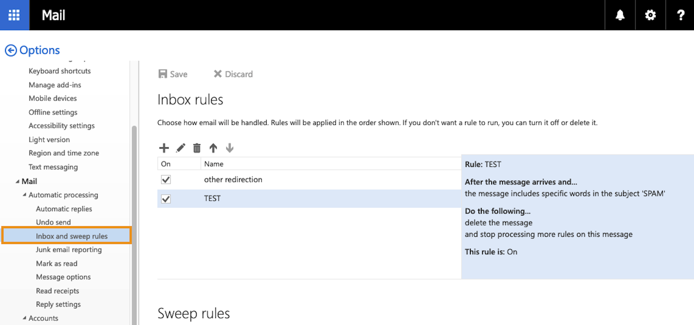

> [!primary]
> Tłumaczenie zostało wygenerowane automatycznie przez system naszego partnera SYSTRAN. W niektórych przypadkach mogą wystąpić nieprecyzyjne sformułowania, na przykład w tłumaczeniu nazw przycisków lub szczegółów technicznych. W przypadku jakichkolwiek wątpliwości zalecamy zapoznanie się z angielską/francuską wersją przewodnika. Jeśli chcesz przyczynić się do ulepszenia tłumaczenia, kliknij przycisk "Zgłoś propozycję modyfikacji" na tej stronie.
>

## Wprowadzenie

W tym przewodniku znajdziesz różne informacje i pomoce dotyczące konfiguracji Twoich **przekierowań** i **aliasów** e-maili, na przykład aby wysyłać e-maile otrzymane na adres A na adres B.

{.thumbnail}

**Dowiedz się, jak zarządzać aliasami i przekierowaniami e-mail.**

### Co to jest przekierowanie wiadomości e-mail?

Przekierowanie pozwala na zmianę pierwotnej podróży z jednego e-maila na jeden lub kilka innych adresów e-mail.

Na przykład chcesz, aby przy wysyłce wiadomości e-mail na adres **contact@mydomain.ovh** została ona również przekierowana na adres **john.smith@otherdomain.ovh**. Pozwala to na automatyczne przesłanie e-maila na adres **contact@mydomain.ovh** na adres **john.smith@otherdomain.ovh**.

### Co to jest alias e-mail?

W przeciwieństwie do przekierowania, adres e-mail powiązany z aliasem nie jest adresem, który się z nim konsultuje, jest to "maska".

Utworzenie aliasu dla Twojego konta e-mail umożliwia komunikację z użytkownikami konta "maska" bez ujawniania nadawcy adresu e-mail. Jeden adres e-mail może mieć kilka aliasów.

Na przykład adres e-mail to **john.smith@mydomain.ovh** oraz alias **information@mydomain.ovh**. Możesz wówczas podać do wiadomości swoich kontaktów adres **information@mydomain.ovh** i otrzymywać e-maile na **john.smith@mydomain.ovh**, bez znajomości **john.smith@mydomain.ovh**.

### Przekierowanie i alias 

Kliknij poniższe zakładki, aby uzyskać ilustrowane wyjaśnienia dotyczące działania aliasów i przekierowań.

- `From` oznacza adres nadawcy
- `To` oznacza adres odbiorcy
- `Redirect to` oznacza skonfigurowany adres e-mail przekierowania.

> [!tabs]
> **1. Przekierowanie proste**
>>
>> Wiadomość jest przesyłana bezpośrednio na adres przekierowania. Pierwotny odbiorca nie otrzymuje wiadomości.  
>> {.thumbnail}
>>
> **2. Przekierowanie z kopią lokalną**
>>
>> E-mail jest wysyłany do pierwotnego adresata oraz na adres przekierowania.  
>> {.thumbnail}
>>
> **3. Alias e-mail**
>>
>> Wiadomość e-mail jest wysyłana do aliasu, który przekierowuje ją do adresata, dla którego został skonfigurowany. Adnotacja `Received by` oznacza adres e-mail, na który wysyłany jest e-mail.  
>> {.thumbnail}
>>

> [!primary]
>
> Pamiętaj, że możliwa jest konfiguracja przekierowania na kilka adresów e-mail. Wiąże się to jednak z koniecznością tworzenia przekierowań pojedynczo do każdego odbiorcy.

## Wymagania początkowe

- Dostęp do [Panelu klienta OVHcloud](/links/manager).
- Posiadanie wcześniej skonfigurowanego rozwiązania poczty elektronicznej OVHcloud (**MX Plan**, zaproponowanego w naszej [ofercie hostingu](https://www.ovhcloud.com/pl/web-hosting/), zawartego w [Darmowy hosting 100M](https://www.ovhcloud.com/pl/domains/free-web-hosting/) lub zamówionym oddzielnie jako rozwiązanie autonomiczne, takie jak [Hosted Exchange](https://www.ovhcloud.com/pl/emails/hosted-exchange/) lub [Email Pro](https://www.ovhcloud.com/pl/emails/email-pro/))

## W praktyce

> [!warning]
>
> Rozdziały "[Utwórz przekierowanie](#redirect)" i "[Utwórz alias](#alias)" dotyczą wszystkich naszych ofert e-mail OVHcloud, **chyba że**:
>
> - posiadasz starszą wersję usługi MXplan (aby to sprawdzić, sprawdź ramkę poniżej).
> - posiadasz domenę zarejestrowaną w OVHcloud bez dołączonej oferty e-mail.
>
> W przypadku tych dwóch wyjątków możliwe jest tylko przekierowanie. Zapraszamy do zapoznania się bezpośrednio z rozdziałem "[Tworzenie przekierowania lub aliasu na historycznej usłudze MX Plan lub nazwie domeny bez oferty e-mail](#mxplanlegacy)".
>

>
> W zależności od daty aktywacji oferty MX Plan lub jeśli [oferta została niedawno przeniesiona](https://www.ovhcloud.com/pl/web-hosting/mxplan-migration/), możliwe jest, że dysponujesz jej starszą lub nową wersją. Zanim przejdziesz dalej, musisz ją zidentyfikować.  
>
> W tym celu zaloguj się do [Panelu klienta OVHcloud](/links/manager), części `Web Cloud`{.action}. Kliknij `E-maile`{.action}, po czym wybierz odpowiednią usługę MX Plan. Kontynuuj w zależności od wersji, którą posiadasz: 
>
> |Poprzednia wersja usługi MX Plan|Nowa wersja usługi MX Plan|
> |---|---|
> |{.thumbnail}  Znajdź nazwę oferty w polu „Abonament”|{.thumbnail} Znajdź `Oznaczenie serwera` w polu „Podsumowanie”|
> |Przejdź do sekcji "[Poprzednia wersja usługi MX Plan](#mxplanlegacy)"|Przejdź do [sekcji Utwórz przekierowanie](#redirect) lub [Utwórz alias](#alias)|

### Utwórz przekierowanie 

Zarządzanie przekierowaniami nie odbywa się w Panelu klienta lecz bezpośrednio w interfejsie webmail danego adresu e-mail.

Przejdź do [webmail](/links/web/email). Wpisz **adres e-mail** i **hasło**, aby się zalogować.

{.thumbnail}

W przykładzie mamy do czynienia z **przekierowaniem z zachowaniem kopii lokalnej** (por. [schemat 2](#diagram) na początku tego przewodnika). Jeśli to spełnia Twoje potrzeby, w lewym górnym rogu kliknij `OK`{.action} (ikona dyskietki), a reguła zostanie zastosowana. W przeciwnym razie przejdź do poniższego etapu.

Postępuj zgodnie z instrukcjami podanymi w opisanych krokach, klikając kolejno na każdą z poniższych zakładek:

> [!tabs]
> **Etap 1**
>>
>> Po zalogowaniu się do Twojego konta e-mail przez [webmail](/links/web/email) kliknij ikonkę koła zębatego w prawym górnym rogu, a następnie kliknij `Opcje`{.action}.  
>> {.thumbnail} 
>>
> **Etap 2**
>> W lewej kolumnie okna **Opcje** przejdź do kategorii **Automatyczne przetwarzanie** w sekcji **Poczta**, a następnie kliknij `Reguły skrzynki odbiorczej i porządkowej`{.action}.   
>> {.thumbnail}  
>> W tym oknie możesz zarządzać przekierowaniami, a także filtrować wszystkie przychodzące wiadomości e-mail. 
>>
> **Etap 3**
>>
>> W oknie zarządzania **Reguły skrzynki odbiorczej** w lewym górnym rogu kliknij ikonę `+`{.action}.  
>> {.thumbnail}  
>>
> **Etap 4**
>>
>> **Nazwa**: zdefiniuj nazwę przekierowania.  
>> **Kiedy wiadomość przychodzi i spełnia wszystkie te warunki**: jeśli przekierowanie dotyczy wszystkich wiadomości, wybierz `[Zastosuj do wszystkich wiadomości]`{.action}.  
>> {.thumbnail .w-640}  
>>
> **Etap 5**
>>
>> **Wykonać wszystkie następujące** czynności: w tym przypadku stosujesz przekierowanie, wybierz pozycję `Przekaż, przekieruj lub wyślij`{.action}, a następnie `Przekieruj wiadomość do...`{.action}.  
>> {.thumbnail .w-640}  
>>
> **Etap 6**
>>
>> Następnie wprowadź adres, na który chcesz przekierować e-mail przed "**Przekierowaniem wiadomości do...**" a następnie kliknij `Zapisz`{.action}. Następnie kliknij `OK`{.action} (ikona dyskietki), aby dokończyć przekierowanie.  
>> {.thumbnail .w-640}  
>>

> [!primary]
> Aby zastosować **przekierowanie proste** (patrz [schemat 1](#diagram) na początku tego przewodnika), dodaj w tym oknie dodatkową regułę do **przekierowania z kopią lokalną**. Kliknij `Dodaj akcję`{.action} (pole 1), a następnie `Przenieś, skopiuj lub usuń`{.action}, a następnie kliknij `Usuń wiadomość`{.action}. Ta reguła spowoduje umieszczenie wiadomości bezpośrednio w koszu po przekierowaniu jej na adres przekierowania.  
> {.thumbnail .w-640}

### Usuń przekierowanie

Postępuj zgodnie z instrukcjami podanymi w poniższych zakładkach:

> [!tabs]
> **Etap 1**
>>
>> Po zalogowaniu się do swojego konta e-mail przez [webmail](/links/web/email), w prawym górnym rogu kliknij ikonę koła zębatego, a następnie ikonę `Opcje`{.action}.  
>> {.thumbnail} 
>>
> **Etap 2**
>> W lewej kolumnie okna **Opcje** przejdź do kategorii **Automatyczne przetwarzanie** w sekcji **Poczta** i kliknij `Skrzynka odbiorcza i reguły oczyszczania`{.action}.   
>> {.thumbnail}  
>> Znajdziesz okno do zarządzania przekierowaniami i filtrami. 
>>
> **Etap 3**
>>
>> W oknie zarządzania **Reguły skrzynki odbiorczej** kliknij przekierowanie, które chcesz usunąć. Musi ono być podświetlone. Następnie kliknij ikonę kosza.  
>> {.thumbnail}  
>>

### Utwórz alias 

Zaloguj się do [Panelu klienta OVHcloud](/links/manager) i przejdź do sekcji `Web Cloud`{.action}. Następnie wybierz menu w zależności od oferty e-mail:

- **Exchange**: w `Microsoft`{.action}, następnie w `Exchange`{.action} i wybierz odpowiednią platformę. Kliknij kartę `Konta e-mail`{.action}.

- **E-mail Pro**: w `E-mail Pro`{.action} wybierz odpowiednią platformę i kliknij zakładkę `Konta e-mail`{.action}.

- **E-maile** (MXplan): w `e-mailach`{.action} wybierz odpowiednią platformę, a następnie kliknij zakładkę `Konta e-mail`{.action}.

Aby dodać alias do konta e-mail, postępuj zgodnie z instrukcjami podanymi poniżej, klikając kolejno na każdą zakładkę:

> [!tabs]
> **Etap 1**
>>
>> W tabeli, która się wyświetli znajdziesz kolumnę `Alias`.  
>> {.thumbnail} 
>>
> **Etap 2**
>>
>> Kliknij przycisk `...`{.action} a następnie `Skonfiguruj aliasy`{.action} (lub `Zarządzaj aliasami`{.action}).  
>> {.thumbnail} 
>>
> **Etap 3**
>>
>> Kliknij `Dodaj alias`{.action}, a następnie wprowadź wybrany przez Ciebie adres dla Twojego aliasu i zatwierdź wybór.  
>> {.thumbnail} 

### Usuń alias

W zakładce `Konta e-mail`{.action} kliknij przycisk `...`{.action} znajdujący się po prawej stronie wybranego konta e-mail. Następnie kliknij `Konfiguracja aliasów`{.action} (lub `Zarządzanie aliasami`{.action}).

Kliknij przycisk `...`{.action} po prawej stronie odpowiedniego aliasu w menu zarządzania aliasami. Na koniec kliknij `Usuń alias`{.action}.

{.thumbnail}

### Utwórz przekierowanie lub alias dla usługi MX Plan lub domeny bez oferty e-mail 

Zaloguj się do [Panelu klienta OVHcloud](/links/manager) i przejdź do sekcji `Web Cloud`. Przejdź do sekcji `E-mail`{.action}:

> [!warning]
>
> - Metoda tworzenia aliasu lub przekierowania jest identyczna.
> - Można utworzyć maksymalnie 2000 aliasów i przekierowań wraz z kopiami lokalnymi.
>

Postępuj zgodnie z instrukcjami podanymi w opisanych krokach, klikając kolejno na każdą z poniższych zakładek:

> [!tabs]
> **Etap 1**
>> Domyślnie znajdujesz się w karcie `Informacje ogólne`{.action} oferty MX Plan. Kliknij kartę `E-maile`{.action}, a następnie przycisk `Zarządzaj przekierowaniami`{.action} po prawej.  
>> {.thumbnail} 
>>
> **Etap 2**
>>
>> Pojawia się tabela już aktywnych przekierowań. Kliknij przycisk `Dodaj przekierowanie`{.action} znajdujący się po prawej.  
>>
>> > [!primary]
>> >
>> > Aby zmienić lub usunąć przekierowanie, kliknij `...`{.action}, po prawej stronie wybranego przekierowania.
>>
>> {.thumbnail} 
>>
> **Etap 3**
>>
>> **Z adresu**: wprowadź tutaj adres e-mail, który chcesz przekierować.  
>> **Na adres**: wprowadź tutaj docelowy adres przekierowania. Może to być jeden z Twoich adresów e-mail OVHcloud lub adres zewnętrzny.  
>> **Wybierz tryb kopii**: wybierz, czy chcesz:   - **Zachowaj kopię e-maila w OVHcloud** (otrzymaj e-mail na Twoim głównym adresie oraz adres przekierowania)  *cf. [schemat 2](#diagram) na początku tego przewodnika.*   - **Nie zachowuj kopii e-maila** (odesłanie bezpośrednio do adresu przekierowania bez otrzymania głównego adresu)   *cf. [schemat 1](#diagram) na początku tego przewodnika.*  
>> Następnie kliknij przycisk `Zatwierdź`{.action}, aby potwierdzić dodanie tego adresu przekierowania. 
>>
>> {.thumbnail}

> [!primary]
>
> Jeśli wybierzesz tryb kopii "**Zachowaj kopię e-maila w OVHcloud**", na liście przekierowań automatycznie tworzone jest przekierowanie z adresu e-mail na ten sam adres, tworząc jego kopię lokalną.
> 

## Usuń przekierowanie lub alias z oferty MX Plan historyczny lub z domeny bez oferty e-mail 

W zakładce `Emaile`{.action} kliknij `Zarządzanie przekierowaniami`{.action} po prawej stronie okna.

Kliknij przycisk `...`{.action} po prawej stronie wybranego przekierowania, a następnie kliknij `Usuń przekierowanie`{.action}

> [!warning]
>
> Nie można zmienić przekierowania ani aliasu. Należy ją usunąć, a następnie utworzyć ponownie.

{.thumbnail}

## Sprawdź również 

W przypadku wyspecjalizowanych usług (pozycjonowanie, rozwój, etc.) skontaktuj się z [partnerami OVHcloud](/links/partner).

Jeśli chcesz otrzymywać wsparcie w zakresie konfiguracji i użytkowania Twoich rozwiązań OVHcloud, zapoznaj się z naszymi [ofertami pomocy](/links/support).

Dołącz do [grona naszych użytkowników](/links/community).