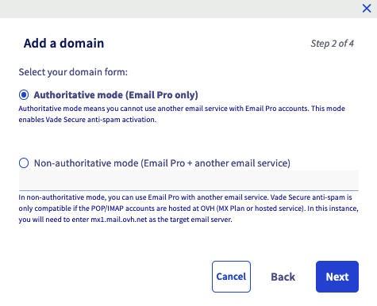
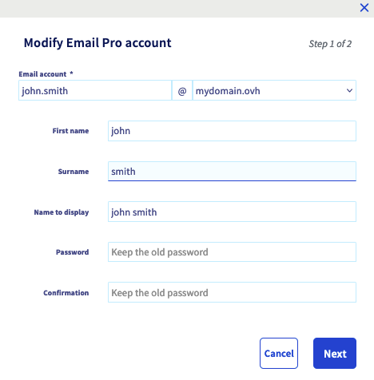

> [!primary]
> Diese Übersetzung wurde durch unseren Partner SYSTRAN automatisch erstellt. In manchen Fällen können ungenaue Formulierungen verwendet worden sein, z.B. bei der Beschriftung von Schaltflächen oder technischen Details. Bitte ziehen Sie im Zweifelsfall die englische oder französische Fassung der Anleitung zu Rate. Möchten Sie mithelfen, diese Übersetzung zu verbessern? Dann nutzen Sie dazu bitte den Button "Beitragen" auf dieser Seite.
>

## Ziel

Sie haben gerade eine E-Mail Pro Lösung erworben. Nun können Sie zu einem günstigen Preis professionelle E-Mail-Adressen nutzen, um Ihr Business zu fördern oder neu zu starten.

**Diese Anleitung erläutert, wie Sie Ihre E-Mail Pro Lösung konfigurieren.**

## Voraussetzungen

- Sie haben einen [E-Mail Pro](/links/web/email-pro)-Dienst in Ihrem Kunden-Account.
- Sie haben die E-Mail zur Installation von E-Mail Pro bereits erhalten.
- Sie verfügen über einen [Domainnamen](/links/web/domains).
- Sie haben Zugriff auf Ihr [OVHcloud Kundencenter](/links/manager).

## In der praktischen Anwendung

### Schritt 1: Zugang zur Verwaltung Ihres Dienstes

Wenn der E-Mail Pro Dienst eingerichtet und verfügbar ist, können Sie ihn über Ihr [OVHcloud Kundencenter](/links/manager) verwalten.

Loggen Sie sich hierzu in Ihrem Kundencenter ein und wählen Sie den betreffenden `E-Mail Pro`{.action} Dienst aus.

> [!primary]
>
> Der Name eines E-Mail Pro Dienstes in Ihrem OVHcloud Kundencenter beginnt mit *emailpro-*, enthält dann einen Teil Ihrer Kundenkennung und endet mit einer Zahl (1 für den ersten eingerichteten E-Mail Pro Dienst, 2 für den zweiten, etc.).
>

### Schritt 2: Ihre Domain hinzufügen

Wenn Sie Ihren E-Mail Pro Dienst gerade bestellt haben, erscheint automatisch ein Fenster mit der Aufforderung `Eine Domain hinzufügen`{.action}. Sollte das Fenster nicht angezeigt werden, gehen Sie in den Tab `Assoziierte Domains`{.action} und klicken Sie auf den Button `Eine Domain hinzufügen`{.action}.

Sie haben folgende Auswahlmöglichkeiten:

- **Eine Domain aus der Liste auswählen**: Es werden nur die Domainnamen angezeigt, die Sie in Ihrem OVHcloud Kundencenter verwalten. Wenn die Domain bei OVHcloud registriert ist, aber nicht in Ihrem Kundencenter angezeigt wird, wählen Sie „Eine Domain eingeben, die nicht in Ihrem OVHcloud Account verwaltet wird“.
- **Eine Domain hinzufügen, die nicht in Ihrem OVHcloud Account verwaltetet wird**: Wählen Sie diese Option, wenn die betreffende Domain bei OVHcloud registriert ist, aber nicht in Ihrem Kunden-Account konfigurierbar ist, **oder** wenn Ihre Domain bei einem anderen Registrar registriert ist. Sie müssen in der Lage sein, die Konfiguration der Domain (ihre DNS-Zone) zu ändern, damit der E-Mail Pro Dienst korrekt funktioniert.

Nachdem Sie Ihre Auswahl vorgenommen haben, klicken Sie auf `Weiter`{.action}.

{.thumbnail}

Das Fenster zeigt dann die Informationen zur Konfiguration eines Modus an.

{.thumbnail}

- **Wenn Sie eine nicht von OVHcloud verwaltete Domain angegeben haben**: Der nicht-autoritative Modus wird standardmäßig konfiguriert.

- **Wenn Sie in der Liste eine von OVHcloud verwaltete Domain ausgewählt haben**: Sie können einen Modus auswählen.
    - **Autoritativ**: Passend, wenn Ihre E-Mail Pro Lösung die einzige E-Mail-Lösung ist, die Sie mit Ihrem Domainnamen verwenden. Es ist nicht möglich, eine andere E-Mail-Lösung mit Ihrem Dienst zu verwenden.
    - **Nicht-autoritativ**: Wählen Sie diese Option, wenn Sie die E-Mail Pro-Lösung und **eine andere E-Mail-Lösung** verwenden, die denselben Domainnamen verwendet.

> **Autoritativer Modus und nicht-autoritativer Modus**
>
> - Wenn eine E-Mail im **autoritativen** Modus an Ihre E-Mail Pro Plattform (*Inbound Mail Server Email Pro*) übermittelt wird, werden alle E-Mail-Adressen Ihres Domainnamens ausschließlich auf dieser Plattform gehostet.     Wenn Sie zum Beispiel eine E-Mail an die Adresse *mary.johnson@mydomain.ovh* senden, sendet der E-Mail Pro Server *Inbound mail server Email Pro* eine Fehlermeldung an den Absender, da diese Adresse auf dem E-Mail Pro Server *Inbound mail server Email Pro* nicht existiert.
> - Wenn eine E-Mail im **nicht-autoritativen** Modus an Ihre E-Mail Pro Plattform (*Inbound Mail Server Email Pro*) gesendet wird, werden die E-Mail-Adressen Ihrer Domain zwischen Ihrer Haupt-E-Mail-Plattform (*Inbound Mail Server Email Pro*) und einem anderen E-Mail-Dienst (*Inbound Mail Server MX Plan*) aufgeteilt.     Wenn Sie zum Beispiel eine E-Mail an die Adresse *mary.johnson@mydomain.ovh* senden, wird die E-Mail vom E-Mail Pro *Inbound Mail Server Email Pro* an den MX Plan Server *Inbound mail server MX Plan* weitergeleitet, damit dieser die E-Mail bereitstellen kann.
>
> {.thumbnail}
>

> [!warning]
>
> Wenn Sie die Nachricht "**authoritative domain detected**" erhalten, wenn Sie Ihren Domainnamen auf Ihrer E-Mail-Plattform hinzufügen, bedeutet dies, dass dieser Domainname auf einer anderen E-Mail-Plattform als **autoritativ** deklariert ist. Daher müssen beide Plattformen in den **nicht-autoritativen** Modus versetzt werden, damit sie nebeneinander verwendet können.

Wenn Sie sich für den **nicht-autoritativen** Modus entscheiden, gibt es zwei Möglichkeiten:

- **Sie verwenden E-Mail-Accounts bei OVHcloud (Exchange oder MX Plan)**: Geben Sie als Ziel-E-Mail-Server *mx1.mail.ovh.net* ein (funktioniert ebenso mit *mx0.mail.ovh.net*, *mx2.mail.ovh.net*, *mx3.mail.ovh.net*, *mx4.mail.ovh.net*).
- **Sie verwenden einen externen E-Mail-Dienst (E-Mail-Angebot eines anderen Anbieters, privater E-Mail-Server)**: Geben Sie in das Feld Ziel-E-Mail-Server den Hostnamen des Eingangsservers dieses externen Dienstes ein. Stellen Sie vorher sicher, dass dieser E-Mail-Anfragen von Ihrem E-Mail Pro Dienst zulässt.

Die Wahl des Modus ist nicht dauerhaft festgelegt und kann im Nachhinein über das OVHcloud Kundencenter geändert werden.

Klicken Sie auf `Weiter`{.action}, um die Domain hinzuzufügen.

**Wenn Sie einen von OVHcloud verwalteten Domainnamen ausgewählt haben**, kann dessen Konfiguration automatisch vorgenommen werden. Setzen Sie hierzu einen Haken im entsprechenden Feld und klicken Sie dann auf `Weiter`{.action}, um mit dem Hinzufügen der Domain fortzufahren.

{.thumbnail}

- **SRV**: DNS-Eintrag für die automatische Konfiguration Ihrer E-Mail-Software, wenn Sie Ihre E-Mail-Adresse darin eintragen.
- **MX**: Für den Empfang von E-Mails über Domainnamen notwendiger DNS-Eintrag für E-Mail-Server.
- **DKIM**: Einrichtung einer verschlüsselten digitalen Signatur zur Sicherung des E-Mail-Verkehrs. Weitere Informationen finden Sie in unserer Anleitung „[Einen DKIM-Eintrag konfigurieren](/pages/web_cloud/domains/dns_zone_dkim)“.

**Für einen nicht von OVHcloud verwalteten Domainnamen** fahren Sie mit Schritt 3 fort.

Am Ende der Konfiguration überprüfen Sie die angezeigten Informationen. Klicken Sie danach auf `Bestätigen`{.action}, um die Domain hinzufügen.

### Schritt 3: Ihre Domain konfigurieren

Sobald die Domain als assoziierte Domain hinzugefügt ist, überprüfen Sie in der angezeigten Tabelle, dass die Konfiguration korrekt ist.

In der Spalte `Diagnose`{.action} können Sie sehen, ob die Konfiguration der MX-Felder der Domain korrekt ist. Ein rotes Feld zeigt an, dass die Konfiguration geändert werden muss.

- **Automatische Konfiguration beim Hinzufügen eines Domainnamens von OVHcloud**: Wenn Sie gerade erst eine Änderung vorgenommen haben, kann es einige Stunden dauern, bis diese im [OVHcloud Kundencenter](/links/manager){.external} angezeigt wird.

- **Manuelle Konfiguration einer nicht von OVHcloud verwalteten Domain**: Klicken Sie auf das rote Feld, um zu sehen, welche Änderungen notwendig sind.
    - *CNAME-Eintrag*: Folgen Sie unserer Anleitung „[CNAME-Eintrag erstellen, um eine assoziierte Domain hinzuzufügen](/pages/web_cloud/email_and_collaborative_solutions/microsoft_exchange/exchange_dns_cname)“.
    - *MX-Eintrag*: Folgen Sie unserer Anleitung „[MX-Eintrag zur Domainkonfiguration hinzufügen](/pages/web_cloud/domains/dns_zone_mx)“.
    - *SRV-Eintrag*: Geben Sie in Ihrer DNS-Zone die Informationen, die Sie beim Klicken auf das rote Feld erhalten haben, ein. Folgen Sie unserer Anleitung „[OVHcloud DNS-Zone bearbeiten](/pages/web_cloud/domains/dns_zone_edit)“.
    - *SPF-Eintrag*: Geben Sie in Ihrer DNS-Zone die Informationen, die Sie beim Klicken auf das rote Feld erhalten haben, ein. Folgen Sie unserer Anleitung „[Einen SPF-Eintrag konfigurieren](/pages/web_cloud/domains/dns_zone_spf)“.
    - *DKIM-Eintrag*: Geben Sie in Ihrer DNS-Zone die Informationen, die Sie beim Klicken auf das rote Feld erhalten haben, ein. Folgen Sie unserer Anleitung „[Einen DKIM-Eintrag konfigurieren](/pages/web_cloud/domains/dns_zone_dkim)“.

{.thumbnail}

### Schritt 4: E-Mail Pro Accounts konfigurieren

Zur Konfiguration Ihrer E-Mail-Accounts gehen Sie in den Tab `E-Mail-Accounts`{.action}. Die Tabelle zeigt die bestellten Accounts als “*@configureme.me*” an.

Um sie zu konfigurieren klicken Sie auf `...`{.action} und dann auf `Ändern`{.action}.

{.thumbnail}

Ergänzen Sie die angezeigten Werte.

- **E-Mail-Account**: Geben Sie den Namen ein, den Ihre E-Mail-Adresse erhalten soll (zum Beispiel vorname.name), und wählen Sie die betreffende Domain aus der Liste aus.

> [!warning]
>
> Die Wahl des Namens Ihrer E-Mail-Adresse muss folgende Bedingungen erfüllen:
>
> - Mindestens 2 Zeichen
> - Maximal 32 Zeichen
> - Keine Zeichen mit Akzent
> - Keine Sonderzeichen außer `.`, `,`, `-` und `_`

- **Vorname**: Geben Sie einen Vornamen ein.
- **Name**: Geben Sie einen Namen ein.
- **Anzeigename**: Geben Sie den Namen ein, der als Absender angezeigt werden soll, wenn E-Mails von dieser Adresse aus versendet werden.
- **Kennwort und Bestätigung**: Legen Sie ein sicheres Kennwort fest, das aus mindestens 8 Zeichen besteht und mindestens einen Großbuchstaben, einen Kleinbuchstaben und eine Zahl enthält. Aus Sicherheitsgründen empfehlen wir Ihnen, nicht zweimal das gleiche Passwort zu verwenden, sondern ein Passwort auszuwählen, das keinen Bezug zu Ihren persönlichen Daten hat (vermeiden Sie beispielsweise Ihren Namen, Vornamen und Ihr Geburtsdatum) und dieses regelmäßig zu erneuern.

> [!warning]
>
> Die Wahl des Passworts muss folgende Bedingungen erfüllen:
>
> - Mindestens 9 Zeichen
> - Maximal 30 Zeichen
> - Keine Zeichen mit Akzent

Wenn alle Angaben vollständig sind, klicken Sie auf `Weiter`{.action}. Überprüfen Sie die angezeigten Informationen und klicken Sie dann auf `Bestätigen`{.action}, um die Konfiguration Ihres Accounts abzuschließen.

> [!primary]
>
> Führen Sie diesen Schritt für alle zur Verfügung stehenden Accounts durch. Sie können weitere Accounts über den Button `Accounts bestellen`{.action} hinzufügen.
>

### Schritt 5: Ihre E-Mail-Adressen verwenden

Nach Abschluss der Konfiguration können Sie Ihre E-Mail-Adressen verwenden. Dazu stellt Ihnen OVHcloud eine Online-Anwendung (*Web App*) zur Verfügung. Diese App ist über die Adresse <https://www.ovhcloud.com/de/mail/> erreichbar. Geben Sie hier Ihre E-Mail-Adresse und das Passwort ein, um sich einzuloggen.

Wenn Sie Ihre E-Mail-Adresse auf einem E-Mail-Client oder einem Gerät (beispielsweise einem Smartphone oder einem Tablet) einrichten möchten, nutzen Sie hierzu die passende [E-Mail Pro Anleitung](/products/web-cloud-email-collaborative-solutions-email-pro). Wenn Sie nur die erforderlichen Daten zur Konfiguration Ihres E-Mail Pro Accounts benötigen, verwenden Sie die folgenden Einstellungen:

|Servertyp|Servername|Sicherheitstyp|Port|
|---|---|---|---|
|Eingangsserver|pro**?**.mail.ovh.net|SSL/TLS|993|
|Ausgangsserver|pro**?**.mail.ovh.net|STARTTLS|587|

> [!primary]
>
> In den Anleitungen verwenden wir als Serverbezeichnung: pro**?**.mail.ovh.net. Das „?“ muss mit der jeweils passenden Nummer Ihres zuständigen Servers für den einzurichtenden Email Pro Dienst ersetzt werden.
> 
> Sie finden diese Information im [OVHcloud Kundencenter](/links/manager), wenn Sie den betreffenden `E-Mail Pro`{.action} Dienst auswählen. Der Servername wird im Kasten **Verbindung** auf der Seite `Allgemeine Informationen`{.action} angezeigt.
>

## Weiterführende Informationen

[Verwendung der Outlook Web App](/pages/web_cloud/email_and_collaborative_solutions/using_the_outlook_web_app_webmail/email_owa)

[Posteingangsregeln in OWA erstellen](/pages/web_cloud/email_and_collaborative_solutions/common_email_features/feature_redirections)

[Einen Alias zu einem E-Mail-Account hinzufügen](/pages/web_cloud/email_and_collaborative_solutions/common_email_features/feature_redirections)

[Einrichten einer automatischen Antwort in OWA](/pages/web_cloud/email_and_collaborative_solutions/using_the_outlook_web_app_webmail/owa_automatic_replies)

[Die Abrechnung Ihrer E-Mail Pro Accounts verwalten](/pages/web_cloud/email_and_collaborative_solutions/email_pro/manage_billing_emailpro)

[Sicherheitseinstellungen eines E-Mail-Dienstes verwalten](/pages/web_cloud/email_and_collaborative_solutions/common_email_features/security-policy)

Kontaktieren Sie für spezialisierte Dienstleistungen (SEO, Web-Entwicklung etc.) die [OVHcloud Partner](/links/partner).

Wenn Sie Hilfe bei der Nutzung und Konfiguration Ihrer OVHcloud Lösungen benötigen, beachten Sie unsere [Support-Angebote](/links/support).

Treten Sie unserer [User Community](/links/community) bei.
