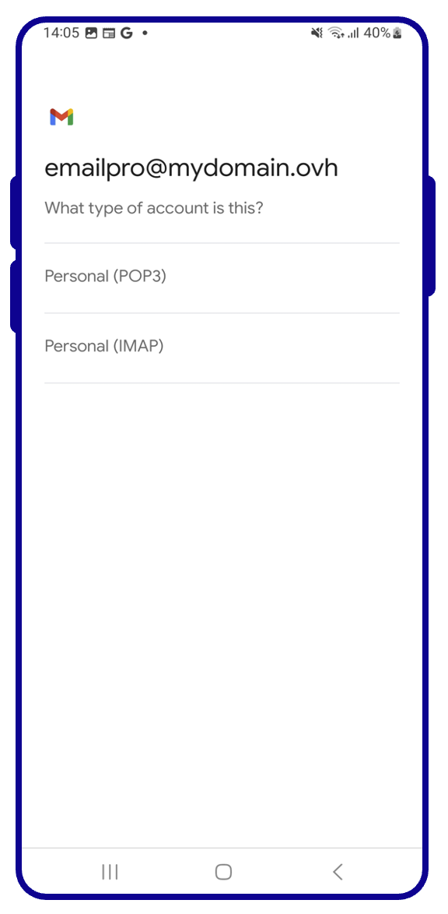
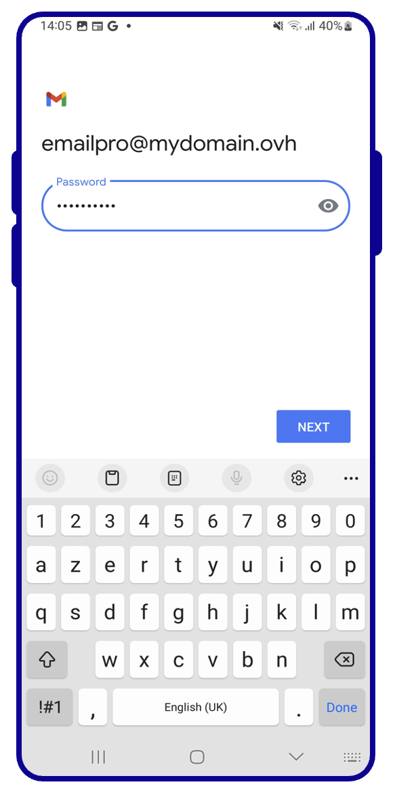
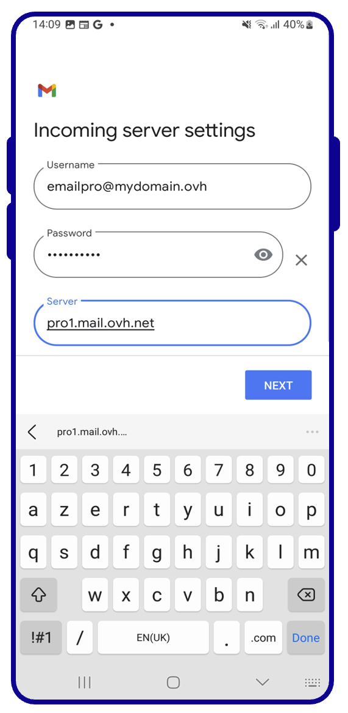
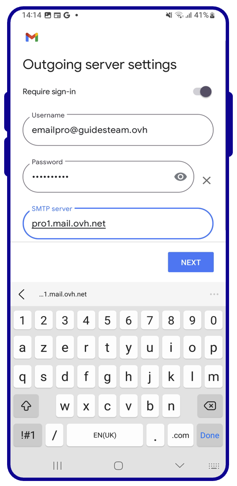
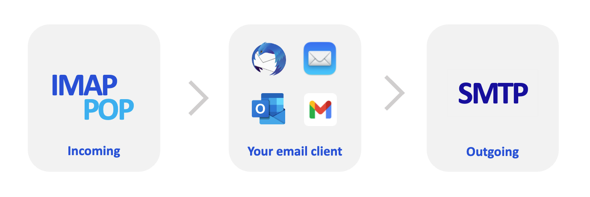

--- 
title: "Email Pro - Configurare un indirizzo email in Gmail per Android"
excerpt: "Scopri come configurare un account Email Pro su Android tramite l’applicazione Gmail"
updated: 2024-03-15
--- 

## Obiettivo

Gli indirizzi email del servizio Email Pro possono essere configurati su client di posta compatibili. per permetterti di inviare e ricevere messaggi dal dispositivo che preferisci. Questa guida ti mostra come configurare un indirizzo email Email Pro dall’applicazione Gmail presente sui dispositivi Android.

**Questa guida ti mostra come configurare un account Email Pro su Android tramite l’applicazione Gmail.**

> [!warning]
>
> OVHcloud mette a disposizione i servizi ma non si occupa della loro configurazione e gestione. garantirne il corretto funzionamento è quindi responsabilità dell’utente.
>
> Questa guida ti aiuta a eseguire le operazioni necessarie alla configurazione del tuo account. Tuttavia, in caso di difficoltà o dubbi, ti consigliamo di contattare un [provider specializzato](https://partner.ovhcloud.com/it/) o il fornitore del servizio. OVH non sarà infatti in grado di fornirti assistenza. Per maggiori informazioni consulta la sezione "Per saperne di più".

## Prerequisiti

- Disporre di una soluzione [Email Pro](https://www.ovhcloud.com/it/emails/email-pro/)
- Aver installato l’applicazione Gmail sul proprio dispositivo, che puoi scaricare da Google Play Store
- Disporre delle credenziali associate all’account email da configurare

> [!primary]
>
> Questa guida è stata realizzata da un dispositivo che utilizza la versione 13 di Android.

## Procedura

### Come aggiungere il tuo account email

> [!primary]
>
> Nel nostro esempio abbiamo utilizzato come nome del server "pro**?**.mail.ovh.net", dove "?" dovrà essere sostituito con il numero che indica il server del servizio Email Pro.
>
> Questa informazione è disponibile nello [Spazio Cliente OVHcloud](https://www.ovh.com/auth/?action=gotomanager&from=https://www.ovh.it/&ovhSubsidiary=it), sezione `Web Cloud`{.action}, selezionando `Email Pro`{.action}. Il nome del server è visibile nel riquadro **Connessione** della scheda `Informazioni generali`{.action}.
>

Sulla schermata Home del tuo dispositivo clicca sull’applicazione `Gmail`{.action}.

{.thumbnail .w-400}

L’aggiunta di un account sarà diversa **se nessun account è stato impostato** o **se un account è già stato impostato**. Seleziona la scheda corrispondente a una delle due situazioni menzionate:

> [!tabs]
> **Prima configurazione**
>>
>> Seleziona `Aggiungi un indirizzo email`{.action}  {.thumbnail .h-600}
>>
> **Configurazione esistente**
>>
>> 1. Clicca sul menu in alto a sinistra dello schermo  
>> 2. Seleziona `Parametri`{.action}  
>> 3. Seleziona `Aggiungi un account`{.action}  {thumbnail .h-600}

Segui i passaggi successivi di configurazione scorrendo le schede seguenti:

> [!tabs]
> **Step 1**
>> Dal menu dei tipi di account email, seleziona `Altro`{.action}.  
>>{.thumbnail .h-600}
>>
> **Step 2**
>> Inserisci il tuo indirizzo email.  
>>{.thumbnail .h-600}
>>
> **Step 3**
>> Selezionare il protocollo di ricezione delle email. Ti consigliamo di selezionare `Personale (IMAP)`{.action}   Trovi [maggiori informazioni sui protocolli POP e IMAP](#popimap) alla fine di questa guida per capirne le differenze.  
>>{.thumbnail .h-600}
>>
> **Step 4**
>> Inserisci la password del tuo indirizzo email.  
>>{.thumbnail .h-600}
>>
> **Step 5**
>> Inserisci le "**Impostazioni server in entrata**"  - **Nome utente**: Indirizzo email completo - **Password**: La password dell’indirizzo email - **Server**: inserisci **pro*?*.mail.ovh.net*** (sostituisci bene "**?**" con il numero del server).   
>>{.thumbnail .h-600}
>>
> **Step 6**
>> Inserisci le "**Impostazioni server in uscita**"  - **Nome utente**: Indirizzo email completo - **Password**: La password dell’indirizzo email - **Server SMTP**: inserisci **pro*?*.mail.ovh.net** (sostituisci bene "**?**" con il numero del server).   
>>{.thumbnail .h-600}
>>
> **Step 7**
>> Scegli la frequenza di sincronizzazione delle tue email in base alle tue preferenze.  
>>{.thumbnail .h-600}
>>
> **Step 8**
>> Determina il nome visualizzato del tuo indirizzo email nell’applicazione Gmail e clicca su `Avanti`{.action}.  
>>{.thumbnail .h-600}
>>

Una volta configurato l’indirizzo email, non ti resta che utilizzarlo! Da questo momento è possibile inviare e ricevere messaggi dall’applicazione Gmail.

> [!success]
>
> OVHcloud propone un’applicazione Web che permette di accedere al tuo indirizzo email da un browser Web, disponibile alla pagina <https://www.ovhcloud.com/it/mail/>. e accessibile con le credenziali del tuo account.

### Impostazioni POP, IMAP e SMTP

Per la ricezione delle email, durante la scelta del tipo di account, ti consigliamo di utilizzare **IMAP**. Tuttavia, è possibile selezionare **POP**. Per maggiori informazioni sul loro funzionamento, consulta la nostra sezione ["POP o IMAP, qual è la differenza?"](#popimap)

- **Per una configurazione in POP**

|Informazione|Descrizione|
|---|---|
|Nome utente|Inserisci l'indirizzo email **completo**|
|Password|Inserisci la password dell’indirizzo email|
|Server|pro**?**.mail.ovh.net (sostituisci "**?**" con il numero del tuo server)|
|Porta|995|
|Tipo di sicurezza|SSL/TLS|

- **Per una configurazione in IMAP**

|Informazione|Descrizione|
|---|---|
|Nome utente|Inserisci l'indirizzo email **completo**|
|Password|Inserisci la password dell’indirizzo email|
|Server|pro**?**.mail.ovh.net (sostituisci "**?**" con il numero del tuo server)|
|Porta|993|
|Tipo di sicurezza|SSL/TLS|

Per l’invio delle email, se hai necessità di inserire manualmente le impostazioni **SMTP** nelle preferenze dell’account, ecco i parametri da utilizzare:

- **Configurazione SMTP**

|Informazione|Descrizione|
|---|---|
|Nome utente|Inserisci l'indirizzo email **completo**|
|Password|Inserisci la password dell’indirizzo email|
|Server|pro**?**.mail.ovh.net (sostituisci "**?**" con il numero del tuo server)|
|Porta|587|
|Tipo di sicurezza|STARTTLS|

### POP o IMAP, qual è la differenza? 

Quando si configura l'indirizzo di posta elettronica manualmente, il client di posta elettronica chiede se si desidera utilizzare il protocollo **POP** (**P**ost **O**ffice **P**rotocol) o **IMAP** (**I**nternet **M**essage **A**ccess **P**rotocol). Per capirlo meglio, è necessario localizzare i protocolli POP e IMAP nella configurazione del tuo indirizzo email.

Durante la configurazione del client di posta, è necessario fornire le informazioni sul **server in entrata** per ricevere le email e sul **server in uscita** per inviare le email. Per inviare le email non è possibile scegliere, ma viene utilizzato il protocollo **SMTP** (**S**imple **M**ail **T**ransfer **P**rotocol). Per la ricezione, potrete quindi scegliere tra **POP** o **IMAP**.

{.thumbnail}

Per comprendere la differenza tra l'utilizzo del protocollo POP e IMAP, scomponiamo gli elementi che compongono l'elaborazione delle tue email in ricezione:

1. **Il tuo dispositivo**: un computer, uno smartphone o un tablet. È il vostro supporto di consultazione.

2. **Il client di posta**: software o applicazione dedicata alla gestione delle email. La sua scelta determinerà il livello di ergonomia e funzionalità di cui avrete bisogno per consultare le vostre email.

3. **Protocollo di ricezione**: una scelta fondamentale per il rilevamento delle email sul dispositivo. La sua scelta ha un impatto sugli altri dispositivi che consultano lo stesso account email.
    - **IMAP**: il client di posta interroga il server di posta e scarica le email sul tuo dispositivo. Quando visualizzi un messaggio non letto, il server lo contrassegna come "letto" di default. Gli altri dispositivi configurati in IMAP potranno visualizzare questo stato e controllare questo messaggio fino a quando non verrà eliminato da uno dei dispositivi.
    - **POP**: il tuo client di posta interroga il server di posta e scaricherà le email sul tuo dispositivo. Per impostazione predefinita, una volta scaricata l'email sul dispositivo, il messaggio viene eliminato dal server. Di conseguenza, gli altri dispositivi connessi a questo indirizzo email non potranno consultare questa email.

{.thumbnail}

> [!primary]
>
> Questa descrizione è una sintesi, rappresenta il funzionamento standard di entrambi i protocolli. È possibile configurare il POP in modo che le email non vengano eliminate quando si raccolgono i messaggi. L’obiettivo è descrivere il funzionamento nativo di questi due protocolli ed evitare operazioni aggiuntive per rispondere alle tue necessità.

## Per saperne di più

[Configurare un indirizzo email su Android tramite l’applicazione Gmail](/pages/web_cloud/email_and_collaborative_solutions/mx_plan/how_to_configure_android)

[Configurare un account Exchange su Android tramite l’applicazione Gmail](/pages/web_cloud/email_and_collaborative_solutions/microsoft_exchange/how_to_configure_android)

Contatta la nostra Community di utenti all’indirizzo [https://community.ovh.com/en/](https://community.ovh.com/en/).