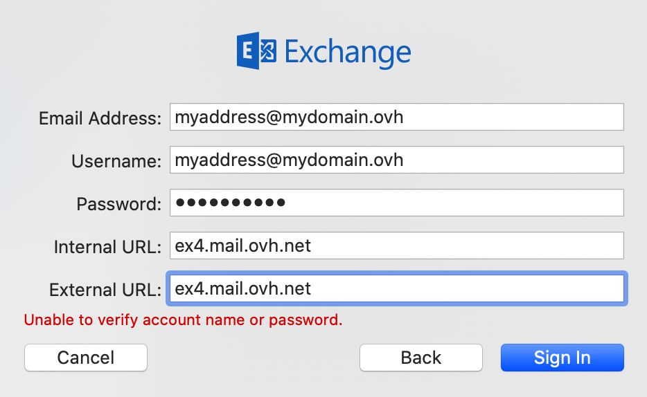

> [!primary]
>
> Questa traduzione è stata generata automaticamente dal nostro partner SYSTRAN. I contenuti potrebbero presentare imprecisioni, ad esempio la nomenclatura dei pulsanti o alcuni dettagli tecnici. In caso di dubbi consigliamo di fare riferimento alla versione inglese o francese della guida. Per aiutarci a migliorare questa traduzione, utilizza il pulsante "Contribuisci" di questa pagina.
>

## Obiettivo

Gli account Exchange possono essere configurati su client di posta compatibili. per permetterti di utilizzare il tuo account email dal dispositivo che preferisci. L'applicazione Mail su macOS è disponibile gratuitamente su tutti i Mac.

**Questa guida ti mostra come configurare il tuo indirizzo email Exchange su Mail di macOS.**

> [!warning]
>
> OVHcloud mette a disposizione i servizi ma non si occupa della loro configurazione e gestione. garantirne il corretto funzionamento è quindi responsabilità dell’utente.
>
> Questa guida ti aiuta a eseguire le operazioni necessarie alla configurazione del tuo account. Tuttavia, in caso di difficoltà o dubbi, ti consigliamo di contattare un [provider specializzato](/links/partner) o il fornitore del servizio. OVHcloud non sarà infatti in grado di fornirti assistenza. Per maggiori informazioni consulta la sezione "Per saperne di più".
>

## Prerequisiti

- Disporre di un indirizzo email [Exchange](links/web/emails-hosted-exchange)
- Disporre del software Mail installato sul tuo Mac
- Disporre delle credenziali associate all’indirizzo email da configurare

## Procedura

### Aggiungi l'account 

> [!primary]
>
> Nel nostro esempio, utilizziamo la dicitura server: ex**?**.mail.ovh.net. Sostituisci "?" con il numero che indica il server del tuo servizio Exchange.
>
> Ritrova questa cifra nel tuo [Spazio Cliente OVHcloud](links/manager), sezione `Web Cloud`{.action}, poi `Microsoft`{.action}.
> Clicca su `Exchange`{.action} e poi sulla piattaforma Exchange desiderata. Il nome del server è visibile nel riquadro **Connessione** della scheda `Informazioni generali`{.action}.
>

- **Al primo avvio dell’applicazione**: un assistente di configurazione apparirà direttamente sullo schermo e ti inviterà a scegliere il tipo di account.

- **Se è già stato impostato un account** : clicca su `Mail`{.action} nella barra del menu in alto nello schermo e poi su `Account`{.action}.

> [!tabs]
> **Step 1**
>> Seleziona `Exchange`{.action}  
>> {.thumbnail .w-400 .h-600}
>>
> **Step 2**
>> Inserisci il **Nome** del tuo account email e il tuo **Indirizzo email**, poi clicca su `Accedi`{.action}   
>> {.thumbnail .w-400 .h-600}
>>
> **Step 3**
>> Nella finestra seguente, clicca su `Configurazione manuale`{.action}:   - Definisci il **Nome** che comparirà nell’interfaccia di navigazione  - Lascia il tuo **indirizzo email** - Lascia il tuo **Password** già inserita   Per completare la configurazione, clicca su `Accedi`{.action}   
>> {.thumbnail .w-400 .h-600}
>>
> **Step 4**
>> Inserisci:   - Indirizzo email: lascia l’indirizzo email completo - Nome utente: lascia l’indirizzo email completo  - Password: lascia la tua **password**  - URL interno: **ex?.mail.ovh.net** (sostituisci il **?* con [il numero del tuo server Exchange](#addaccount)) - URL esterno: **ex?.mail.ovh.net** (sostituisci il **?* con il numero del tuo server Exchange](#addaccount)  
>>
>> > [!warning]
>> >
>> > È normale vedere apparire il messaggio in rosso "**Impossibile controllare il nome o la password dell'account**" quando viene visualizzata la prima finestra. Tuttavia, se il messaggio persiste dopo la convalida, significa che le informazioni immesse sono errate.  
>>
>> {.thumbnail .w-400 .h-600}
>>
> **Step 5**
>> Oltre alle tue email, puoi selezionare altre funzionalità Exchange che desideri gestire dal tuo Mac.   {.thumbnail .w-400 .h-600}

### Utilizza l'indirizzo email

Una volta configurato l’indirizzo email, non ti resta che utilizzarlo! A partire da questo momento puoi inviare e ricevere messaggi.

OVHcloud propone anche un'applicazione Web che permette di accedere al tuo indirizzo email da un browser Internet disponibile alla pagina <https://www.ovhcloud.com/it/mail/> accessibile utilizzando le credenziali del tuo account. Se hai bisogno di aiuto per effettuare questa operazione, consulta [il tuo account dall'interfaccia OWA](/pages/web_cloud/email_and_collaborative_solutions/using_the_outlook_web_app_webmail/email_owa).

### Recuperare un backup del tuo indirizzo email

Se è necessario effettuare un'operazione che potrebbe comportare la perdita dei dati del tuo account email, ti consigliamo di effettuare un backup preliminare dell'account email in questione. Per effettuare questa operazione consulta il paragrafo "**Esporta**" nella sezione "**Mail su Mac OS**" della nostra guida [Migrare manualmente il tuo indirizzo email](/pages/web_cloud/email_and_collaborative_solutions/migrating/manual_email_migration#esportare).

### Modifica i parametri esistenti

Se il tuo account email è già configurato e devi accedere alle impostazioni dell'account per modificarle:

- Clicca su `Mail`{.action} nella barra del menu in alto nello schermo e poi su `Preferenze...`{.action} **o** `Impostazioni...`{.action} in base alla versione di macOS.
- Nella scheda `Account`{.action}, seleziona l’account nella colonna di sinistra e clicca su `Impostazioni server`{.action}.

{.thumbnail .w-400 .h-600}

## Per saperne di più

[FAQ e-mail](/pages/web_cloud/email_and_collaborative_solutions/mx_plan/faq-emails)

[Configurare un account Email Pro su Mail di macOS](/pages/web_cloud/email_and_collaborative_solutions/email_pro/how_to_configure_mail_macos)

[Configurare un account email MX plan su Mail di macOS](/pages/web_cloud/email_and_collaborative_solutions/mx_plan/how_to_configure_mail_macos)

Contatta la nostra Community di utenti all’indirizzo <https://community.ovh.com/en/>.
