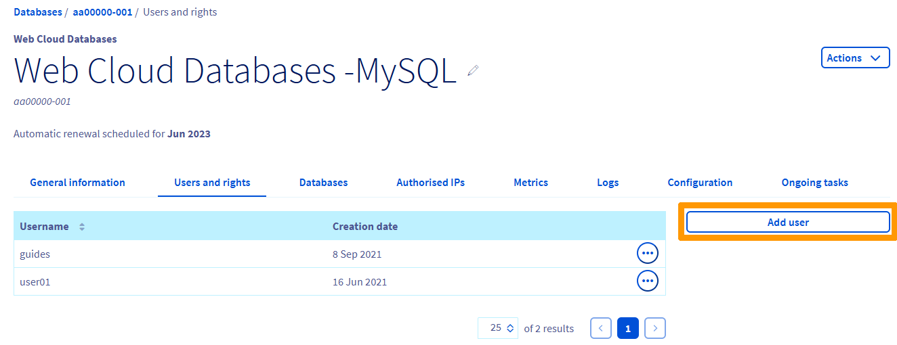
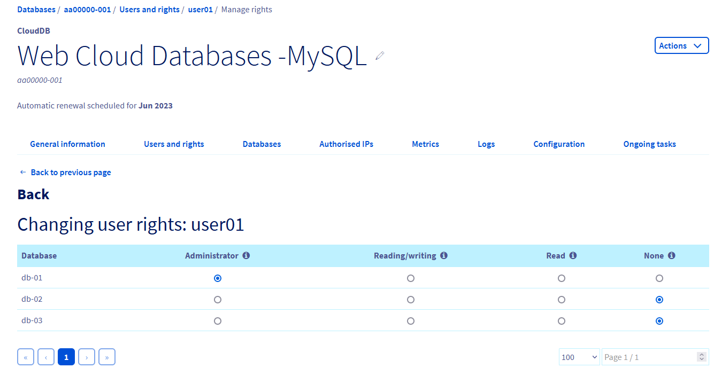
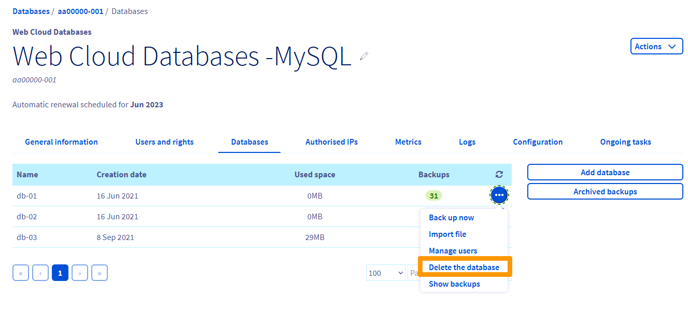

> [!primary]
> Questa traduzione è stata generata automaticamente dal nostro partner SYSTRAN. I contenuti potrebbero presentare imprecisioni, ad esempio la nomenclatura dei pulsanti o alcuni dettagli tecnici. In caso di dubbi consigliamo di fare riferimento alla versione inglese o francese della guida. Per aiutarci a migliorare questa traduzione, utilizza il pulsante "Contribuisci" di questa pagina.
>

## Obiettivo

Un database («DB») permette di conservare elementi cosiddetti dinamici quali, ad esempio, commenti o articoli. Oggi questi database sono utilizzati per quasi tutti i sistemi di gestione contenuti (Content Management System o CMS) come WordPress o Joomla! e sono accessibili digitando una password.

**Questa guida ti mostra come creare un database sul tuo database server.**

## Prerequisiti

- Disporre di una [istanza Web Cloud Databases](https://www.ovh.it/cloud/cloud-databases/){.external} (inclusa in un'offerta di[hosting web Performance](https://www.ovhcloud.com/fr/web-hosting/)
- Avere accesso allo [Spazio Cliente OVHcloud](/links/manager)

## Procedura

### Crea un database

Accedi allo [Spazio Cliente OVHcloud](/links/manager){.external}. Clicca sulla scheda `Web Cloud` e poi su `Web Cloud Databases`{.action}. Seleziona il nome del tuo database server.

Clicca sulla scheda `Database` e infine su `Aggiungi un database`{.action}

{.thumbnail}

Inserisci i campi rispettando i criteri indicati. È possibile creare un utente direttamente selezionando la casella **Creare un utente**:

- **Nome del database** (obbligatorio): il nome del tuo futuro database
- **Nome utente** (solo se hai selezionato la voce `Creare un utente`): è l'utente che potrà connettersi al tuo database ed effettuare richieste.
- **Permessi** (solo se la casella `Creare un utente` è selezionata): sono i permessi che saranno associati all'utente sul database. Per un utilizzo standard, scegli `Amministratore`{.action}. Sarà comunque possibile modificare i diritti assegnati in un secondo momento
- **Password**/**Conferma password** (solo se hai selezionato la voce `Creare un utente`): seleziona una password e confermala.

Clicca su `Conferma`{.action}.

{.thumbnail}

### Crea un utente

Per utilizzare un database server OVHcloud è necessario creare utenti con diritti specifici per connettersi a un database.

Accedi allo [Spazio Cliente OVHcloud](/links/manager){.external}. Clicca sulla scheda `Web Cloud` e poi su `Web Cloud Databases`{.action}. Seleziona il nome del tuo database server.

Clicca sulla scheda `Utenti e diritti` e poi su `Aggiungi un utente`{.action}

{.thumbnail}

Inserisci un "nome utente" e una "password" e clicca su `Conferma`{.action}.

### Gestire i diritti degli utenti

Per autorizzare un utente ad effettuare azioni su un database, è necessario assegnargli dei diritti.

Per gestire i diritti di ogni utente accedi al tuo [Spazio Cliente OVHcloud](/links/manager){.external}. Clicca sulla scheda `Web Cloud` e poi su `Web Cloud Databases`{.action}. Seleziona il nome del tuo database server. Clicca sulla scheda `Utenti e diritti`.

Clicca sui tre puntini `...`{.action} in corrispondenza dell'utente interessato e seleziona `Gestisci i permessi`{.action}.

{.thumbnail}

Nella colonna di sinistra "**database**" è riportata la lista dei database presenti sul tuo database server.

Ecco la descrizione dei 3 tipi di diritti proposti:

- `Amministratore`: autorizzazione delle richieste di tipo **Select/Insert/Update/Delete/Create/Alter/Drop**.
- `Lettura/Scrittura`: autorizzazione delle richieste di tipo **Select/Insert/Update/Delete**.
- `Lettura`: autorizzazione delle richieste di tipo **Select**.
- `Nessuno`: nessun diritto sul database.

> [!primary]
> 
> La suddivisione dei diritti sopra indicati è specifica di OVHcloud. In questo modo, un utente con i diritti `Amministratore` potrà utilizzare il **DLL** (Data Definition Language) e il **DML** (Data Manipulation Language), mentre un utente con i diritti `Lettura/Scrittura` Farà solo del DML (Data Manipulation Language).

{.thumbnail}

#### Elimina un database

> [!warning]
>
> Prima della eliminazione di un database, non sono presenti
> verifiche del contenuto presente sul database. L'operazione sarà quindi completata anche se
> i dati sono ancora memorizzati, per cui si raccomanda di effettuare
> un backup personale prima dell'eliminazione.
> 

Accedi allo [Spazio Cliente OVHcloud](/links/manager){.external}. Clicca sulla scheda `Web Cloud` e poi su `Web Cloud Databases`{.action}. Seleziona il nome del tuo database server.

Per eliminare un database sul tuo database server, vai nella scheda `Database`, poi clicca sul pulsante `...`{.action} a destra del database in questione e infine clicca su `Elimina il database`{.action}.

{.thumbnail}

## Per saperne di più

Per prestazioni specializzate (referenziamento, sviluppo, ecc...), contatta i [partner OVHcloud](https://partner.ovhcloud.com/it/directory).

Per usufruire di un supporto per l'utilizzo e la configurazione delle soluzioni OVHcloud, è possibile consultare le nostre soluzioni [offerte di supporto](https://www.ovhcloud.com/it/support-levels/).

Contatta la nostra Community di utenti all'indirizzo <https://community.ovh.com>.
