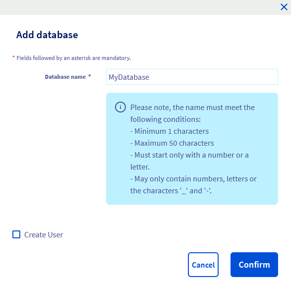

> [!primary]
> Tłumaczenie zostało wygenerowane automatycznie przez system naszego partnera SYSTRAN. W niektórych przypadkach mogą wystąpić nieprecyzyjne sformułowania, na przykład w tłumaczeniu nazw przycisków lub szczegółów technicznych. W przypadku jakichkolwiek wątpliwości zalecamy zapoznanie się z angielską/francuską wersją przewodnika. Jeśli chcesz przyczynić się do ulepszenia tłumaczenia, kliknij przycisk "Zgłoś propozycję modyfikacji" na tej stronie.
>

## Wprowadzenie

Baza danych (z ang.*database* lub w skrócie „DB”) umożliwia przechowywanie elementów dynamicznych, takich jak komentarze czy artykuły. Bazy danych są obecnie wykorzystywane przez niemal wszystkie systemy zarządzania treścią (*Content Management System* lub CMS), takie jak WordPress czy Joomla!.

**Dowiedz się, jak utworzyć bazę danych na serwerze baz danych.**

## Wymagania początkowe

- Posiadanie [instancji Web Cloud Databases](https://www.ovh.pl/cloud/cloud-databases/){.external} (zawartej w ofercie[hostingu www Performance](https://www.ovhcloud.com/pl/web-hosting/).
- Dostęp do [Panelu klienta OVHcloud](/links/manager).

## W praktyce

### Tworzenie bazy danych

Przejdź do Panelu [klienta OVHcloud](/links/manager){.external}. Kliknij kartę `Web Cloud`, a następnie `Web Cloud Databases`{.action}. Wybierz nazwę prywatnego serwera SQL.

Przejdź do karty `Bazy danych`, a następnie `Dodaj bazę danych`{.action}.

{.thumbnail}

Wypełnij pola zgodnie z podanymi kryteriami. Możesz utworzyć użytkownika bezpośrednio zaznaczając okienko **"Utwórz użytkownika"**:

- **Nazwa bazy** (obowiązkowa): nazwa Twojej przyszłej bazy danych.
- **Nazwa użytkownika** Podaj nazwę użytkownika, który będzie miał uprawnienia do logowania się do bazy i wykonywania zapytań (opcjonalne, jeśli okienko „**Utwórz użytkownika**” zostało zaznaczone).
- **Prawa** (tylko jeśli okienko `Utwórz użytkownika` jest zaznaczone): są to uprawnienia, które będą przypisane użytkownikowi w bazie danych. W przypadku standardowego użycia wybierz opcję Administrator. Uprawnienia mogą zostać zmienione.
- **Hasło**/**Potwierdź hasło**\** (tylko jeśli okienko `Utwórz użytkownika` jest zaznaczone): wybierz hasło i potwierdź je.

Następnie kliknij `Zatwierdź`{.action}.

{.thumbnail}

### Tworzenie użytkownika.

Aby korzystać z serwera baz danych OVHcloud, należy utworzyć użytkowników, którzy będą mieli określone uprawnienia do łączenia się z bazą danych. 

Przejdź do Panelu [klienta OVHcloud](/links/manager){.external}. Kliknij kartę `Web Cloud`, a następnie `Web Cloud Databases`{.action}. Wybierz nazwę serwera baz danych.

Następnie przejdź do zakładki `Użytkownicy i uprawnienia` i kliknij `Dodaj użytkownika`{.action}

{.thumbnail}

Wpisz nazwę użytkownika i hasło, a następnie kliknij `Zatwierdź`{.action}. 

### Zarządzanie prawami użytkowników

Aby zezwolić użytkownikowi na wykonywanie operacji na bazie danych, należy mu przypisać uprawnienia.

Aby zarządzać uprawnieniami każdego użytkownika, przejdź do [Panelu klienta OVHcloud](/links/manager){.external}. Kliknij kartę `Web Cloud`, a następnie `Web Cloud Databases`{.action}. Wybierz nazwę serwera baz danych. Teraz wybierz zakładkę `Użytkownicy i uprawnienia`{.action}.

Kliknij przycisk `(...)`{.action} po prawej stronie wybranego użytkownika, a następnie `Zarządzanie uprawnieniami`{.action}.

{.thumbnail}

W kolumnie po lewej stronie **"baza danych"** znajdziesz listę baz danych znajdujących się na serwerze baz danych.

Opis 3 rodzajów proponowanych uprawnień:

- `Administrator` : Zezwolenie na zapytania typu **Select / Insert / Update / Delete / Create / Alter / Drop**.
- `Odczyt/Zapis` : Zezwolenie na zapytania typu **Select / Insert / Update / Delete**.
- `Odczyt` : Zezwolenie na zapytania typu **Select**.
- `Żaden` : Brak uprawnień dla bazy.

> [!primary]
> 
> Podział wyżej wymienionych uprawnień jest właściwy dla OVHcloud. W ten sposób użytkownik posiadający uprawnienia `Administrator` będzie mógł utworzyć **DLL** (Data Definition Language) i **DML** (Data Manipulation Language), podczas gdy użytkownik posiadający uprawnienia `Odczyt/Zapis` będzie mógł utworzyć tylko **DML**.

{.thumbnail}

#### Usuwanie bazy danych

> [!warning]
>
> Przed usunięciem bazy danych na serwerze baz danych, nie jest sprawdzana zawartość bazy. Zostanie ona zatem usunięta, nawet jeśli dane są tam nadal zapisywane. Dlatego przed usunięciem bazy danych zaleca się wykonanie kopii zapasowej i pobranie jej.
> 

Przejdź do Panelu [klienta OVHcloud](/links/manager){.external}. Kliknij kartę `Web Cloud`, a następnie `Web Cloud Databases`{.action}. Wybierz nazwę prywatnego serwera SQL.

Aby usunąć bazę danych na serwerze baz danych, przejdź do zakładki `Bazy danych`, następnie kliknij przycisk `...`{.action} znajdujący się po prawej stronie odpowiedniej bazy danych i kliknij `Usuń bazę danych`{.action}.

{.thumbnail}

## Sprawdź również

W przypadku wyspecjalizowanych usług (pozycjonowanie, rozwój, etc.) skontaktuj się z [partnerami OVHcloud](https://partner.ovhcloud.com/pl/directory).

Jeśli chcesz otrzymywać wsparcie w zakresie konfiguracji i użytkowania Twoich rozwiązań OVHcloud, zapoznaj się z naszymi [ofertami pomocy](/links/support).

Dołącz do społeczności naszych użytkowników na stronie <https://community.ovh.com/en/>. 
