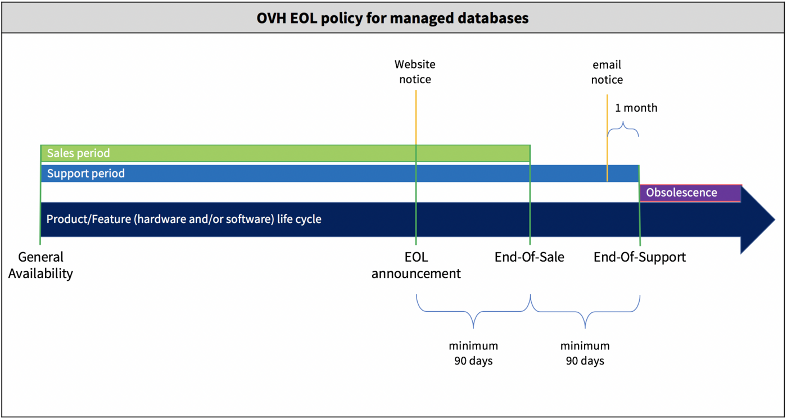

> [!primary]
> Esta tradução foi automaticamente gerada pelo nosso parceiro SYSTRAN. Em certos casos, poderão ocorrer formulações imprecisas, como por exemplo nomes de botões ou detalhes técnicos. Recomendamos que consulte a versão inglesa ou francesa do manual, caso tenha alguma dúvida. Se nos quiser ajudar a melhorar esta tradução, clique em "Contribuir" nesta página.
>

## Objetivo

As bases de dados geridas pela OVHcloud propõem vários sistemas de gestão de bases de dados (SGBD), como MySQL ou PostgreSQL. Cada versão destes programas atinge, em algum momento, o fim da sua venda e, em seguida, o fim do seu suporte. Pode ser atualizada pelos nossos serviços ou deixar de ser funcional ("fim de vida"). Desejamos permitir-lhe compreender o ciclo de vida das bases de dados geridas pela OVHcloud, de forma a melhor antecipar e preparar as suas evoluções.

**Descubra a política de fim de vida das bases de dados geridas pela OVHcloud.**

## Requisitos

Dispor de, pelo menos, uma das 3 ofertas seguintes:

- Uma das bases de dados incluídas com um [Alojamento web](/links/web/hosting).
- Uma [instance Web Cloud Databases](https://www.ovh.pt/cloud/cloud-databases/) {.external} (incluída numa oferta de [Alojamento web Performance](/links/web/hosting).
- Um pack de bases de dados [Start SQL](https://www.ovhcloud.com/pt/web-hosting/options/start-sql/).

## Instruções

### Produtos abrangidos

Os produtos abrangidos por esta política de fim de vida são:

- Os serviços Web Cloud Databases Web Hosting (também conhecidos como serviços SQLP Privado), instâncias SGBD dedicadas acessíveis através da rede Web Hosting ([ver os anúncios](/pages/web_cloud/web_cloud_databases/clouddb-eos-eol)).
- Os serviços SharedSQL Web Hosting, bases de dados MySQL disponíveis através da rede Web Hosting ([ver os anúncios](/pages/web_cloud/web_hosting/sql_eos_eol)).

### Definições e orientações da política de fim de vida

EOL = End Of Life

#### Anúncio de fim de vida ("End of Life" - EOL)

É a publicação das datas de fim de venda e de fim de suporte. Regra geral, a OVHcloud respeitará um prazo de 90 dias entre o anúncio de um fim de vida e a sua aplicação.

#### Fim de venda ("End of Sale")

O produto em causa não pode ser encomendado para além dessa data. Tal como anunciado anteriormente, esta regra aplica-se no mínimo 90 dias após o anúncio do fim da vida.

#### Fim do suporte ("End of Support")

A data até à qual o cliente pode beneficiar de assistência para o produto, de acordo com as modalidades do contrato de serviço ou as condições gerais da garantia.
Após essa data, o produto deixou de ser objeto de serviços de assistência e é considerado obsoleto.
Aplicável no mínimo seis meses após o anúncio do fim da vida.

#### Período de obsolescência

Ocorre após o fim do suporte.

Quando um serviço de bases de dados gerido pela OVHcloud se torna obsoleto, pode entrar nos dois casos listados abaixo.
Uma vez que pode haver consequências para o seu serviço, receberá uma notificação por e-mail pelo menos um mês antes do período de obsolescência.

**Grande atualização do serviço**

O seu serviço permanece ativo e nós atualizamos o seu SGBD para uma nova versão importante.
Este tipo de atualização pode induzir comportamentos indesejados nas suas aplicações. Por esta razão, aconselhamos os clientes a anteciparem as alterações das versões da sua base de dados e a não esperarem pelo fim do suporte.

**Cessação do serviço**

Em vez de atualizar o SGBD do seu serviço para a próxima versão maior disponível, podemos decidir cessar o serviço, por várias razões:

- A atualização é desaconselhada pelo editor do SGBD.

- O desenvolvimento do SGBD terminou.

A cessação pode ser efetuada de duas formas, consoante o caso:

- Interrompemos a renovação do serviço. Nesse caso, o serviço será suspenso no final do período de compromisso.

- Nós suspendemos o serviço e recreditamos o excedente pago.

## Saiba mais

Para serviços especializados (referenciamento, desenvolvimento, etc), contacte os [parceiros OVHcloud](/links/partner).

Se pretender usufruir de uma assistência na utilização e na configuração das suas soluções OVHcloud, consulte as nossas diferentes [ofertas de suporte](/links/support).

Fale com nossa comunidade de utilizadores: <https://community.ovh.com/en/>. 