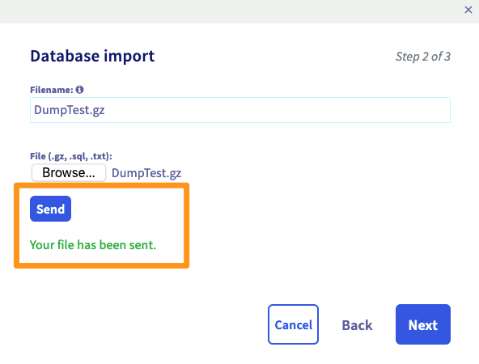

> [!primary]
> Tłumaczenie zostało wygenerowane automatycznie przez system naszego partnera SYSTRAN. W niektórych przypadkach mogą wystąpić nieprecyzyjne sformułowania, na przykład w tłumaczeniu nazw przycisków lub szczegółów technicznych. W przypadku jakichkolwiek wątpliwości zalecamy zapoznanie się z angielską/francuską wersją przewodnika. Jeśli chcesz przyczynić się do ulepszenia tłumaczenia, kliknij przycisk "Zgłoś propozycję modyfikacji" na tej stronie.
> 

## Wprowadzenie

W wyniku błędu bazy danych musisz mieć możliwość przywrócenia kopii zapasowej lub importu lokalnej bazy danych. 

**Dowiedz się, jak przywrócić i zaimportować bazę danych na serwer baz danych.**

## Wymagania początkowe

- Posiadanie [instancji Web Cloud Databases](https://www.ovhcloud.com/pl/web-cloud/databases/) (zawartej w ofercie[hostingu www Performance](https://www.ovhcloud.com/pl/web-hosting/).
- Dostęp do [Panelu klienta OVHcloud](https://www.ovh.com/auth/?action=gotomanager&from=https://www.ovh.pl/&ovhSubsidiary=pl).

## W praktyce

> [!primary]
>
> Pamiętaj, że rozwiązania [Web Cloud Databases](https://www.ovh.pl/cloud/cloud-databases/) nie dają dostępu do systemu zarządzania bazami danych, ale do baz danych na nim hostowanych.
> <br> - Pamiętaj, że nie ma dostępu "root".
> <br> - Ogólne polecenia SQL działają normalnie, a oprogramowanie takie jak HeidiSQL, SQuirreL lub Adminer jest w pełni kompatybilne.
>

### Przywracanie i importowanie bazy danych w Panelu klienta

Przejdź do Panelu [klienta OVHcloud](https://www.ovh.com/auth/?action=gotomanager&from=https://www.ovh.pl/&ovhSubsidiary=pl). Kliknij kartę `Web Cloud`, a następnie `Web Cloud Databases`{.action}. Wybierz nazwę serwera baz danych. Przejdź do karty `Bazy danych`.

W kolumnie **"Kopie zapasowe"** liczba ta odpowiada liczbie kopii zapasowych dostępnych dla Twojej bazy danych.

#### 1\. Przywróć istniejącą kopię zapasową

Kliknij przycisk `...`{.action} po prawej stronie bazy danych, a następnie `Wyświetl kopie zapasowe`{.action}.

Pojawi się lista dostępnych kopii zapasowych, kliknij przycisk `...`{.action} po prawej stronie wybranej kopii zapasowej, a następnie kliknij `Przywróć kopię zapasową`{.action}.

{.thumbnail}

> [!warning]
>
> Przywrócenie bazy danych wymaga usunięcia zawartości bazy danych i tym samym potencjalnej utraty danych. Jeśli nie jesteś pewien, co robisz, zalecamy wykonanie wcześniej kopii zapasowej.
> 

#### 2\. Importuj lokalną kopię zapasową

Kliknij przycisk `...`{.action} znajdujący się po prawej stronie bazy danych, a następnie kliknij `Importuj plik`{.action}.

{.thumbnail}

Masz dwie możliwości:

##### Import nowego pliku

Następnie kliknij **"Importuj nowy plik"**, a następnie `Dalej`{.action}.

Wpisz nazwę pliku importowanego, kliknij `Przeglądaj`{.action}, aby go wybrać, następnie `Wyślij`{.action}, a następnie wybierz `Dalej`{.action}.

> [!warning]
>
> Plik musi mieć format ".sql", ".txt" lub ".gz".
> 

{.thumbnail}

Zaznacz, jeśli chcesz, **"Wyczyść aktualną bazę danych"** przed importem i **"Wyślij e-mail po zakończeniu importu"**, aby otrzymać informacje o zakończeniu operacji na głównym adresie e-mail Twojego konta OVHcloud, po czym kliknij `Zatwierdź`{.action}.

##### Używanie istniejącego pliku

Jeśli wcześniej zaimportowałeś plik, możesz wybrać opcję **"Import istniejącego pliku"**.

Wybierz plik w rozwijanym menu i kliknij `Dalej`{.action}.

{.thumbnail}

Zaznacz, jeśli chcesz, **"Wyczyść aktualną bazę danych"** przed importem i **"Wyślij e-mail po zakończeniu importu"**, aby otrzymać informacje o zakończeniu operacji na głównym adresie e-mail Twojego konta OVHcloud, po czym kliknij `Zatwierdź`{.action}.

### Import bazy danych MySQL lub MariaDB z poziomu panelu klienta

W niektórych przypadkach pamięć RAM dostępna na serwerze baz danych nie pozwala na zrealizowanie żądanego importu. W takim przypadku zalecamy użycie narzędzia OVHcloud w Panelu klienta. Przejdź do sekcji ["Przywracanie i importowanie bazy danych w Panelu klienta"](./#przywracanie-i-importowanie-bazy-danych-w-panelu-klienta) niniejszego przewodnika.

#### Import bazy MySQL lub MariaDB z poziomu phpMyAdmin

Aby zaimportować bazę danych bezpośrednio z phpMyAdmin, należy najpierw się do niej zalogować. Aby to zrobić, możesz zapoznać się z tym [przewodnikiem](/pages/web_cloud/web_cloud_databases/connecting-to-database-on-database-server#logowanie-do-bazy-danych-mysql-lub-mariadb).

Po zalogowaniu się do phpMyAdmin wybierz bazę danych klikając na jej nazwę.

Następnie kliknij zakładkę `Importuj`{.action}.

Wybierz plik kopii zapasowej, klikając `Przeglądaj`{.action} (uwaga, plik nie może przekroczyć 100 MB).

> [!primary]
>
> Zalecamy podzielenie bazy danych na kilka plików, jeśli przekracza ona 100 MB i import z poziomu phpMyAdmin.<br>
> Aby zaimportować plik o rozmiarze większym niż 100 MB, wystarczy zalogować się do panelu klienta zgodnie z instrukcją ["Przywracanie i importowanie bazy danych w Panelu klienta"](./#przywracanie-i-importowanie-bazy-danych-w-panelu-klienta).

Pozostaw domyślne opcje i kliknij `Uruchom`{.action} import.

{.thumbnail}

#### Importuj bazę MySQL lub MariaDB za pomocą wiersza poleceń

Operacja ta jest możliwa tylko przez [SSH](/pages/web_cloud/web_hosting/ssh_on_webhosting) z poziomu hostingu OVHcloud.

```bash
cat nazwa_bazy.sql | mysql —host=serwer —user=uzytkownik —port=port —password=password nazwa_bazy
```
#### Import bazy MySQL lub MariaDB z pliku PHP

```php
1. <?php
2. echo "Twoja baza jest w trakcie przywracania.....<br>";
3. system("cat nom_de_la_base.sql | mysql --host=serveur --user=utilisateur --port=port --password=password nom_de_la_base");
4. Echo "Koniec. Twoja baza jest zainstalowana na tym hostingu.";
5. ?>
```

> [!warning]
>
> - Aby uniknąć sytuacji, w której ktoś miałby dostęp do tego pliku zawierającego wrażliwe dane, zapoznaj się z przewodnikiem dotyczącym bezpieczeństwa dostępu do tego pliku: ["Używanie .htaccess do ochrony hasła katalogu w serwisie WWW"](/pages/web_cloud/web_hosting/htaccess_protect_directory_by_password)
> - Operacja ta jest możliwa tylko z poziomu hostingu OVHcloud.
>

### Import bazy danych PostgreSQL poza Panel klienta

W niektórych przypadkach RAM dostępny na serwerze baz danych nie pozwala na zrealizowanie żądanego importu poza Panelem klienta. Przejdź do sekcji ["Przywracanie i importowanie bazy danych w Panelu klienta"](./#przywracanie-i-importowanie-bazy-danych-w-panelu-klienta) niniejszego przewodnika.

#### Importuj bazę PostgreSQL za pomocą wiersza poleceń

Operacja ta jest możliwa wyłącznie przez [SSH](/pages/web_cloud/web_hosting/ssh_on_webhosting) z poziomu hostingu OVHcloud w wersji stabilnej lub wyższej.

```bash
psql —host=serwer —port=port —user=uzytkownik —password=password nazwa_bazy < nazwa_bazy_bazy.sql
```

#### Import bazy PostgreSQL z pliku PHP

```php
1. <?php
2. echo "Twoja baza jest w trakcie przywracania.....<br>";
3. system("PGPASSWORD=mot_de_passe psql --host=serveur --port=port --user=utilisateur --password=password nom_de_la_base < nom_de_la_base.sql");
4. Echo "Koniec. Twoja baza jest zainstalowana na tym hostingu.";
5. ?>
```

> [!warning]
>
> - Aby uniknąć sytuacji, w której ktoś miałby dostęp do tego pliku zawierającego wrażliwe dane, sprawdź, czy zabezpieczysz dostęp do tego pliku za pomocą przewodnika ["Używanie .htaccess do ochrony hasła katalogu w serwisie WWW"](/pages/web_cloud/web_hosting/htaccess_protect_directory_by_password)
> - Operacja ta jest możliwa tylko z poziomu hostingu OVHcloud.
>

## Sprawdź również

W przypadku wyspecjalizowanych usług (pozycjonowanie, rozwój, etc.) skontaktuj się z [partnerami OVHcloud](https://partner.ovhcloud.com/pl/directory).

Jeśli chcesz otrzymywać wsparcie w zakresie konfiguracji i użytkowania Twoich rozwiązań OVHcloud, zapoznaj się z naszymi [ofertami pomocy](https://www.ovhcloud.com/pl/support-levels/).

Dołącz do społeczności naszych użytkowników na stronie <https://community.ovh.com/en/>.