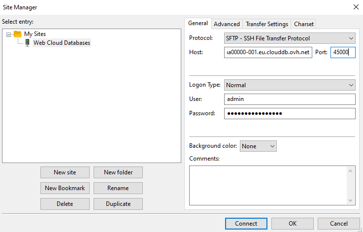

> [!primary]
> Esta tradução foi automaticamente gerada pelo nosso parceiro SYSTRAN. Em certos casos, poderão ocorrer formulações imprecisas, como por exemplo nomes de botões ou detalhes técnicos. Recomendamos que consulte a versão inglesa ou francesa do manual, caso tenha alguma dúvida. Se nos quiser ajudar a melhorar esta tradução, clique em "Contribuir" nesta página.
>

## Objetivo

A solução [Web Cloud Databases](/links/web/databases) permite alojar várias bases de dados. Em certas situações, poderá ter de consultar / recuperar os logs:

- do seu servidor Web Cloud Databases;
- para uma das bases de dados alojadas no seu servidor Web Cloud Databases.

**Saiba como recuperar os logs das suas bases de dados alojadas no servidor Web Cloud Databases**

## Requisitos

- Ter uma solução [Web Cloud Databases](/links/web/databases) (incluída ou não numa oferta de [alojamento web performance](/links/web/hosting)).
Ter acesso à [Área de Cliente OVHcloud](/links/manager){.external}.

## Instruções

> [!warning]
>
> A OVHcloud oferece-lhe serviços cuja configuração, gestão e responsabilidade é da sua responsabilidade. Assim, deverá assegurar o seu bom funcionamento.
> 
> Nós disponibilizamos-lhe este tutorial a fim de o acompanhar nas tarefas mais comuns. No entanto, se encontrar dificuldades, recomendamos que recorra a um [fornecedor especializado](/links/partner). Não poderemos proporcionar-lhe assistência na interpretação dos logs disponíveis com a sua solução Web Cloud Databases. Mais informações na secção "[Vá mais longe](#go-further)" deste tutorial.
>

### Consultar os logs da solução Web Cloud Databases em tempo real

Para verificar em tempo real os logs da sua solução Web Cloud Databases, execute as seguintes ações:

1. Aceda à [Área de Cliente OVHcloud](/links/manager).
2. Na linha situada no topo da Área de Cliente, clique no separador `Web Cloud`{.action}.
3. Na coluna da esquerda, clique no menu pendente `Web Cloud Databases`{.action}.
4. Selecione a solução Web Cloud Databases correspondente.
5. Na página que vai aparecer, clique no separador `Logs (registos)`{.action}.

{.thumbnail}

É nesta consola integrada que encontrará, em tempo real, os logs da sua solução Web Cloud Databases.

> [!primary]
>
> Como já indicado, os logs só estão disponíveis aqui em tempo real. Isto significa que estes logs apenas aparecerão se forem gerados no momento em que se encontrar no separador `Logs (registos)`{.action}. 
>
> Se sair do separador `Logs (registos)`{.action} e voltar a abri-lo mais tarde, o histórico anteriormente apresentado desaparecerá.
>

### Obter o histórico dos logs da sua solução Web Cloud Databases

Para recuperar o histórico dos logs da sua solução Web Cloud Databases deverá ligar-se em SFTP.

> [!warning]
>
> Antes de se ligar, verifique se o endereço IP público do posto que utiliza é autorizado no seu servidor Web Cloud Databases, com a opção `SFTP` selecionada.
>
> Para verificar esta informação, obtenha o endereço IP público do seu ponto de acesso à Internet e consulte **Permitir um endereço IP** de [este manual](/pages/web_cloud/web_cloud_databases/starting_with_clouddb).
>

Para encontrar as informações de ligação em SFTP à sua solução Web Cloud Databases, realize as seguintes ações:

1. Aceda à [Área de Cliente OVHcloud](/links/manager).
2. Na linha situada no topo da Área de Cliente, clique no separador `Web Cloud`{.action}.
3. Na coluna da esquerda, clique no menu pendente `Web Cloud Databases`{.action}.
4. Selecione a solução Web Cloud Databases correspondente.
5. Na página que é apresentada, permaneça no separador `Informações gerais`{.action} e posicione-se no quadro intitulado `Informações da ligação`{.action}.
6. Abaixo da menção `SFTP`{.action}, encontrará todas as informações necessárias para se ligar em SFTP.

> [!primary]
>
> Se não souber qual será a `Palavra-passe do servidor`{.action}, clique no botão `...`{.action} à direita para a alterar.
>

{.thumbnail}

Quando tiver recuperado as credenciais de acesso SFTP, ligue-se através de um cliente FTP (FileZilla, Cyberduck, WinSCP, etc.).

Para o FileZilla, aceda ao menu em cima à esquerda `File`{.action} e clique em `Site Manager`{.action}.

Clique em `New site`{.action} e introduza os parâmetros indicados anteriormente.

{.thumbnail}

O ficheiro de logs, chamado `stdout.log`, encontra-se na raiz.

Poderá descarregá-lo para o seu computador para o consultar.

> [!primary]
>
> Na raiz SFTP do servidor Web Cloud Databases, poderá aparecer um ficheiro adicional de logs intitulado `slow-query.log`.
> Este ficheiro contém o histórico dos pedidos lentos que foram executados no servidor Web Cloud Databases. 
> 
> O valor predefinido é de 1 segundo nas soluções Web Cloud Databases na variável **long_query_time**.
> 
> Graças a este ficheiro, poderá otimizar os seus scripts e o conteúdo da(s) sua(s) base(s) de dados a fim de melhorar as performances dos seus diferentes serviços associados.
>

## Quer saber mais? 

[Primeiros passos com o seu Web Cloud Databases](/pages/web_cloud/web_cloud_databases/starting_with_clouddb)
 
Para serviços especializados (referenciamento, desenvolvimento, etc), contacte os [parceiros OVHcloud](/links/partner).
 
Fale com nossa comunidade de utilizadores: <https://community.ovh.com/en/>.