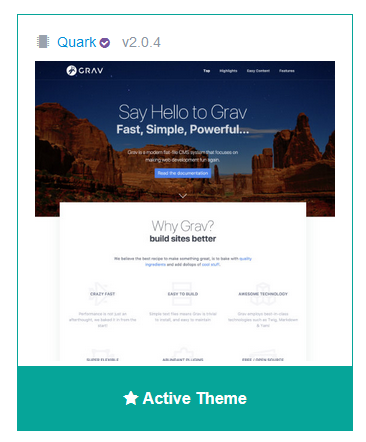

## Objectif

Le **CMS** (**C**ontent **M**anagement **S**ystem) Grav permet de développer rapidement des sites web. Conçu pour une gestion optimisée du contenu à travers des fichiers Markdown, Grav se prête parfaitement à la création de sites web personnels ou de projets pour petites entreprises, sans en compromettre la qualité ou la personnalisation.

**Découvrez comment installer manuellement le CMS Grav sur votre hébergement web OVHcloud.**

## Prérequis

- Disposer d'une offre d'[hébergement web OVHcloud](https://www.ovhcloud.com/fr-ca/web-hosting/).
- Disposer d'un [nom de domaine](https://www.ovhcloud.com/fr-ca/domains/).
- Être connecté à votre [espace client OVHcloud](https://ca.ovh.com/auth/?action=gotomanager&from=https://www.ovh.com/ca/fr/&ovhSubsidiary=qc).

## En pratique

### Préparer l'installation

Pour installer le CMS **Grav** sur votre [hébergement web](https://www.ovhcloud.com/fr-ca/web-hosting/), quelques préparatifs sont nécessaires.

Suivez l'**ensemble des étapes** décrites dans notre tutoriel sur l'[installation manuelle d'un CMS](/pages/web_cloud/web_hosting/cms_manual_installation) avant de poursuivre à l'étape suivante.

### Finaliser l'installation manuelle

> [!primary]
>
> Avant de continuer l'installation, videz le cache de votre navigateur Internet, afin d'éviter tout dysfonctionnement.
>

#### Se rendre sur votre site web Grav via votre navigateur

Saisissez votre nom de domaine dans la barre de recherche de votre navigateur Internet.

Si les fichiers source de Grav ont été placés correctement dans votre dossier racine, la page `your-domain/admin` s'affiche :

{.thumbnail}

Remplissez le formulaire pour créer un utilisateur admin, puis cliquez sur `Create User`{.action} pour confirmer.

Une fois connecté à l'interface d'administration de Grav, commencez à personnaliser votre site web.

### Personnaliser votre site web Grav

Une fois connecté en tant qu'administrateur au tableau de bord de Grav, accédez à une multitude d'options pour configurer et personnaliser votre site web.

#### Configuration générale du site web

##### Configuration du système

Dans le menu principal de Grav, cliquez sur `Configuration`{.action}, puis dans l'onglet `Site`{.action}, changez le nom de votre site web, définissez la langue par défaut ou encore configurez plusieurs paramètres liés à votre site web.

Pour améliorer les performances de votre site web, activez le cache. Cliquez sur l'onglet `System`{.action} puis sur `Caching`{.action}. Identifiez la ligne `Caching`{.action} et cochez `Yes`{.action}.

{.thumbnail}

##### Configuration des médias

Dans le menu principal de Grav, choisissez `Configuration`{.action}, puis dans l'onglet `System`{.action}, cliquez sur `Media`{.action}. Sur cette page, définissez le comportement des médias de votre site web, tels que les images, les vidéos ou encore les documents.

#### Gestion du contenu

##### Pages

Dans le menu principal de Grav, cliquez sur `Pages`{.action} pour voir la liste de toutes les pages de votre site web. Créez de nouvelles pages, modifiez les existantes et organisez la structure de votre site web.

Pour voir et modifier le contenu d'une page, cliquez sur le nom de la page dans la liste. Par exemple, cliquez sur `Home`{.action} pour modifier le titre de la page principale de votre site web ainsi que son contenu.

{.thumbnail}

##### Thèmes

Dans le menu principal de Grav, cliquez sur `Themes`{.action} pour changer l'apparence de votre site web. Installez de nouveaux thèmes ou sélectionnez-en un déjà installé comme thème actif.

Pour modifier le thème actif, cliquez sur le thème possédant l'étiquette `Active Theme`.

{.thumbnail}

Sur la page qui s'affiche, personnalisez votre thème actif.

#### Sauvegarde et mise à jour

##### Sauvegarde

Sauvegarder votre site web permet de le restaurer à un état antérieur en cas de dysfonctionnement.

Dans le menu principal de Grav, cliquez sur `Tools`{.action}, sélectionnez `Backup Now`{.action} en haut à droite de l'écran qui s'affiche, puis `Download Backup`{.action} pour télécharger la sauvegarde de votre site web sur votre ordinateur. En actualisant la page `Backup`, votre sauvegarde s'affiche dans la liste `Backup History`{.action}.

{.thumbnail}

##### Mise à jour

Garder votre système à jour est primordial pour la sécurité et la performance de votre site web. Dans le menu principal de Grav, cliquez sur `Check for Updates`{.action} pour découvrir les mises à jour disponibles.

### Conclusion

Vous venez d'installer manuellement le CMS Grav sur votre hébergement web OVHcloud. Après avoir configuré votre site web, ajouté du contenu, personnalisé le thème et installé des plugins, votre site web Grav est accessible en ligne via votre nom de domaine.

## Aller plus loin 

[Tutoriel - Installer manuellement WordPress](/pages/web_cloud/web_hosting/cms_manual_installation_wordpress)

[Tutoriel - Installer manuellement Joomla!](/pages/web_cloud/web_hosting/cms_manual_installation_joomla)

[Tutoriel - Installer manuellement Drupal](/pages/web_cloud/web_hosting/cms_manual_installation_drupal)

[Tutoriel - Installer manuellement PrestaShop](/pages/web_cloud/web_hosting/cms_manual_installation_prestashop)

[Tutoriel - Installer manuellement Pico](/pages/web_cloud/web_hosting/cms_manual_installation_pico)

[Tutoriel - Installer manuellement Typo3](/pages/web_cloud/web_hosting/cms_manual_installation_typo3)

[Tutoriel - Installer manuellement SPIP](/pages/web_cloud/web_hosting/cms_manual_installation_spip)

[Tutoriel - Installer manuellement un CMS sur mon hébergement](/pages/web_cloud/web_hosting/cms_manual_installation)

Pour des prestations spécialisées (référencement, développement, etc), contactez les [partenaires OVHcloud](https://partner.ovhcloud.com/fr-ca/directory/).

Échangez avec notre communauté d'utilisateurs sur <https://community.ovh.com>.