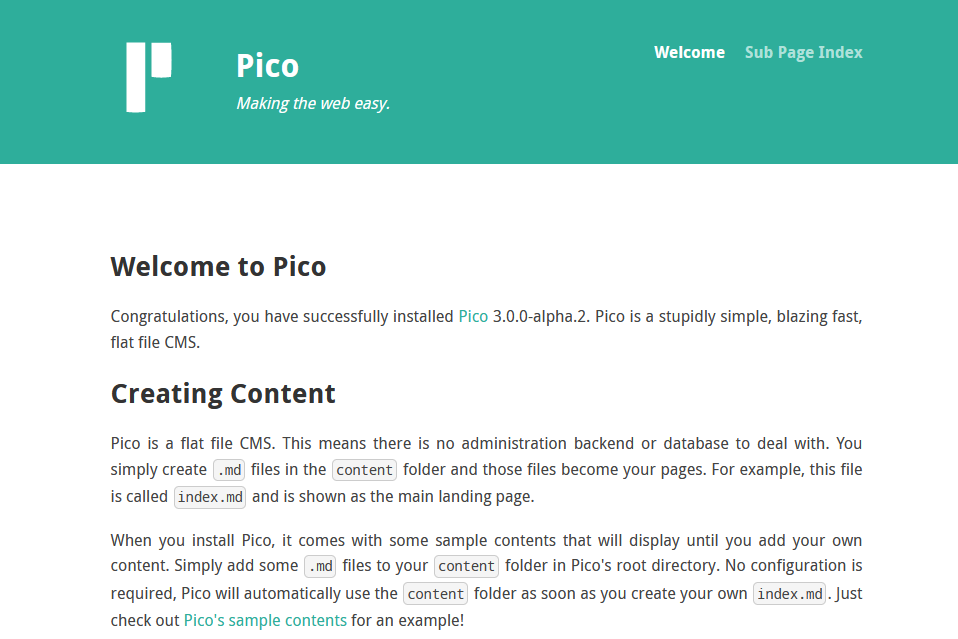

> [!primary]
> Esta traducción ha sido generada de forma automática por nuestro partner SYSTRAN. En algunos casos puede contener términos imprecisos, como en las etiquetas de los botones o los detalles técnicos. En caso de duda, le recomendamos que consulte la versión inglesa o francesa de la guía. Si quiere ayudarnos a mejorar esta traducción, por favor, utilice el botón "Contribuir" de esta página.
>

## Objetivo

El **CMS** (**C**ontent **M**anagement **S**ystem) Pico permite crear rápidamente sitios web. Diseñado para crear y gestionar contenido fácilmente con archivos Markdown, Pico es ideal para diseñar sitios web personales, carteras o proyectos de pequeñas empresas.

**Descubra cómo instalar manualmente el CMS Pico en su alojamiento web de OVHcloud.**

## Requisitos

- Tener contratado [un plan de hosting de OVHcloud](https://www.ovhcloud.com/es-es/web-hosting/).
- Tener un [dominio](https://www.ovhcloud.com/es-es/domains/).
- Estar conectado a su [área de cliente de OVHcloud](/links/manager).

## Procedimiento

### Preparar la instalación

Para instalar el CMS **Pico** en su [alojamiento web](https://www.ovhcloud.com/es-es/web-hosting/), es necesario realizar algunos preparativos.

Siga el**conjunto de pasos** descritos en nuestro tutorial sobre la [instalación manual de un CMS](/pages/web_cloud/web_hosting/cms_manual_installation) antes de continuar con el siguiente paso.

### Finalizar la instalación manual

> [!primary]
>
> Antes de continuar con la instalación, vacíe la caché de su navegador para evitar errores.
>

#### Ir a su sitio web Pico a través de su navegador

Introduzca su nombre de dominio en la barra de búsqueda de su navegador de Internet.

Si los archivos de origen de Pico se colocaron correctamente en la carpeta raíz, aparecerá la siguiente página:

{.thumbnail}

Pico es un CMS basado en archivos, lo que significa que toda la configuración y la creación de contenido se hace directamente modificando los archivos en el servidor. Estos son los pasos que debe seguir para configurar y personalizar su sitio web Pico.

#### Entender la estructura de carpetas de Pico

Después de la instalación, hay varias carpetas y archivos en el directorio principal de Pico. Los más importantes son:

- `content/`: contiene los archivos Markdown de su contenido
- `config/`: contiene el archivo de configuración `config.yml` de Pico
- `themes/`: contiene los temas de su sitio web
- `assets/`: contiene recursos estáticos como imágenes, hojas de estilos CSS, scripts JavaScript, etc.
- `plugins/`: contiene los plugins que desea utilizar

#### Configuración básica

**1. Configurar un sitio web** : abra el archivo `config/config.yml` con un editor de texto. Configure aquí los parámetros básicos del sitio web, como el título, la descripción, la dirección URL o los temas.

**2. Cambiar el título y la descripción de su sitio web** : busque las líneas para `site_title:` y `site_description:` en el archivo `config/config.yml` para actualizar el título y la descripción de su sitio web.

**3. Cambiar el título y la descripción de su sitio web** : Si tiene un nombre de dominio específico, busque la línea para `base_url:` en el archivo `config/config.yml` para actualizar el nombre de dominio de su sitio web. De lo contrario, deje el valor predeterminado `~`.

#### Agregar contenido

**1. Crear páginas** : Para añadir una nueva página al sitio web, cree un nuevo archivo Markdown (.md) en la carpeta `content/`. El nombre del archivo determinará la dirección URL de la página. Por ejemplo, `about.md` estará disponible en http://yourdomain.tld/about.

**2. Escribir contenido**: abra el archivo Markdown con un editor de texto y comience a escribir el contenido. Utilice la sintaxis Markdown para dar formato al texto, crear vínculos, insertar imágenes, etc. Por ejemplo, si desea editar la página principal (home) de su sitio web, abra el archivo `index.md` e inserte el contenido que desee.

**3. Comprobar contenido**: los archivos Markdown deben tener un encabezado YAML válido. Si el encabezado no se encuentra o tiene un formato incorrecto, es posible que Pico no lo reconozca como una página válida. Un ejemplo de encabezado YAML válido es:

```bash
---
title: About
---
Your content here
```

#### Personalizar el tema

**1. Seleccionar un tema**: Pico está instalado con un tema predeterminado, pero puede descargar más temas del [sitio web oficial de Pico](https://picocms.org/themes/) o crear el suyo propio.

**2. Modificar tema**: para cambiar de tema, actualice la sección `theme:` del archivo `config/config.yml` con el nombre de la carpeta del tema que desea utilizar.

**3. Personalizar el tema** : Puede modificar los archivos del tema en `themes/yourtheme/` para personalizar la apariencia de su sitio web. Esto puede incluir la edición de archivos HTML Twig, CSS y JavaScript.

#### Añadir plugins

Pico permite ampliar sus funcionalidades con plugins.

**1. Encontrar plugins** : Consulte el [sitio web oficial de Pico](https://picocms.org/plugins/) para ver la lista de plugins disponibles.

**2. Instalar un plugin** : Descargue el plugin y colóquelo en la carpeta `plugins/` de su instalación Pico.

**3. Configurar el plugin** : algunos plugins requieren una configuración adicional en `config/config.yml`. Siga las instrucciones del plugin.

### Conclusión

Acaba de instalar manualmente el CMS Pico en su alojamiento web de OVHcloud. Una vez que haya configurado su sitio web, haya añadido contenido, haya personalizado el tema y haya instalado plugins, podrá acceder a su sitio web de Pico en línea a través de su dominio.

## Más información <a name="go-further"></a>

[Tutorial - Instalar WordPress manualmente](/pages/web_cloud/web_hosting/cms_manual_installation_wordpress)

[Tutorial - Instalar Joomla! manualmente](/pages/web_cloud/web_hosting/cms_manual_installation_joomla)

[Tutorial - Instalar Drupal manualmente](/pages/web_cloud/web_hosting/cms_manual_installation_drupal)

[Tutorial - Instalar PrestaShop manualmente](/pages/web_cloud/web_hosting/cms_manual_installation_prestashop)

[Tutorial - Instalar Typo3 manualmente](/pages/web_cloud/web_hosting/cms_manual_installation_typo3)

[Tutorial - Instalar Grav manualmente](/pages/web_cloud/web_hosting/cms_manual_installation_grav)

[Tutorial - Instalar SPIP manualmente](/pages/web_cloud/web_hosting/cms_manual_installation_spip)

[Tutorial - Instalar manualmente un CMS en mi alojamiento](/pages/web_cloud/web_hosting/cms_manual_installation)
 
Para servicios especializados (posicionamiento, desarrollo, etc.), contacte con [partners de OVHcloud](https://partner.ovhcloud.com/es-es/directory/).
 
Interactúe con nuestra comunidad de usuarios en <https://community.ovh.com/en/>.