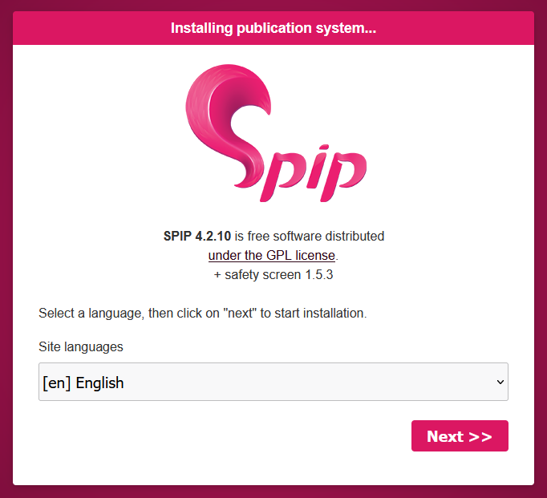

> [!primary]
> Questa traduzione è stata generata automaticamente dal nostro partner SYSTRAN. I contenuti potrebbero presentare imprecisioni, ad esempio la nomenclatura dei pulsanti o alcuni dettagli tecnici. In caso di dubbi consigliamo di fare riferimento alla versione inglese o francese della guida. Per aiutarci a migliorare questa traduzione, utilizza il pulsante "Contribuisci" di questa pagina.
>

## Obiettivo

Il **CMS** (**C**ontent **M**anagement **S**ystem) SPIP è una soluzione adatta ai siti editoriali come riviste online, giornali o siti istituzionali. Grazie all'architettura modulare e al sistema di ossature personalizzabili, SPIP permette di progettare siti Web ricchi di funzionalità, offrendo al tempo stesso una grande libertà di personalizzazione.

**Questa guida ti mostra come installare manualmente il CMS Spip su un hosting Web OVHcloud.**

## Prerequisiti

- Disporre di una soluzione di [hosting Web OVHcloud](https://www.ovhcloud.com/it/web-hosting/) che includa almeno un database.
- Disporre di un [dominio](https://www.ovhcloud.com/it/domains/).
- Avere accesso allo [Spazio Cliente OVHcloud](https://www.ovh.com/auth/?action=gotomanager&from=https://www.ovh.it/&ovhSubsidiary=it).

## Procedura

### Prepara l'installazione

Per installare il CMS **Spip** sul tuo [hosting Web](https://www.ovhcloud.com/it/web-hosting/), è necessario effettuare alcuni preparativi.

Segui gli step** descritti nel nostro tutorial sull'[installazione manuale di un CMS](/pages/web_cloud/web_hosting/cms_manual_installation) prima di proseguire con lo step successivo.

### Completa l'installazione manuale

> [!primary]
>
> Prima di continuare l'installazione, svuota la cache del tuo browser per evitare qualsiasi malfunzionamento.
>

#### Accedi al tuo sito Web Spip tramite il browser

Inserisci `your_domain/ecrire` nella barra di ricerca del tuo browser Internet per avviare l’installazione del tuo sito Web Spip. Viene visualizzata la pagina seguente:

{.thumbnail}

Seleziona la lingua del sito Web Spip e clicca su `Next`{.action} per confermare. Viene visualizzata la seguente schermata:

{.thumbnail}

Inserisci le informazioni di accesso al tuo DBMS (ad esempio, MySQL). Una volta stabilita la connessione al database, viene visualizzata la seguente schermata:

{.thumbnail}

Seleziona il database da utilizzare per il tuo sito Web o [crea un nuovo database](/pages/web_cloud/web_hosting/sql_create_database). Scegliere un prefisso per le tabelle del database. Di default, viene utilizzato il prefisso `spip`. Clicca su `Next`{.action} per confermare le informazioni. Viene visualizzata la seguente schermata:

{.thumbnail}

Inserisci le informazioni richieste e clicca su `Next`{.action} per confermare. Viene visualizzata la seguente schermata:

{.thumbnail}

La schermata mostra l’elenco dei plugin disponibili per il tuo sito Web e ti informa che l’installazione di Spip è stata completata.

### Conclusione

Il CMS Spip è stato installato manualmente sul tuo hosting Web OVHcloud. Il sito Web Spip è accessibile online dal tuo dominio. Per accedere allo spazio amministratore del sito Web Spip, digitare `your_domain/ecrire` nella barra di ricerca del browser Internet.

## Per saperne di più 

[Tutorial - Installare manualmente WordPress](/pages/web_cloud/web_hosting/cms_manual_installation_wordpress)

[Tutorial - Installare manualmente Joomla!](/pages/web_cloud/web_hosting/cms_manual_installation_joomla)

[Tutorial - Installare manualmente Drupal](/pages/web_cloud/web_hosting/cms_manual_installation_drupal)

[Tutorial - Installare manualmente PrestaShop](/pages/web_cloud/web_hosting/cms_manual_installation_prestashop)

[Tutorial - Installare manualmente Pico](/pages/web_cloud/web_hosting/cms_manual_installation_pico)

[Tutorial - Installare manualmente Typo3](/pages/web_cloud/web_hosting/cms_manual_installation_typo3)

[Tutorial - Installare manualmente Grav](/pages/web_cloud/web_hosting/cms_manual_installation_grav)

[Tutorial - Installare manualmente un CMS sul tuo hosting](/pages/web_cloud/web_hosting/cms_manual_installation)

[Creare un database sul proprio hosting Web](/pages/web_cloud/web_hosting/sql_create_database)
 
Per prestazioni specializzate (referenziamento, sviluppo, ecc...), contatta i [partner OVHcloud](https://partner.ovhcloud.com/it/directory/).
 
Contatta la nostra Community di utenti all'indirizzo <https://community.ovh.com/en/>.