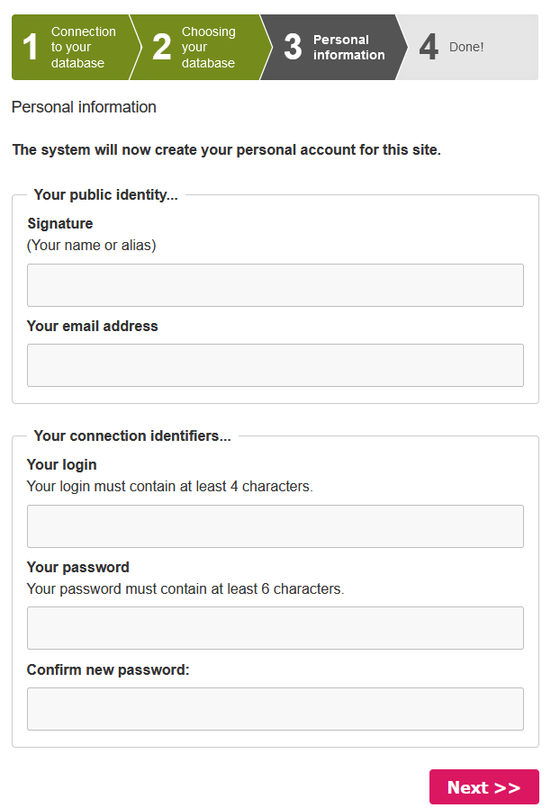
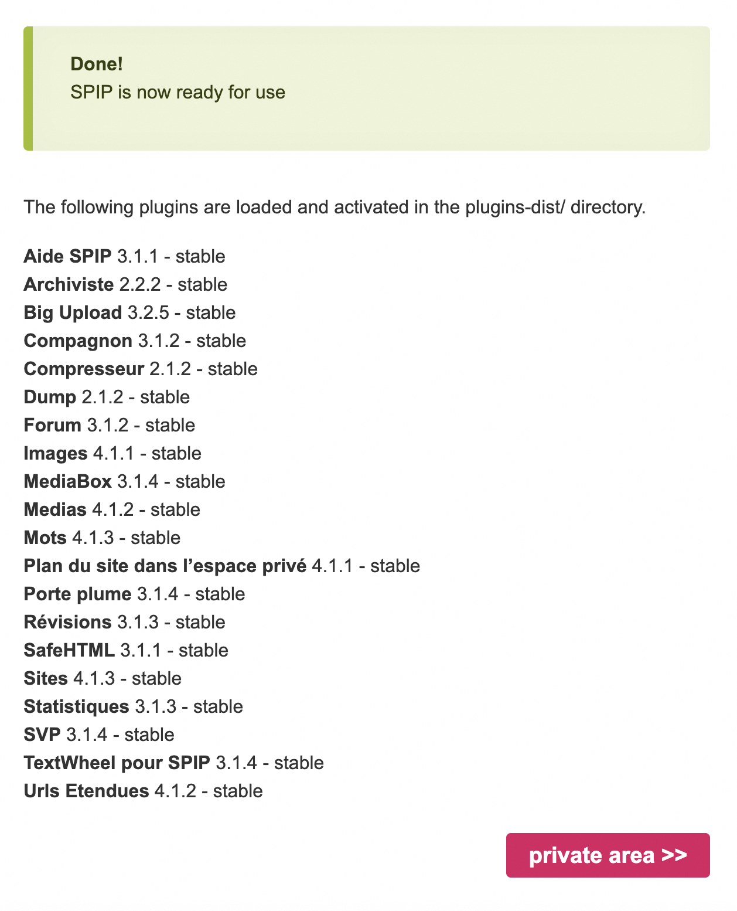

> [!primary]
> Tłumaczenie zostało wygenerowane automatycznie przez system naszego partnera SYSTRAN. W niektórych przypadkach mogą wystąpić nieprecyzyjne sformułowania, na przykład w tłumaczeniu nazw przycisków lub szczegółów technicznych. W przypadku jakichkolwiek wątpliwości zalecamy zapoznanie się z angielską/francuską wersją przewodnika. Jeśli chcesz przyczynić się do ulepszenia tłumaczenia, kliknij przycisk "Zgłoś propozycję modyfikacji" na tej stronie.
>

## Wprowadzenie

**CMS** (**C**ontent **M**anagement **S**ystem) SPIP to rozwiązanie odpowiednie dla stron redakcyjnych, takich jak czasopisma internetowe, gazety i witryny instytucjonalne. Dzięki modułowej architekturze i konfigurowalnym systemom szkieletów SPIP umożliwia projektowanie stron WWW o wielu funkcjach, oferując jednocześnie dużą dowolność personalizacji.

**Dowiedz się, jak ręcznie zainstalować CMS Spip na hostingu OVHcloud.**

## Wymagania początkowe

- Posiadanie hostingu [OVHcloud](https://www.ovhcloud.com/pl/web-hosting/) zawierającego co najmniej jedną bazę danych.
- Posiadanie [domeny](https://www.ovhcloud.com/pl/domains/).
- Dostęp do [panelu klienta OVHcloud](https://www.ovh.com/auth/?action=gotomanager&from=https://www.ovh.pl/&ovhSubsidiary=pl).

## W praktyce

### Przygotowanie do instalacji

Aby zainstalować CMS **Spip** na Twoim [hostingu](https://www.ovhcloud.com/pl/web-hosting/), należy wykonać kilka czynności przygotowawczych.

Postępuj zgodnie z **wszystkimi krokami** opisanymi w tutorialu [Instalacja ręczna modułu CMS](/pages/web_cloud/web_hosting/cms_manual_installation), aby przejść do kolejnego etapu.

### Zakończ instalację ręczną

> [!primary]
>
> Przed kontynuowaniem instalacji wyczyść pamięć podręczną przeglądarki internetowej, aby uniknąć problemów z jej działaniem.
>

#### Przejdź do strony WWW Spip za pomocą przeglądarki

Wpisz `your_domain/ecrire` w pasku wyszukiwania przeglądarki internetowej, aby rozpocząć instalację strony www Spip. Pojawi się następująca strona:

{.thumbnail}

Wybierz język Twojej strony WWW Spip i kliknij na `Next`{.action}, aby potwierdzić. Pojawi się następujący ekran:

{.thumbnail}

Wpisz informacje, aby zalogować się do Twojego DBMS (np. MySQL). Po pomyślnym zalogowaniu się do bazy danych zostanie wyświetlony następujący ekran:

{.thumbnail}

Wybierz bazę danych, której chcesz użyć na Twojej stronie WWW lub [utwórz nową](/pages/web_cloud/web_hosting/sql_create_database). Wybierz prefiks dla tabel w bazie danych. Domyślnie używany jest prefiks `spip`. Kliknij na `Next`{.action}, aby potwierdzić informacje. Pojawi się następujący ekran:

{.thumbnail}

Wprowadź wymagane informacje i kliknij na `Next`{.action}, aby potwierdzić. Pojawi się następujący ekran:

{.thumbnail}

Ekran wyświetla listę dostępnych wtyczek do Twojej strony WWW i informuje, że instalacja Spip przebiegła pomyślnie.

### Zakończenie

Właśnie ręcznie zainstalowałeś CMS Spip na Twoim hostingu OVHcloud. Twoja strona WWW Spip jest dostępna online za pośrednictwem Twojej domeny. Aby zalogować się do panelu administratora witryny Spip, wpisz `your_domain/ecrire` w pasku wyszukiwania przeglądarki internetowej.

## Sprawdź również 

[Tutorial - Zainstaluj ręcznie WordPress](/pages/web_cloud/web_hosting/cms_manual_installation_wordpress)

[Tutorial - Zainstaluj ręcznie Joomla!](/pages/web_cloud/web_hosting/cms_manual_installation_joomla)

[Tutorial - Zainstaluj ręcznie Drupal](/pages/web_cloud/web_hosting/cms_manual_installation_drupal)

[Tutorial - Zainstaluj ręcznie PrestaShop](/pages/web_cloud/web_hosting/cms_manual_installation_prestashop)

[Tutorial - Zainstaluj ręcznie Pico](/pages/web_cloud/web_hosting/cms_manual_installation_pico)

[Tutorial - Zainstaluj ręcznie Typo3](/pages/web_cloud/web_hosting/cms_manual_installation_typo3)

[Tutorial - Zainstaluj ręcznie Grav](/pages/web_cloud/web_hosting/cms_manual_installation_grav)

[Tutorial - Zainstaluj ręcznie CMS na hostingu](/pages/web_cloud/web_hosting/cms_manual_installation)

[Tworzenie bazy danych na hostingu OVHcloud](/pages/web_cloud/web_hosting/sql_create_database)
 
W przypadku wyspecjalizowanych usług (pozycjonowanie, rozwój, etc.) skontaktuj się z [partnerami OVHcloud](https://partner.ovhcloud.com/pl/directory/).
 
Dołącz do społeczności naszych użytkowników na stronie <https://community.ovh.com/en/>.