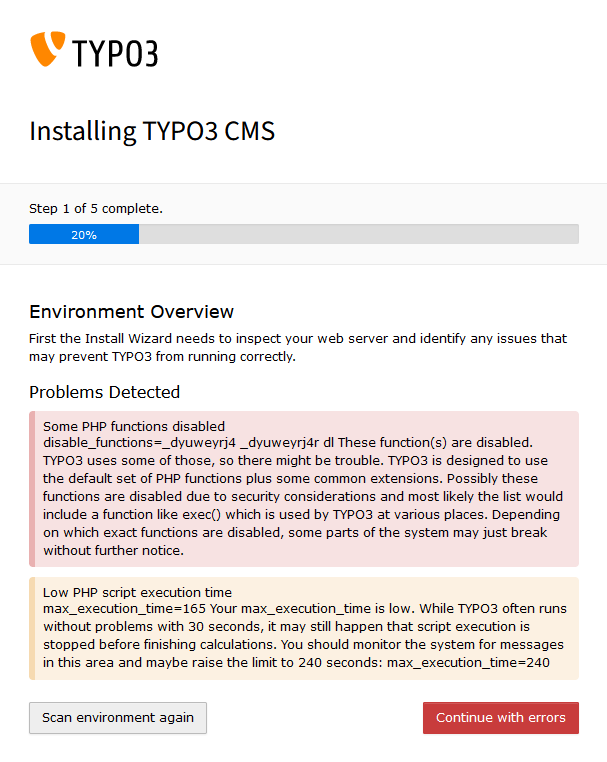

> [!primary]
> Diese Übersetzung wurde durch unseren Partner SYSTRAN automatisch erstellt. In manchen Fällen können ungenaue Formulierungen verwendet worden sein, z.B. bei der Beschriftung von Schaltflächen oder technischen Details. Bitte ziehen Sie im Zweifelsfall die englische oder französische Fassung der Anleitung zu Rate. Möchten Sie mithelfen, diese Übersetzung zu verbessern? Dann nutzen Sie dazu bitte den Button "Beitragen" auf dieser Seite.
>

## Ziel

Das **CMS** (**C**ontent **M**anagement **S**ystem) Typo3 ermöglicht die Entwicklung komplexer und skalierbarer Websites für Unternehmen jeder Größe von institutionellen Websites bis hin zu E-Commerce-Plattformen. Mit einer starken Entwicklergemeinschaft und einer breiten Palette von Erweiterungen bietet Typo3 leistungsstarke Tools, um Ihre Website an Ihre spezifischen Bedürfnisse anzupassen und zu erweitern.

**So installieren Sie das CMS Typo3 manuell auf Ihrem OVHcloud Webhosting.**

## Voraussetzungen

- Sie verfügen über ein [OVHcloud Webhosting](https://www.ovhcloud.com/de/web-hosting/) Angebot mit mindestens einer Datenbank.
- Sie besitzen eine [Domain](https://www.ovhcloud.com/de/domains/).
- Sie sind in Ihrem [OVHcloud Kundencenter](/links/manager) eingeloggt.

## In der praktischen Anwendung

### Installation vorbereiten

Für die Installation des CMS **Typo3** auf Ihrem [Webhosting](https://www.ovhcloud.com/de/web-hosting/) sind einige Vorbereitungen erforderlich.

Folgen Sie **allen Schritten** in unserer Anleitung zur [manuellen Installation eines CMS](/pages/web_cloud/web_hosting/cms_manual_installation), bevor Sie zum nächsten Schritt übergehen.

### Manuelle Installation abschließen

> [!primary]
>
> Leeren Sie vor der Installation den Cache Ihres Internetbrowsers, um Fehlfunktionen zu vermeiden.
>

#### Besuchen Sie Ihre Typo3 Website über Ihren Browser

Geben Sie Ihren Domainnamen in die Suchleiste Ihres Webbrowsers ein.

Wenn die Typo3 Quelldateien erfolgreich im Wurzelverzeichnis abgelegt wurden, wird die folgende Seite angezeigt:

{.thumbnail}

Erstellen Sie eine leere Datei mit dem Namen `FIRST_INSTALL` in dem Verzeichnis, in dem Sie die Dateien und Ordner der Typo3 Installation abgelegt haben. Aktualisieren Sie im Browser die Seite. Wenn Fehler auftreten, erscheint die folgende Anzeige mit einer Beschreibung der Fehler.

{.thumbnail}

Beheben Sie die Fehler, oder klicken Sie auf `Continue with errors`{.action}.

Der zweite Schritt der Installation wird angezeigt.

{.thumbnail}

Geben Sie Ihre DBMS-Informationen ein und klicken Sie auf `Continue`{.action}.

Der dritte Schritt der Installation wird angezeigt.

{.thumbnail}

Wählen Sie den Namen der Datenbank aus, die Sie für Ihre Website verwenden möchten, oder [erstellen Sie eine neue Datenbank](/pages/web_cloud/web_hosting/sql_create_database), und klicken Sie dann auf `Continue`{.action}.

Der vierte Schritt der Installation wird angezeigt.

{.thumbnail}

Geben Sie den Namen Ihrer Website und die Informationen zu Ihrem Admin-Benutzer ein.

Der fünfte und letzte Schritt der Installation wird angezeigt.

{.thumbnail}

Lesen Sie die angezeigten Informationen und wählen Sie die Option aus, die am besten zu Ihren Bedürfnissen passt:

- `Create Empty Starting Page`: Wählen Sie diese Option aus, um eine Standardseite für Ihre Website zu erstellen. Nachdem Sie diesen Schritt bestätigt haben, geben Sie Ihren Domainnamen in Ihrem Webbrowser ein, um auf Ihre Typo3 Website zuzugreifen.
- `Take me straight to the backend`: Wählen Sie diese Option aus, um zum Dashboard Ihrer Typo3 Website weitergeleitet zu werden. Mit diesem Dashboard erstellen Sie Ihre eigenen Webseiten, editieren Inhalte und vieles mehr. Weitere Informationen finden Sie in der [offiziellen Dokumentation von Typo3](https://docs.typo3.org/Home/GettingStarted.html){.external}.

Klicken Sie auf `Open the TYPO3 Backend`{.action}, um die gewählte Option zu bestätigen.

### Fazit

Sie haben das CMS Typo3 manuell auf Ihrem OVHcloud Webhosting installiert. Nachdem Sie Ihre Website konfiguriert, Inhalte hinzugefügt, das Theme personalisiert und Plugins installiert haben, ist Ihre Typo3 Website online über Ihren Domainnamen verfügbar.

## Weiterführende Informationen 

[Tutorial - Manuelle Installation von WordPress](/pages/web_cloud/web_hosting/cms_manual_installation_wordpress)

[Tutorial - Manuelle Installation von Joomla!](/pages/web_cloud/web_hosting/cms_manual_installation_joomla)

[Tutorial - Manuelle Installation von Drupal](/pages/web_cloud/web_hosting/cms_manual_installation_drupal)

[Tutorial - Manuelle Installation von PrestaShop](/pages/web_cloud/web_hosting/cms_manual_installation_prestashop)

[Tutorial - Manuelle Installation von Pico](/pages/web_cloud/web_hosting/cms_manual_installation_pico)

[Tutorial - Manuelle Installation von Grav](/pages/web_cloud/web_hosting/cms_manual_installation_grav)

[Tutorial - Manuelle Installation von SPIP](/pages/web_cloud/web_hosting/cms_manual_installation_spip)

[Tutorial - Manuelle Installation eines CMS auf einem Webhosting](/pages/web_cloud/web_hosting/cms_manual_installation)

[Datenbank auf Ihrem Webhosting erstellen](/pages/web_cloud/web_hosting/sql_create_database)
 
Kontaktieren Sie für spezialisierte Dienstleistungen (SEO, Web-Entwicklung etc.) die [OVHcloud Partner](https://partner.ovhcloud.com/de/directory/).
 
Für den Austausch mit unserer User Community gehen Sie auf <https://community.ovh.com/en/>.
