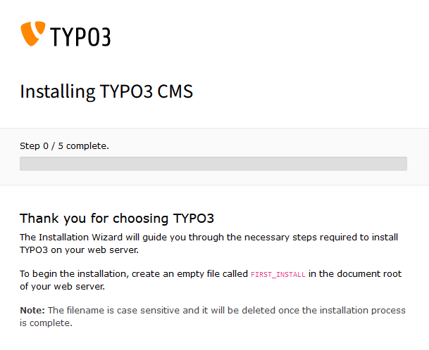

## Objective

The **CMS** (**C**ontent **M**anagement **S**ystem) Typo3 enables the development of complex and scalable websites for businesses of all sizes, from institutional sites to e-commerce platforms. With a strong developer community and a wide range of extensions, Typo3 offers powerful tools to customize and expand your site to your specific needs.

**Find out how to manually install the Typo3 CMS on your OVHcloud web hosting plan.**

## Requirements

- An [OVHcloud web hosting plan](https://www.ovhcloud.com/en-ie/web-hosting/) that contains at least one database
- A [domain name](https://www.ovhcloud.com/en-ie/domains/).
- Access to the [OVHcloud Control Panel](https://www.ovh.com/auth/?action=gotomanager&from=https://www.ovh.ie/&ovhSubsidiary=ie).

## Instructions

### Prepare for installation

To install the **Typo3** CMS on your [web hosting](https://www.ovhcloud.com/en-ie/web-hosting/), you will need to make some preparations.

Follow the **full set of steps** described in our tutorial on [installing a CMS manually](/pages/web_cloud/web_hosting/cms_manual_installation) before continuing on to the next step.

### Finalize manual installation

> [!primary]
>
> Before continuing with the installation, clear your web browser cache to avoid any errors.
>

#### Go to your Typo3 website via your browser

Enter your domain name in the search bar of your web browser.

If the source files for Typo3 were placed correctly in your root folder, the following page appears:

{.thumbnail}

As shown, create an empty file named `FIRST_INSTALL` in the directory where you uploaded your Typo3 files and folders. Go back to your web browser and refresh the page. If any errors occur, the screen below will appear, with a description of the errors.

{.thumbnail}

Resolve the errors or click `Continue with errors`{.action}.

The second step of the installation is displayed.

{.thumbnail}

Enter the information for your DBMS, then click `Continue`{.action}.

The third step of the installation is displayed.

{.thumbnail}

Select the name of the database you want to use for your website, or [create a new one](/pages/web_cloud/web_hosting/sql_create_database), then click `Continue`{.action}.

The fourth step of the installation is displayed.

{.thumbnail}

Enter the name of your website, as well as information about your admin user.

The fifth and final step of the installation is displayed.

{.thumbnail}

Read the information displayed on the screen and choose the option that suits you:

- `Create empty starting page`: Select this option to create a default page for your website. Once you have confirmed this step, enter your domain name in your web browser to access your Typo3 website.
- `Take me straight to the backend`: Select this option to be redirected to your Typo3 website's dashboard. With this dashboard, you can create your web pages, edit their content, and much more. You can find more information in the [official documentation of Typo3](https://docs.typo3.org/Home/GettingStarted.html){.external}.

Click `Open the TYPO3 Backend`{.action} to confirm the option you have just chosen.

### Conclusion

You have just manually installed CMS Typo3 on your OVHcloud web hosting plan. After configuring your website, adding content, customizing the theme and installing plugins, your Typo3 website is accessible online via your domain name.

## Go further 

[Tutorial - Installing WordPress manually](/pages/web_cloud/web_hosting/cms_manual_installation_wordpress)

[Tutorial - Installing Joomla! manually](/pages/web_cloud/web_hosting/cms_manual_installation_joomla)

[Tutorial - Installing Drupal manually](/pages/web_cloud/web_hosting/cms_manual_installation_drupal)

[Tutorial - Installing PrestaShop manually](/pages/web_cloud/web_hosting/cms_manual_installation_prestashop)

[Tutorial - Installing Pico manually](/pages/web_cloud/web_hosting/cms_manual_installation_pico)

[Tutorial - Installing Grav manually](/pages/web_cloud/web_hosting/cms_manual_installation_grav)

[Tutorial - Installing SPIP manually](/pages/web_cloud/web_hosting/cms_manual_installation_spip)

[Tutorial - Manually install a CMS on my hosting plan](/pages/web_cloud/web_hosting/cms_manual_installation)

[Creating a database on your web hosting plan](/pages/web_cloud/web_hosting/sql_create_database)
 
For specialised services (SEO, development, etc.), contact [OVHcloud partners](https://partner.ovhcloud.com/en-ie/directory/).
 
Join our community of users on <https://community.ovh.com/en/>.