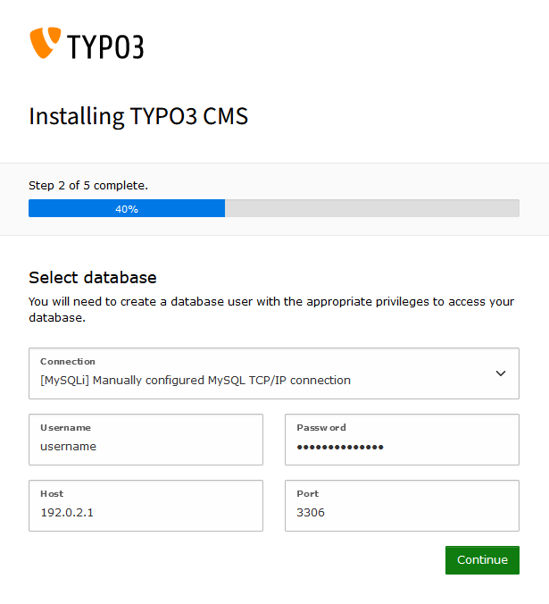
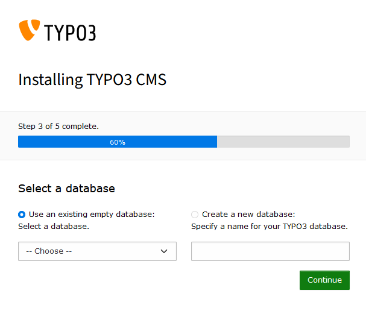

> [!primary]
> Esta traducción ha sido generada de forma automática por nuestro partner SYSTRAN. En algunos casos puede contener términos imprecisos, como en las etiquetas de los botones o los detalles técnicos. En caso de duda, le recomendamos que consulte la versión inglesa o francesa de la guía. Si quiere ayudarnos a mejorar esta traducción, por favor, utilice el botón "Contribuir" de esta página.
>

## Objetivo

El **CMS** (**C**ontent **M**anagement **S**ystem) Typo3 permite desarrollar sitios web complejos y escalables para empresas de todos los tamaños, desde sitios web institucionales hasta plataformas de e-commerce. Con una gran comunidad de desarrolladores y una amplia gama de extensiones, TYPO3 ofrece potentes herramientas para personalizar y ampliar su sitio web según sus necesidades específicas.

**Descubra cómo instalar manualmente el CMS Typo3 en su alojamiento web de OVHcloud.**

## Requisitos

- Tener contratado un plan de [alojamiento web de OVHcloud](https://www.ovhcloud.com/es/web-hosting/) que incluya al menos una base de datos.
- Tener un [dominio](https://www.ovhcloud.com/es/domains/).
- Estar conectado a su [área de cliente de OVHcloud](/links/manager).

## Procedimiento

### Preparar la instalación

Para instalar el CMS **Typo3** en su [alojamiento web](https://www.ovhcloud.com/es/web-hosting/), es necesario realizar algunos preparativos.

Siga el **conjunto de pasos** descritos en nuestro tutorial sobre la [instalación manual de un CMS](/pages/web_cloud/web_hosting/cms_manual_installation) antes de continuar con el siguiente paso.

### Finalizar la instalación manual

> [!primary]
>
> Antes de continuar con la instalación, vacíe la caché de su navegador para evitar posibles fallos de funcionamiento.
>

#### Visite su sitio web de Typo3 a través de su navegador

Introduzca su nombre de dominio en la barra de búsqueda de su navegador de Internet.

Si los archivos de origen de Typo3 se han colocado correctamente en la carpeta raíz, aparecerá la siguiente página:

{.thumbnail}

Cree un archivo vacío denominado `FIRST_INSTALL` en el directorio en el que haya colocado los archivos y carpetas de Typo3. Vuelva a su navegador de Internet y actualice la página. Si se producen errores, aparecerá la siguiente pantalla con la descripción de los errores.

{.thumbnail}

Resuelva los errores o haga clic en `Continue with errors`{.action}.

Aparecerá el segundo paso de la instalación.

{.thumbnail}

Introduzca la información relativa a su SGBD y haga clic en `Continue`{.action}.

Aparecerá el tercer paso de la instalación.

{.thumbnail}

Seleccione el nombre de la base de datos que desea utilizar para su sitio web o [cree una nueva](/pages/web_cloud/web_hosting/sql_create_database) y haga clic en `Continue`{.action}.

Aparecerá el cuarto paso de la instalación.

{.thumbnail}

Introduzca el nombre de su sitio web y la información relativa a su usuario admin.

Aparecerá el quinto y último paso de la instalación.

{.thumbnail}

Lea la información que aparece en la pantalla y elija la opción que desee:

- `Create empty starting page`: seleccione esta opción para crear una página predeterminada para su sitio web. Una vez validado este paso, introduzca su nombre de dominio en su navegador de Internet para acceder a su sitio web Typo3.
- `Take me straight to the backend`: seleccione esta opción para ser redirigido al panel de control de su sitio web Typo3. A través de este dashboard, deberá crear usted mismo sus páginas web, alimentar su contenido y mucho más. Para más información, consulte la [documentación oficial de Typo3](https://docs.typo3.org/Home/GettingStarted.html){.external}.

Haga clic en `Open the TYPO3 Backend`{.action} para confirmar la opción que acaba de elegir.

### Conclusión

Acaba de instalar manualmente el CMS Typo3 en su alojamiento web de OVHcloud. Después de configurar su sitio web, agregar contenido, personalizar el tema e instalar plugins, su sitio web de Typo3 estará accesible en línea a través de su nombre de dominio.

## Más información 

[Tutorial - Instalar WordPress manualmente](/pages/web_cloud/web_hosting/cms_manual_installation_wordpress)

[Tutorial - Instalar Joomla! manualmente](/pages/web_cloud/web_hosting/cms_manual_installation_joomla)

[Tutorial - Instalar Drupal manualmente](/pages/web_cloud/web_hosting/cms_manual_installation_drupal)

[Tutorial - Instalar PrestaShop manualmente](/pages/web_cloud/web_hosting/cms_manual_installation_prestashop)

[Tutorial - Instalar Pico manualmente](/pages/web_cloud/web_hosting/cms_manual_installation_pico)

[Tutorial - Instalar Grav manualmente](/pages/web_cloud/web_hosting/cms_manual_installation_grav)

[Tutorial - Instalar SPIP manualmente](/pages/web_cloud/web_hosting/cms_manual_installation_spip)

[Tutorial - Instalar manualmente un CMS en mi alojamiento](/pages/web_cloud/web_hosting/cms_manual_installation)

[Crear una base de datos en un alojamiento web](/pages/web_cloud/web_hosting/sql_create_database)
 
Para servicios especializados (posicionamiento, desarrollo, etc.), contacte con [partners de OVHcloud](https://partner.ovhcloud.com/es/directory/).
 
Interactúe con nuestra comunidad de usuarios en <https://community.ovh.com/en/>.