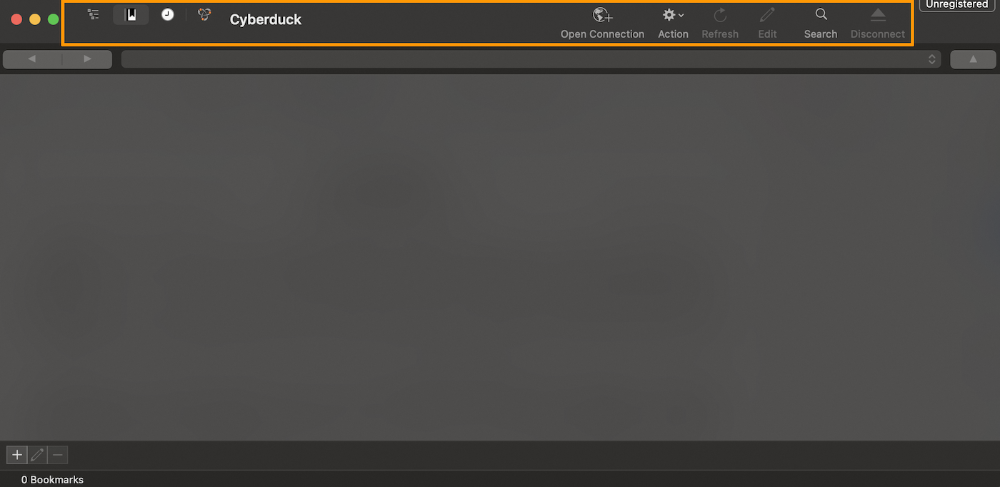
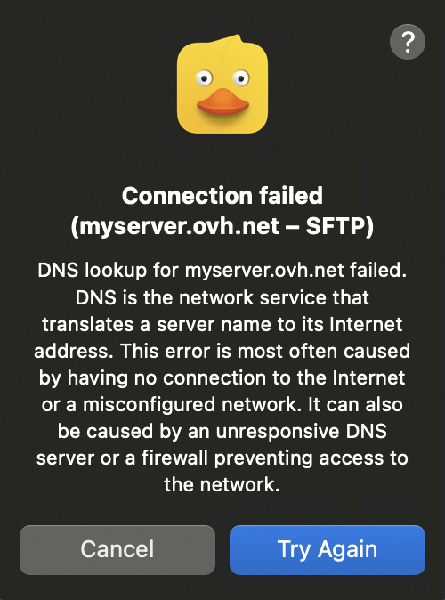
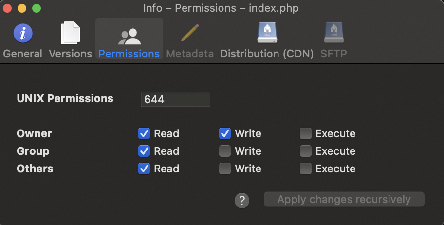

## Objective

Available for macOS and Windows, Cyberduck is an open-source file transfer application. You can use it to log in to your web hosting plan’s FTP storage space (using FTP or SFTP protocol).

To download Cyberduck, go to the [official website](https://cyberduck.io/) of the application.

{.thumbnail}

> [!primary]
>
> - Cyberduck is an application available on macOS and Windows. Because Cyberduck's interface and features are similar on both operating systems, the tutorial can be applied universally, even though it relies on screenshots from the Windows verion.
> - This guide has been created with a free version of the application, version 8.7.2, downloaded from the [official website](https://cyberduck.io/).
>

> [!warning]
>
> OVHcloud provides services for which you are responsible with regard to their configuration and management. It is therefore your responsibility to ensure that they function correctly.
> 
> This guide is designed to help you with common tasks. Nevertheless, we recommend contacting a [specialist provider](https://partner.ovhcloud.com/en/directory/) or the software publisher if you encounter any difficulties. OVHcloud cannot provide you with technical support in this regard. You can find more information in the [Go further](#go-further) section of this guide.
> 

## Requirements

- An [OVHcloud web hosting plan](https://www.ovhcloud.com/en/web-hosting/)
- The Cyberduck application downloaded and installed

## Instructions

### Interface

When you start the application, the interface below will appear.

- The top part, highlighted in orange, corresponds to the toolbar. You can use it to establish a connection to your hosting space, browse the tree-view of your folders and files, view the history of your actions, and many other actions.
- The lower section shows the content you want to view. For example, if you click on the `History`{.action} icon, the list of your actions will appear.

{.thumbnail}

### Customize the Cyberduck display

You can customize the display of Cyberduck to make it more efficient and personal.

In the main menu, at the top of the interface, click `View`{.action} then `Customize Toolbar...`{.action}.

{.thumbnail}

In the window that appears, drag the elements you want onto the toolbar. For example, if you want to add the `Download`{.action} function to your toolbar, drag and drop the `Download`{.action} icon onto the toolbar. To confirm your changes, click `Done`{.action}.

{.thumbnail}

### Use Cyberduck

#### SFTP connection

> [!warning]
>
> For security reasons, logging in via FTP is not recommended. Most operating systems now prohibit the ability to connect via FTP. For this reason, we recommend an SFTP connection.
>

To log in to your web hosting space, follow the steps below:

**1.** In the toolbar, click `Open Connection`{.action}

**2.** In the drop-down menu (orange frame of the image), select `SFTP (SSH File Transfer Protocol)`{.action}

**3.** Enter the information for connecting to your FTP space:

- Server
- Username
- Password
- Port (22)

{.thumbnail}

> [!success]
>
> - You can save your password in Cyberduck by ticking `Add to keychain`{.action}. If you do not tick the box, you will need to enter your password in order to log in to your web hosting space again.
> - If you do not know all of your FTP information (server, credentials, etc.), please refer to our guide on "[Logging in to your web hosting plan’s FTP storage space](/pages/web_cloud/web_hosting/ftp_connection)".
> 

When you log in to your web hosting space for the first time, a window with the title `Modified fingerprint`{.action} will appear. Tick the `Always`{.action} box, then confirm. This will allow you to permanently certify the connection host (OVHcloud).

> [!success]
>
> - We recommend saving your login details via a bookmark. This will allow you to retain all information necessary for an individual connection.
> - Read this part of the guide: [What is a bookmark?](#signet)
> 

#### Connection errors

When you try to connect to your web hosting space, an error may occur. Here are the 2 most common errors you may encounter.

- `Connection failed (<server-SFTP>) - DNS lookup for <server> failed`

In the majority of cases, this error is related to the credentials you have entered, which are probably incorrect. Check the login details you have entered.

{.thumbnail}

> [!success]
>
> - If you do not know all of your FTP information (server, credentials, etc.), please refer to our guide on "[Logging in to your web hosting plan’s FTP storage space](/pages/web_cloud/web_hosting/ftp_connection)".
> 

- `Connection failed (<server-SFTP>) - Operation timed out`

The message `Operation timed out` usually means that the host is unreachable or in error. Verify the login information you have entered.

This error can also be caused by a firewall or the local network blocking port 21 or 22 which are used to connect to the server. In this case, you will need to check your local configuration.

{.thumbnail}

> [!primary]
>
> - As a reminder, the connection host for your hosting space is `ftp.cluster0XX.hosting.ovh.net` (replace the `XXX` with your cluster number).
> - If necessary, please refer to our guide on "[Logging in to your web hosting plan’s FTP storage space](/pages/web_cloud/web_hosting/ftp_connection)".
>

### What is a bookmark?

To facilitate access to your web hosting space, we recommend using bookmarks. They store your login details, so you don't have to enter them each time you log in.

To add it:

1. Log in to your web hosting plan’s FTP space.
2. At the top of the interface, in the toolbar, click on the `Bookmarks`{.action} tab (orange box in the image below).
3. At the bottom left of the window, click on the icon `+`{.action} to add a new bookmark.

{.thumbnail}

A window will appear containing your login details, along with a new line in the bookmark list. The next time you start Cyberduck, you can double-click the bookmark to log in faster.

### Transfer files

File transfers allow you to put your website on your web hosting space. By default, you must deposit your files in the directory (folder) `www`. You can transfer your files via several methods.

#### Via drag and drop

To transfer your files, select and drag and drop them from the local folder window (your files on your machine) to the Cyberduck window (FTP storage space on your web hosting plan). Once you have done this, your files will automatically queue up for upload. A window will then open.

{.thumbnail}

#### Via the main menu

In the Cyberduck menu, click `File`{.action} then `Upload...`{.action}. Select the files you want to transfer to the server, then click `Upload`{.action}.

{.thumbnail}

### View transfers in progress

You can view the log of transfers made to your Web Hosting plan’s FTP storage space. You will find:

- Files waiting to be deposited on the remote server (still present in the queue or being sent).
- The files for which the transfer failed.
- Files that have been successfully transferred to the remote Web Hosting plan.

This window appears in two different ways:

- Automatically when a transfer is initiated
- By clicking `Window`{.action} (in the main menu), then `Transfers`{.action}

{.thumbnail}

### Possible actions on a file/folder

Double-click a file or folder to do the following:

- Read information from a file or folder and modify its permissions (CHMOD)
- Edit the file with the application of your choice
- Rename the file or folder
- Delete the file or folder
- Download the selected item(s)
- Create a new folder or file

The list above is not exhaustive. Other actions are possible. Visit the [official website](https://cyberduck.io/) of Cyberduck if you need to.

### Useful information

#### Rights of files and folders

You can modify the permissions (CHMOD) of your files and folders on the Web Hosting plan.

These are divided into 3 permission classes:

- Owner
- Group
- Others

Double-click on a file or folder, then select `Info`{.action}. The following window appears:

{.thumbnail}

Click on the `Permissions`{.action} tab, then make the changes you want:

- UNIX Permissions: This value defines the rights of the permission triad (Owner, Group and Others).
- Select the desired check boxes: The value will update automatically for UNIX permissions.

#### Unlocking the website

You can reopen your website using a custom command.

In most cases, this action is necessary following the closing your web hosting plan’s FTP storage space by OVHcloud for security reasons, after a hack.

In the Cyberduck menu, click `Go`{.action} then `Send command...`{.action}.

{.thumbnail}

In the new window, insert the command `CHMOD 705 /` and then click `Send`{.action} to execute the command. In confirmation, the message `200 Permissions changed on /` should appear in the box below.

To check that the reopening is effective, open your website in a web browser.

{.thumbnail}

> [!warning]
>
> - This command does not work over SFTP. To do this, use an FTP connection.
> - Our robots check every 3 hours for status changes; it is therefore not unusual that the unlocking does not come into effect immediately.
> - If the 3 hour period has passed and your website is still not displayed online, please contact OVHcloud support.
>

## Go further 

[Tutorial - Using FileZilla with your OVHcloud hosting plan](/pages/web_cloud/web_hosting/ftp_filezilla_user_guide)

For specialised services (SEO, development, etc.), contact [OVHcloud partners](https://partner.ovhcloud.com/en/directory/).

Join our community of users on <https://community.ovh.com/en/>.