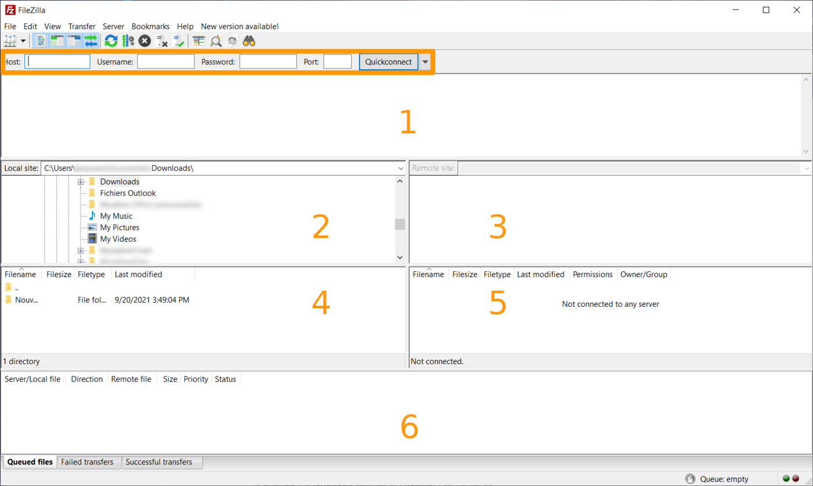
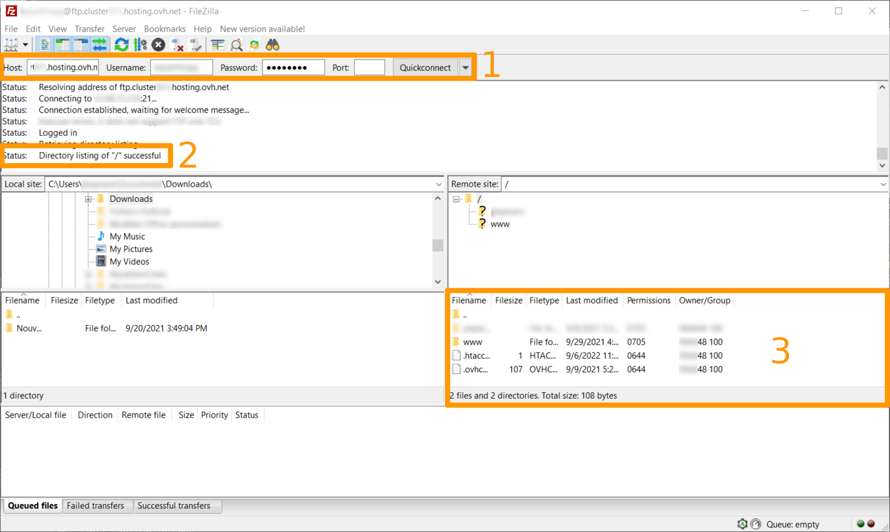
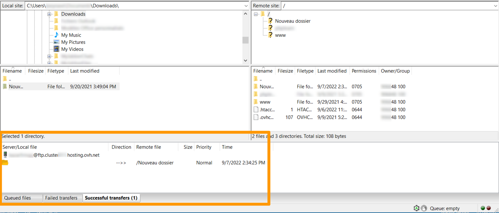
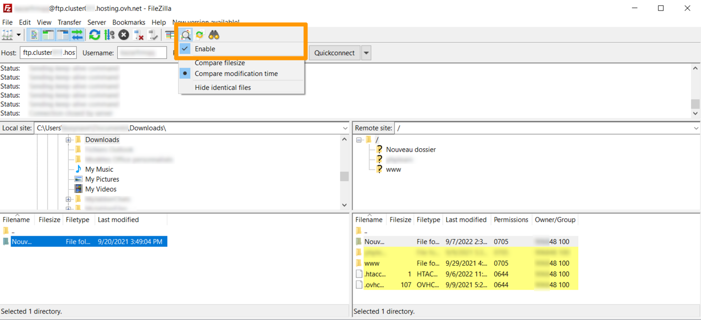

> [!primary]
>
> Esta traducción ha sido generada de forma automática por nuestro partner SYSTRAN. En algunos casos puede contener términos imprecisos, como en las etiquetas de los botones o los detalles técnicos. En caso de duda, le recomendamos que consulte la versión inglesa o francesa de la guía. Si quiere ayudarnos a mejorar esta traducción, por favor, utilice el botón «Contribuir» de esta página.
>

## Objetivo

FileZilla es un programa gratuito disponible en varios sistemas operativos (Windows, macOS, etc.).
Permite publicar archivos o su sitio web [conectándose al espacio FTP](/pages/web_cloud/web_hosting/ftp_connection) del alojamiento.

**Esta guía explica cómo utilizar Filezilla en un alojamiento compartido.**

> [!warning]
>
> La configuración, la gestión y la responsabilidad de los servicios que OVHcloud pone a su disposición recaen sobre usted. Por lo tanto, usted deberá asegurarse de que estos funcionen correctamente.
> 
> Ponemos a su disposición este tutorial para ayudarle a realizar las tareas más habituales. No obstante, si necesita ayuda, le recomendamos que contacte con un [proveedor especializado](https://partner.ovhcloud.com/es-es/directory/) o con el editor del programa. Nosotros no podremos asistirle al respecto. Para más información, consulte el apartado ["Más información"](#go-further) de este tutorial.
> 

## Requisitos

- Haber iniciado sesión en el [área de cliente de OVHcloud](/links/manager).
- Tener contratado un [plan de hosting](https://www.ovhcloud.com/es-es/web-hosting/){.external}.
- Haber instalado Filezilla en su ordenador. Está disponible de forma gratuita en la página [filezilla-project.org.](https://filezilla-project.org/download.php){.external}

## Presentación de la interfaz <a name="interface"></a>

{.thumbnail}

- La parte superior **del recuadro** permite una conexión rápida al alojamiento, introduciendo el nombre del **host**, el nombre de **usuario**, la **contraseña** asociada y el número de **puerto** utilizado.
- **zona 1**: información sobre el historial de operaciones, la conexión al espacio FTP, las transferencias de archivos, los errores, etc. Para más información, consulte la [documentación oficial de Filezilla](https://filezilla-project.org/){.external}.
- **zona 2**: árbol de directorios/archivos locales en su ordenador.
- **zona 3**: árbol de directorios/ archivos remotos cuando se conecta al alojamiento.
- **zone 4**: lista de carpetas/archivos en el directorio seleccionado localmente en su ordenador.
- **zona 5**: lista de carpetas/archivos remotos en el directorio seleccionado en su alojamiento.
- **zona 6**: lista de las operaciones de transferencia en curso, en espera o en error entre su ordenador y su alojamiento.

## Procedimiento

### Conexión con Filezilla por FTP

{.thumbnail}

Introduzca la información en la siguiente tabla:

|Información solicitada|Detalles|
|---|---|
|Host| Dirección del servidor que permite acceder al espacio de almacenamiento de su alojamiento.<br><br> Para los alojamientos compartidos, suele tener esta forma: `ftp.clusterXXX.hosting.ovh.net` (los `XXX` representan el número de cluster en el que se encuentra el alojamiento)|
|Usuario|Identificador que permite acceder al espacio de almacenamiento del alojamiento.|
|Contraseña|Contraseña asociada al usuario.|
|Puerto|Se suele completar automáticamente con el programa. En caso contrario, introduzca:<br><br>- el puerto "21" para una conexión FTP;<br>- el puerto "22" para una conexión SFTP (en caso de que esté activada). Más información sobre el SFTP en [la sección dedicada de este tutorial](#sftp).|

Si no dispone de esta información, conéctese al [área de cliente de OVHcloud](/links/manager){.external} en la sección Web Cloud y haga clic en `Alojamientos`{.action}. Seleccione el alojamiento correspondiente y abra la pestaña `FTP - SSH`{.action}. Se mostrará la información relativa a su espacio de almacenamiento:

{.thumbnail}

> [!warning]
>
> Algunos productos de OVHcloud no utilizan el puerto 22 para las conexiones por SFTP y/o SSH. Utilice los puertos que se muestran en el [área de cliente de OVHcloud](/links/manager){.external}
>

Una vez que haya introducido todo correctamente en el recuadro **1** de la imagen inferior, haga clic en `Conexión rápida`{.action}.

{.thumbnail}

Si la conexión se ha realizado correctamente, se le informará de ello en el recuadro **2** de la imagen anterior. Así podrá ver los directorios, carpetas y archivos que ya tenga en su alojamiento (recuadro **3**).

### Conexión con Filezilla por SFTP <a name="sftp"></a>

El **SFTP** (para **S**ecure **F**ile **T**ransfer **P**rotocol) es un protocolo similar al **FTP**. Utiliza, al igual que el SSH, el puerto 22 por defecto en lugar del puerto 21. Si utiliza un plan de hosting Cloud Web, debe utilizar el puerto que se muestra en el [área de cliente de OVHcloud](/links/manager){.external}. El puerto 22 está desactivado por seguridad en SSH y SFTP para los alojamientos Cloud Web.

> [!success]
>
> SFTP puede activarse gratuitamente en todos los planes de hosting de OVHcloud (excepto en los antiguos planes 60free/demo1g).
> 

#### Verificar la activación del SFTP

En primer lugar, compruebe que el SFTP esté activado en su **Usuario FTP**.

Acceda al [área de cliente de OVHcloud](/links/manager){.external}, en la sección Web Cloud y haga clic en `Alojamientos`{.action}. Seleccione el alojamiento correspondiente y abra la pestaña `FTP - SSH`{.action}.

Compruebe si el **SFTP** está activo en la tabla de la parte inferior de la página.

{.thumbnail}

Si no está activo:

- Haga clic en el botón `...`{.action} a la derecha de la tabla y, seguidamente, en `Editar`{.action}.

{.thumbnail}

- En la nueva ventana, compruebe que se haya activado una de las dos opciones siguientes:
    - **FTP y SFTP**: para activar únicamente el SFTP, además del FTP.
    - **FTP, SFTP y SSH**: para activar el FTP, el SFTP y el SSH.

{.thumbnail}

- Haga clic en `Siguiente`{.action} y seleccione `Aceptar`{.action}.

#### Iniciar la conexión SFTP

{.thumbnail}

En la parte alta de Filezilla, introduzca los siguientes datos para conectarse al servidor remoto (alojamiento):

- Host: `ftp.clusterXXX.hosting.ovh.net` (no olvide sustituir las `X` por las de su cluster de alojamiento)
- Identificador: su login FTP
- Contraseña: la contraseña FTP asociada al login
- Puerto: 22

Al hacer clic en el botón `Conexión rápida`{.action}, se abrirá un diálogo (ver la imagen inferior) para verificar la conexión al servidor al que se va a conectar. Al estar conectado a un host de OVHcloud, puede marcar la casilla *Confiar siempre en el host. Añadir esta llave a la caché* para que el programa no vuelva a solicitarla en el futuro.

{.thumbnail}

### Errores de conexión

El siguiente mensaje indica un error de identificación durante la conexión por FTP o SFTP al alojamiento compartido:

{.thumbnail}

Este tipo de mensaje se genera por un error en el par Login/Contraseña.

Compruebe las claves para asegurarse de que no se ha producido ningún error. En su caso, puede cambiar la contraseña del acceso FTP del alojamiento directamente en el [área de cliente de OVHcloud](/links/manager){.external}.

> [!success]
> Consulte nuestra guía sobre el [cambio de la contraseña FTP](/pages/web_cloud/web_hosting/ftp_change_password) en los planes de hosting.

En el siguiente caso, el error se genera con un nombre de host incorrecto:

{.thumbnail}

Compruebe que la contraseña del host se corresponde con el nombre del host que haya indicado en el [área de cliente de OVHcloud](/links/manager){.external}.

### Transferencia de archivos

Para transferir sus archivos por FTP, puede seleccionarlos y arrastrarlos y soltarlos desde la ventana izquierda *(ordenador)* a la derecha *(alojamiento)* (**áreas 4 y 5** descritas en la sección de este tutorial sobre [la interfaz](#interface) de Filezilla).

Seleccione el directorio de destino en la ventana derecha.

Una vez realizada esta acción, los archivos se pondrán automáticamente en espera para ser depositados en el servidor.

{.thumbnail}

### Vista de la cola de espera

Hay disponible una vista de la cola (**zona 6** descrita en la sección de este tutorial sobre [la interfaz](#interface) de Filezilla).

En esta zona se encuentran:

- los archivos pendientes de ser depositados en el servidor remoto que aún estén en la cola de espera;
- los archivos en los que no se ha podido transferir;
- los archivos para los que se ha realizado la transferencia en el alojamiento remoto.

{.thumbnail}

### Menú contextual del servidor

Haga clic derecho en uno de los archivos del **área 5** (descrito en la sección de este tutorial sobre [la interfaz](#interface) de Filezilla).

Aparecerá un menú contextual con varias opciones:

- Descargar: descarga el archivo en la carpeta local abierta.
- Añadir los archivos a la cola de espera: añade el archivo a la cola de espera, que le permite, por ejemplo, retrasar la descarga de los datos.
- Mostrar/Editar: permite ver o editar directamente un archivo del alojamiento. Sin embargo, es necesario tener un programa capaz de leer el archivo instalado en su equipo.
- Crear una carpeta: permite crear una nueva carpeta directamente en el alojamiento remoto.
- Actualizar: actualiza la visualización de los datos para mostrar correctamente los diferentes archivos.
- Eliminar: le permite borrar el archivo seleccionado.
- Renombrar: le permite renombrar el archivo seleccionado.
- Copiar la(s) dirección(s) al portapapeles: permite copiar automáticamente el vínculo directo al archivo seleccionado. Ejemplo de URL que puede generarse: `ftp://loginftp@ftp.cluster0XX.hosting.ovh.net/www/mondossier1/monfichier.jpg`
- Permisos de archivo: le permite cambiar los permisos de los archivos (Chmod)

{.thumbnail}

## Información útil <a name="useful-information"></a>

### Permisos de acceso (Chmod) a archivos y carpetas

Haga clic derecho en uno de los archivos del servidor y seleccione `Permisos de archivo...`{.action}.

Puede modificar los permisos de acceso (Chmod) de sus archivos y carpetas presentes en el alojamiento.

Por lo general, es más fácil manejar los permisos de Chmod con el valor numérico `XXX` (compuesto por 3 dígitos que pueden ir de 0 a 7). El grupo de permisos puede entonces ir desde `000` (sin derechos) hasta `777` (todos los derechos).

> [!alert]
>
> Atención: No es recomendable asignar los permisos Chmod 000 a sus carpetas o archivos. ya no podrá (al menos por FTP) gestionar este elemento (incluso como administrador FTP).
>
> Lo mismo sucede con los permisos Chmod 777, ya que, a diferencia del Chmod 000, todo el mundo puede actuar sobre el directorio o el archivo, lo que conlleva un fallo de seguridad considerable para los datos alojados.
>

El primero de los tres dígitos `XXX` que definen el Chmod corresponde a los derechos del propietario/administrador, el segundo a los derechos de grupo (raramente utilizado y generalmente igual a 0) y el tercero a los visitantes de su sitio web en su alojamiento.

Por defecto, le recomendamos que no sobrepase los permisos Chmod **705** para las carpetas y los permisos de Chmod **604** para los archivos.

Cuanto más alto sea el número, mayor será el número de permisos.

{.thumbnail}

Introduzca los permisos que desee asignar. El valor Chmod se actualizará automáticamente.

Puede marcar la casilla "Seguridad en las subcarpetas".

Esto modificará los permisos de la carpeta en cuestión, así como los archivos y carpetas que puedan estar presentes en ella.

### Reapertura del sitio

> [!primary]
>
> Independientemente de su acción, su alojamiento puede desactivarse debido a la detección de archivos maliciosos o no autorizados en su alojamiento por nuestros sistemas de seguridad.
>
> En ese caso, deberá [proteger sus soluciones](/pages/web_cloud/web_hosting/diagnostic_403_forbidden) corrigiendo los fallos de seguridad indicados en la notificación de bloqueo recibida por correo electrónico.
>

A continuación, haga clic en `Servidor`{.action} y seleccione `Introducir un comando personalizado`{.action} (también puede llamarse `Introduzca un comando FTP`{.action}).

Introduzca el siguiente comando:

```bash
SITE CHMOD 705 /
```

> [!warning]
>
> Este comando no funciona en SFTP.
>

{.thumbnail}

Si ha obtenido el error `550 would not change perms on /. not such file or directory`, utilice el siguiente comando:

```bash
SITE CHMOD 705 .
```

> [!primary]
>
> Para comprobar que la reapertura es efectiva, pruebe su sitio web desde un navegador de internet al cabo de unos minutos.
>

> [!warning]
>
> Pruebe la pantalla después de 3 horas máximo.<br>
> De hecho, nuestros robots pasan cada tres horas como mínimo para comprobar los cambios de estado.<br>
> En función del momento en que se realice la operación anterior, la restauración de la visualización del sitio web podrá ser más o menos rápida.<br>
> Si el plazo de 3 horas ha expirado y su sitio web todavía no está en línea, compruebe que el pedido se haya entregado correctamente repitiendo la operación.<br>
> Si todavía no funciona, contacte con el soporte.
> 

### Transferencia de archivos binarios

Para archivos binarios, como archivos de tipo **CGI**, puede ser interesante elegir cómo se realizará la transferencia.

Para cambiar el tipo de transferencia, seleccione `Transferencia`{.action} en el menú principal y luego `Tipo de transferencia`{.action}.

{.thumbnail}

### Comparación de directorios

{.thumbnail}

La opción de comparación de archivos muestra colores en los **cuadros 4** y **5** (presentados en la sección de este tutorial sobre [la interfaz](#interface) de Filezilla). Esta opción permite destacar las diferencias entre los archivos y carpetas locales y los del servidor. 

Pulse con el botón derecho del ratón sobre el icono para cambiar el modo de comparación. A continuación, podrá activar o desactivar la opción, así como:

- comparar el tamaño de los archivos;
- comparar la fecha y hora;
- ocultar los archivos idénticos.

**Significado de los colores:**

- Amarillo: el archivo sólo existe en un lado.
- Verde: el archivo es más reciente que el archivo sin color del otro lado.
- Rojo: los tamaños de los archivos son diferentes.

## Más información <a name="go-further"></a>

A continuación puede consultar nuestra guía para [solucionar los errores recurrentes en el uso de un programa FTP](/pages/web_cloud/web_hosting/ftp_recurring_ftp_problems).

En términos más generales, consulte [todas nuestras guías relativas a los alojamientos compartidos](/products/web-cloud-hosting).

No dude en consultar la [página oficial de Filezilla](https://filezilla-project.org/).

Para servicios especializados (posicionamiento, desarrollo, etc.), contacte con los [partners de OVHcloud](https://partner.ovhcloud.com/es-es/directory/).

Si quiere disfrutar de ayuda para utilizar y configurar sus soluciones de OVHcloud, puede consultar nuestros distintos [servicios de soporte](/links/support).

Interactúe con nuestra comunidad de usuarios en <https://community.ovh.com/en/>.