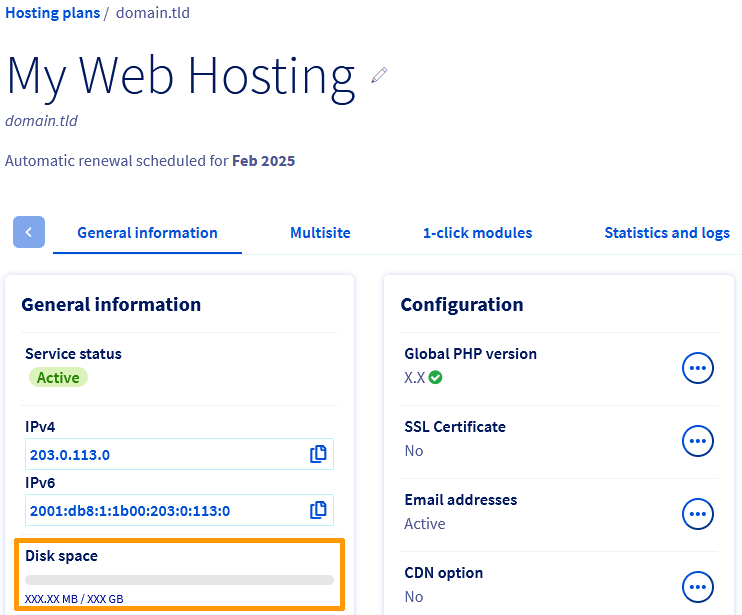

> [!primary]
> Diese Übersetzung wurde durch unseren Partner SYSTRAN automatisch erstellt. In manchen Fällen können ungenaue Formulierungen verwendet worden sein, z.B. bei der Beschriftung von Schaltflächen oder technischen Details. Bitte ziehen Sie im Zweifelsfall die englische oder französische Fassung der Anleitung zu Rate. Möchten Sie mithelfen, diese Übersetzung zu verbessern? Dann nutzen Sie dazu bitte den Button "Beitragen" auf dieser Seite.
>

## Ziel 

Die Verwendung von FTP-Software beim Login auf Ihr [Hosting-Pakete](/links/web/hosting) kann zu verschiedenen Anomalien führen. In dieser Anleitung können Sie die gängigsten Lösungen auswählen.

**Diese Anleitung erklärt, wie Sie gängige Fehler im Zusammenhang mit FTP-Programmen beheben.**

> [!warning]
> OVHcloud stellt Ihnen Dienstleistungen zur Verfügung, für deren Konfiguration und Verwaltung Sie die alleinige Verantwortung tragen. Es liegt somit bei Ihnen, sicherzustellen, dass diese ordnungsgemäß funktionieren.
> 
> Diese Anleitung soll Sie bei allgemeinen Aufgaben bestmöglich unterstützen. Dennoch empfehlen wir Ihnen, falls Sie Hilfe brauchen, einen [spezialisierten Dienstleister](/links/partner) zu kontaktieren und/oder Ihre Fragen in der OVHcloud Community zu stellen. Leider können wir Ihnen für administrative Aufgaben keine weitergehende technische Unterstützung anbieten. Weitere Informationen finden Sie am [Ende dieser Anleitung](#go-further).
>

## Voraussetzungen

- Sie verfügen über ein [OVHcloud Webhosting](/links/web/hosting).
- Sie haben Zugriff auf Ihr [OVHcloud Kundencenter](/links/manager).

## In der praktischen Anwendung

### “Dieser Server unterstützt FTP auf TLS nicht“ (FileZilla)

{.thumbnail}

Diese Nachricht im [FileZilla-Programm](/pages/web_cloud/web_hosting/ftp_filezilla_user_guide) zeigt an, dass Sie die SFTP- oder SSH-Option in Ihrem [OVHcloud Kundencenter](/links/manager) nicht aktiviert haben. Daher werden die zwischen Ihrem OVHcloud Hosting-Server und Ihrem Computer ausgetauschten Informationen nicht verschlüsselt.

Wenn die Daten, die Sie über diese Verbindung austauschen möchten, nicht vertraulich sind, klicken Sie auf `OK`{.action}.

Ist das nicht der Fall, gehen Sie in Ihr [OVHcloud Kundencenter](/links/manager), dann auf `Web Cloud`{.action} und `Hosting-Pakete`{.action}. Wählen Sie das betreffende Hosting aus und öffnen Sie den Tab `FTP-SSH`{.action}.

Wenn Sie über ein Webhosting [Basic](https://www.ovhcloud.com/de/web-hosting/personal-offer/) verfügen, setzen Sie in der Spalte `SFTP`{.action} den Haken bei der Feld `Deaktiviert`{.action} und warten Sie einige Minuten.

Wenn Sie über ein Webhosting [Pro](https://www.ovhcloud.com/de/web-hosting/professional-offer/) oder [Performance](https://www.ovhcloud.com/de/web-hosting/performance-offer/) verfügen, klicken Sie auf die Schaltfläche `...`{.action} rechts neben dem betreffenden FTP-Benutzer und dann auf `Ändern`{.action}.

Wählen Sie `SFTP`{.action} oder `Aktiviert`{.action} aus (um das SSH-Protokoll auf Ihrem Hosting zu aktivieren), klicken Sie auf `Weiter`{.action}, dann auf `Bestätigen`{.action}. Die Umstellung dauert einige Minuten.

> [!primary]
>
> Für sonstige Fehlermeldungen beachten Sie den Bereich `Diagnose` unserer [Webhosting-Anleitungen](/products/web-cloud-hosting).
>

### Ich habe meine Dateien mit einem FTP-Programm übertragen, aber meine Seite wird nicht angezeigt

Überprüfen Sie zunächst, dass die Dateien und Ordner Ihrer Website im [Wurzelverzeichnis](/pages/web_cloud/web_hosting/hosting_how_to_get_my_website_online#3-dateien-auf-ihren-speicherplatz-hochladen) Ihres Hostings enthalten sind.

Wenn Sie vor weniger als 48 Stunden eine Änderung an Ihren [DNS-Servern oder der DNS-Zone](/pages/web_cloud/domains/dns_zone_edit#dns-konzept-verstehen) vorgenommen haben, warten Sie ab und starten Sie Ihre Geräte regelmäßig neu, um deren Cache zu leeren.

### Meine FTP-Zugangsdaten funktionieren nicht.

Wenn Sie sich nicht authentifizieren können, ändern Sie Ihr FTP-Passwort entsprechend den Anweisungen in [dieser Anleitung](/pages/web_cloud/web_hosting/ftp_change_password).

### Auf meiner Website sind zufällige Fehler aufgetreten

Wenn Sie den Speicherplatz auf Ihrem Shared Hosting überschreiten, kann es zu Fehlfunktionen auf Ihrer Seite kommen.

Um den verbleibenden Speicherplatz auf Ihrem Hosting zu überprüfen, loggen Sie sich in Ihr [OVHcloud Kundencenter](/links/manager) ein. Klicken Sie auf `Web Cloud`{.action} und dann `Hosting-Pakete`{.action}. Wählen Sie das betreffende Hosting aus.

Die auf Ihrem Hosting-Server gespeicherte Datenmenge (ausgenommen Datenbanken) erscheint im Bereich `Allgemeine Informationen`{.action} unter `Speicherplatz`.

{.thumbnail}

### Ich kann meine Dateien nicht auf den FTP Server übertragen

Überprüfen Sie, dass Ihr FTP-Programm im “Passivmodus“ (Konfigurationsmodus eines FTP-Servers, in dem der Server den Verbindungsport bestimmt) verbunden ist.

Klicken Sie zum Beispiel für [Filezilla](/pages/web_cloud/web_hosting/ftp_filezilla_user_guide) auf `Bearbeiten`{.action}, dann auf `Einstellungen`{.action}. Öffnen Sie `Verbindung`{.action}, dann klicken Sie auf `FTP`{.action} und wählen Sie dann `Passiv (empfohlen)`{.action} aus.

Begrenzen Sie auch die Größe Ihrer Datentransfers (Sie können nicht mehr als **5000 Dateien und Ordner** auf den Shared Hosting Servern von OVHcloud in einem einzigen Transfer versenden). Führen Sie mehrere Importe durch, wenn nötig unter Verwendung komprimierter Ordner.

Wenn Sie über eine [Pro](https://www.ovhcloud.com/de/web-hosting/professional-offer/) oder [Performance](https://www.ovhcloud.com/de/web-hosting/performance-offer/) Lösung verfügen, verwenden Sie vorzugsweise das [SSH-Protokoll](/pages/web_cloud/web_hosting/ssh_on_webhosting), um Ihre Dateien dem Speicherplatz Ihres Hostings hinzuzufügen.

### Der symbolische Link “index.html“ kann nicht in meinem FTP-Bereich gelöscht werden

Dieser Link ist standardmäßig auf den Shared Hosting Paketen von OVHcloud installiert. Er zeigt die unten abgebildete Seite an:

{.thumbnail}

Wenn Sie die Funktion “[1-Klick-Modul](/pages/web_cloud/web_hosting/cms_install_1_click_modules)“ nicht für Ihre Website verwendet haben, müssen Sie das über das [OVHcloud Kundencenter](/links/manager) zugängliche [Net2FTP-Programm](/pages/web_cloud/web_hosting/ftp_connection#1-via-ftp-explorer-verbinden) verwenden, um die Seite “Site under construction“ manuell zu löschen.

## Weiterführende Informationen 

[Verwendung des FileZilla Programms mit Ihrem Hosting](/pages/web_cloud/web_hosting/ftp_filezilla_user_guide)

Für spezialisierte Dienstleistungen (Referenzierung, Entwicklung etc.) kontaktieren Sie die [OVHcloud Partner](/links/partner).

Wenn Sie Hilfe bei der Nutzung und Konfiguration Ihrer OVHcloud Lösungen benötigen, lesen Sie unsere [Support-Angebote](/links/support).

Für den Austausch mit unserer User Community gehen Sie auf <https://community.ovh.com/en/>.