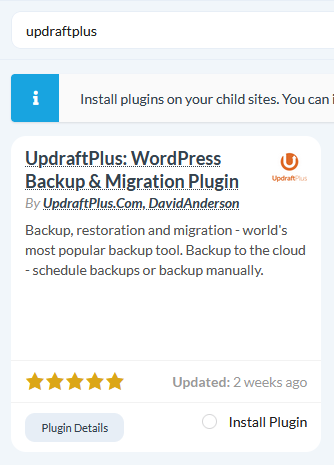
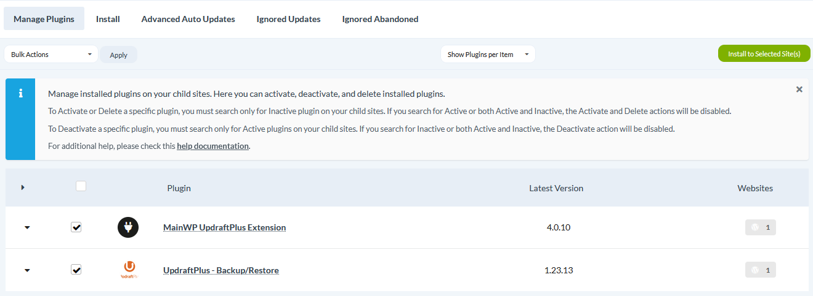
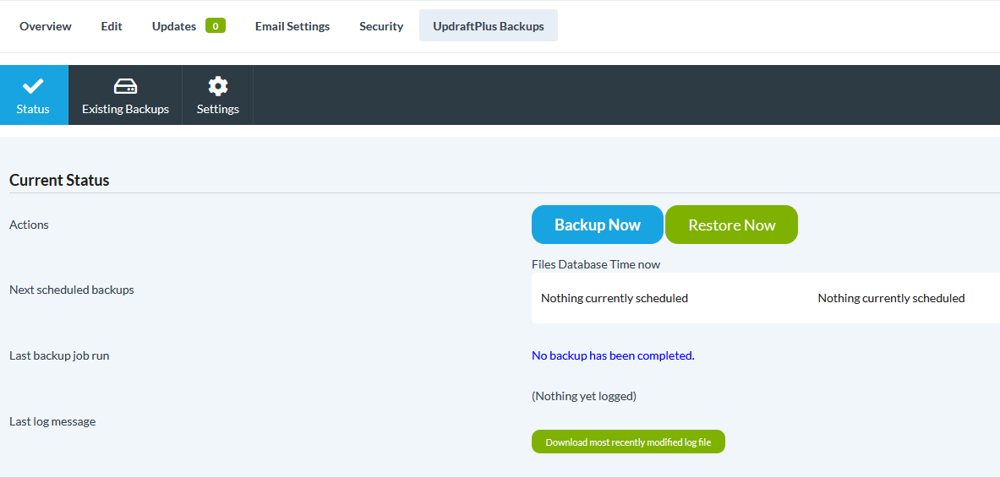
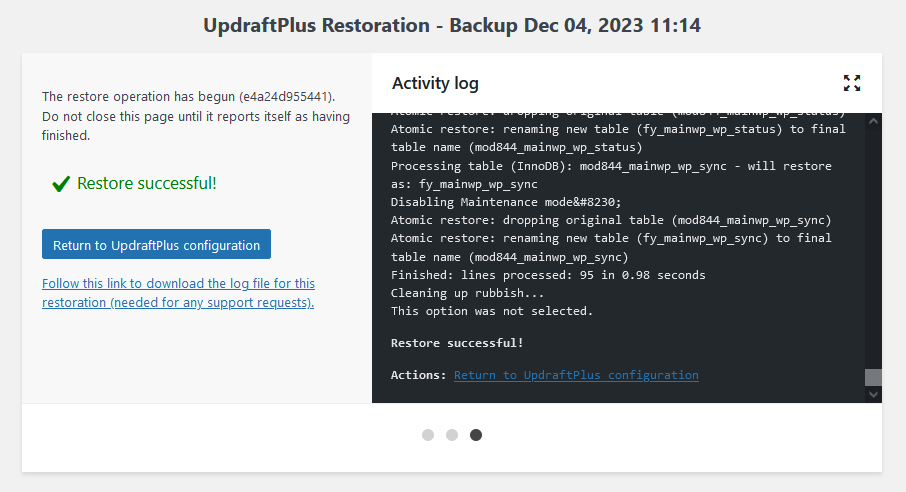

## Objective

Backing up a website is a vital part of running your business. It offers several advantages:

- **Data security**: Regular backups ensure your website's data is protected in the event of a cyberattack, technical failure or human error.
- **Protection against update errors**: A backup made before a WordPress plugin or theme is updated allows you to go back in time if an error or version conflict occurs during the update.
- **Rapid Restore**: In the event of a technical error, the backup can be reverted to a previous version to offer your customers a functional website and business continuity.
- **Legal Compliance**: Maintaining regular backups may be a regulatory compliance requirement for your organization and may protect you from legal action.

MainWP offers several extensions for backing up your websites.

**This guide explains how to back up your WordPress websites with the UpdraftPlus extension.**

## Requirements

- A [Web Cloud hosting plan](https://www.ovhcloud.com/en-ie/web-hosting/).
- Access to your MainWP dashboard.

> [!warning]
>
> OVHcloud provides services that you are responsible for with regard to their configuration and management. It is therefore your responsibility to ensure that they function properly.
> 
> This tutorial is designed to help you with common tasks. However, we recommend contacting a [specialist provider](/links/partner) or [the publisher of the MainWP plugin](https://mainwp.com/support/){.external} if you experience any difficulties. We will not be able to assist you. More information in the ["Go further"](#go-further) section of this tutorial.
>

## Instructions

### Install the UpdraftPlus extension

> [!primary]
> If you have never installed a MainWP extension, you can find out how to install one in [this guide](/pages/web_cloud/web_hosting/mainwp_general).
>

To find all the extensions linked to the backup, go to the [backup](https://mainwp.com/mainwp-extensions/extension-category/backup/) section of MainWP. You can also search for an extension by clicking `Extensions`{.action} from the MainWP main menu, then `Install Extensions`{.action}. Click on the `Backup`{.action} tab to view the list of extensions linked to the backup.

In this example, we choose the free UpdraftPlus extension, but you are free to choose the extension of your choice.

{.thumbnail}

Once you have selected the extension, click `Install Selected Extensions`{.action}.

In the MainWP main menu, click `Extensions`{.action} then `Manage Extensions`{.action}. The previously installed UpdraftPlus extension appears.

{.thumbnail}

Click `Enable`{.action} to enable the extension. If an error message indicates that the license is not activated, simply click the `License`{.action} button. Before you can use UpdraftPlus, you must enable the UpdraftPlus plugin on the child sites that you want to back up.

### Install the UpdraftPlus plugin on a child site

In the main menu of MainWP, click `Sites`{.action} then `Install Plugins`{.action}. In the search bar, type UpdraftPlus.

{.thumbnail}

Once you have identified the "UpdraftPlus: WordPress Backup & Migration" plugin, click `Install Plugin`{.action}. Then, on the right-hand side of the screen, select the child website on which you want to install UpdraftPlus. Click `Complete Installation`{.action}. Remember to tick `Activate after installation`{.action}.

Once the installation is complete, go to the MainWP main menu. Click `Sites`{.action}, `Plugins`{.action} then `Manage Plugins`{.action}. To check that UpdraftPlus is installed on your websites, select the child websites you want, on the right-hand side of the screen. Further down, in the search field `Search Options`{.action}, type “UpdraftPlus” then select `Show Plugins`{.action}.

{.thumbnail}

The extension “MainWP UpdraftPlus Extension” and the plugin “UpdraftPlus - Backup/Retore” are displayed, which means that they are correctly installed on the child websites concerned.

Select the “MainWP UpdraftPlus Extension” and the “UpdraftPlus - Backup/Retore” plugin, then click `Install to Selected Site(s)`{.action} (button in the top right-hand corner).

To ensure that the plugins are enabled on your child website, click `Sync Dashboard with Sites`{.action}, in the top right-hand corner of the interface.

{.thumbnail}

You can now create backups of your child websites with UpdraftPlus.

### Create a backup with UpdraftPlus

In the main menu of MainWP, click `Sites`{.action} then `Manage Sites`{.action}. Click the child site for which you want to create a backup, then click the `UpdraftPlus Backups`{.action} tab.

{.thumbnail}

On the screen that pops up, click `Backup Now`{.action} and follow the instructions. To confirm the backup, click `Backup Now`{.action}.

{.thumbnail}

Once the backup is complete, click the `ExistingBackups`{.action} tab.

{.thumbnail}

A new line will appear, corresponding to your backup. You can perform various actions on your backup, including restoring.

### Restore a backed up version of a child site

In the MainWP main menu, click `Extensions`{.action} then `UpdraftPlus`{.action}. If you click `Existing Backups`{.action}, a list of your backups will appear.

To restore your website, locate the line corresponding to your backup, then click `Restore`{.action}.

{.thumbnail}

A new window will appear. It contains some information, including a list of your backups.

Identify the backup you want to restore, then click `Restore`{.action}. Remember to check the date to avoid any errors.

{.thumbnail}

Select the elements you want to restore, then confirm. The following confirmation message is displayed:

{.thumbnail}

## Go further 

[Manage multiple WordPress websites with the MainWP plugin](/pages/web_cloud/web_hosting/mainwp_general)

[Manage your website’s customer information with MainWP](/pages/web_cloud/web_hosting/mainwp-client-management)

[Improve your website's security with MainWP](/pages/web_cloud/web_hosting/mainwp-security)

[Tutorial - Backup your WordPress website](/pages/web_cloud/web_hosting/how_to_backup_your_wordpress)

[Restore your web hosting plan’s storage space](/pages/web_cloud/web_hosting/ftp_save_and_backup)

For specialised services (SEO, development, etc.), contact [OVHcloud partners](/links/partner).

Join our community of users on <https://community.ovh.com/en/>.