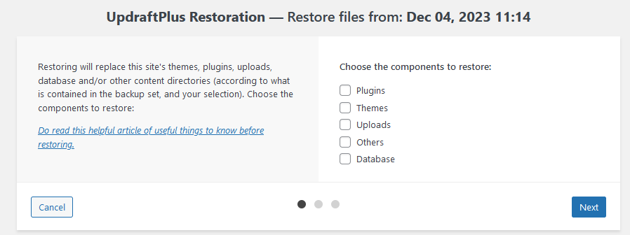

## Objectif

La sauvegarde d'un site web est une pratique cruciale pour la gestion de votre entreprise. Elle offre plusieurs avantages :

- **Sécurité des données** : les sauvegardes régulières garantissent que les données de votre site sont protégées en cas de cyberattaque, de défaillance technique ou d'erreur humaine.
- **Protection contre des erreurs de mise à jour** : une sauvegarde effectuée avant la mise à jour de WordPress, d'un plugin ou d'un thème permet de revenir en arrière en cas d'erreur ou de conflit de versions lors de la mise à jour.
- **Restauration rapide** : en cas d'erreur technique, la sauvegarde permet de revenir à une version précédente pour proposer à vos clients un site web fonctionnel et une continuité des opérations commerciales.
- **Conformité légale** : pour votre entreprise, maintenir des sauvegardes régulières peut correspondre à une exigence de conformité réglementaire et vous protéger contre des actions en justice.

MainWP propose plusieurs extensions permettant de sauvegarder vos sites web.

**Ce guide vous explique comment sauvegarder vos sites web WordPress avec l'extension UpdraftPlus.**

## Prérequis

- Disposer d'une [offre d'hébergement Web Cloud](/links/web/hosting).
- Être connecté à votre dashboard MainWP.

> [!warning]
>
> OVHcloud met à votre disposition des services dont la configuration, la gestion et la responsabilité vous incombent. Il vous revient de ce fait d'en assurer le bon fonctionnement.
> 
> Nous mettons à votre disposition ce tutoriel afin de vous accompagner au mieux sur des tâches courantes. Néanmoins, nous vous recommandons de faire appel à un [prestataire spécialisé](/links/partner) ou à [l'éditeur du du plugin MainWP](https://mainwp.com/support/){.external} si vous éprouvez des difficultés. En effet, nous ne serons pas en mesure de vous fournir une assistance. Plus d'informations dans la section [« Aller plus loin »](#go-further) de ce tutoriel.
>

## En pratique

### Installer l'extension UpdraftPlus

> [!primary]
> Si vous n'avez jamais installé d'extension MainWP, découvrez dans [ce guide](/pages/web_cloud/web_hosting/mainwp_general) comment installer une extension.
>

Pour retrouver toutes les extensions liées à la sauvegarde, rendez-vous sur la rubrique [sauvegarde](https://mainwp.com/mainwp-extensions/extension-category/backup/) de MainWP. Vous pouvez également chercher une extension en cliquant sur `Extensions`{.action} depuis le menu principal de MainWP, puis sur `Install Extensions`{.action}. Cliquez sur l'onglet `Backup`{.action} pour afficher la liste des extensions liées à la sauvegarde.

Dans cet exemple, nous choisissons l'extension gratuite UpdraftPlus, mais vous êtes libre de choisir l'extension de votre choix.

{.thumbnail}

Une fois l'extension sélectionnée, cliquez sur `Install Selected Extensions`{.action}.

Dans le menu principal de MainWP, cliquez sur `Extensions`{.action} puis sur `Manage Extensions`{.action}. L'extension UpdraftPlus précédemment installée apparaît.

{.thumbnail}

Cliquez sur `Enable`{.action} pour activer l'extension. Si un message d'erreur vous indique que la licence n'est pas activée, cliquez simplement sur le bouton `License`{.action}. Avant de pouvoir utiliser UpdraftPlus, vous devez activer le plugin UpdraftPlus sur les sites enfants que vous souhaitez sauvegarder.

### Installer le plugin UpdraftPlus sur un site enfant

Dans le menu principal de MainWP, cliquez sur `Sites`{.action} puis sur `Install Plugins`{.action}. Dans la barre de recherche, tapez « UpdraftPlus ».

{.thumbnail}

Une fois le plugin « UpdraftPlus : WordPress Backup & Migration » identifié, cliquez sur `Install Plugin`{.action} puis, à droite de l'écran, sélectionnez le site enfant sur lequel vous souhaitez installer UpdraftPlus. Cliquez sur `Complete Installation`{.action}. N'oubliez pas de cocher `Activate after installation`{.action}.

Une fois l'installation terminée, dirigez-vous dans le menu principal de MainWP. Cliquez sur `Sites`{.action}, `Plugins`{.action} puis `Manage Plugins`{.action}. Pour vérifier que UpdraftPlus est bien installé sur vos sites web, sélectionnez les sites enfants de votre choix, à droite de l'écran. Plus bas, dans le champ de recherche `Search Options`{.action}, tapez « UpdraftPlus » puis sélectionnez `Show Plugins`{.action}.

{.thumbnail}

L'extension « MainWP UpdraftPlus Extension » et le plugin « UpdraftPlus – Backup/Retore » s'affichent, ce qui veut dire qu'ils sont bien installés sur les sites enfants concernés.

Sélectionnez l'extension « MainWP UpdraftPlus Extension » et le plugin « UpdraftPlus – Backup/Retore » puis cliquez sur `Install to Selected Site(s)`{.action} (bouton en haut à droite).

Pour être sûr que les plugins sont bien activés sur votre site enfant, cliquez sur `Sync Dashboard with Sites`{.action}, en haut à droite de l'interface.

{.thumbnail}

Vous pouvez désormais effectuer des sauvegardes de vos sites enfants avec UpdraftPlus.

### Effectuer des sauvegardes avec UpdraftPlus

Dans le menu principal de MainWP, cliquez sur `Sites`{.action} puis sur `Manage Sites`{.action}. Cliquez sur le site enfant sur lequel vous voulez effectuer votre sauvegarde puis cliquez sur l'onglet `UpdraftPlus Backups`{.action}.

{.thumbnail}

Sur l'écran qui s'affiche, cliquez sur `Backup Now`{.action} et suivez les instructions. Pour valider la sauvegarde, cliquez sur `Backup Now`{.action}.

{.thumbnail}

Une fois la sauvegarde achevée, cliquez sur l'onglet `ExistingBackups`{.action}.

{.thumbnail}

Une nouvelle ligne correspondant à votre sauvegarde apparait. Vous pouvez effectuer différentes actions sur votre sauvegarde, dont la restauration.

### Restaurer une version sauvegardée d'un site enfant

Dans le menu principal de MainWP, cliquez sur `Extensions`{.action} puis sur `UpdraftPlus`{.action}. Si vous cliquez sur `Existing Backups`{.action}, la liste de vos sauvegardes s'affiche.

Pour restaurer votre site web, identifiez la ligne correspondant à votre sauvegarde puis cliquez sur `Restore`{.action}.

{.thumbnail}

Une nouvelle fenêtre s'affiche. Elle contient un certain nombre d'informations dont la liste de vos sauvegardes.

Identifiez la sauvegarde que vous souhaitez restaurer puis cliquez sur `Restore`{.action}. Pensez à vérifier la date pour éviter toute erreur.

{.thumbnail}

Sélectionnez les éléments que vous souhaitez restaurer puis validez. Le message de confirmation suivant s'affiche :

{.thumbnail}

## Aller plus loin 

[Administrer plusieurs sites web WordPress avec le plugin MainWP](/pages/web_cloud/web_hosting/mainwp_general)

[Gérer les informations clients de vos sites web avec MainWP](/pages/web_cloud/web_hosting/mainwp-client-management)

[Améliorer la sécurité de son site web avec MainWP](/pages/web_cloud/web_hosting/mainwp-security)

[Tutoriel - Sauvegarder votre site WordPress](/pages/web_cloud/web_hosting/how_to_backup_your_wordpress)

[Restaurer l'espace de stockage de son hébergement web](/pages/web_cloud/web_hosting/ftp_save_and_backup)

Pour des prestations spécialisées (référencement, développement, etc), contactez les [partenaires OVHcloud](/links/partner).

Échangez avec notre [communauté d'utilisateurs](/links/community).