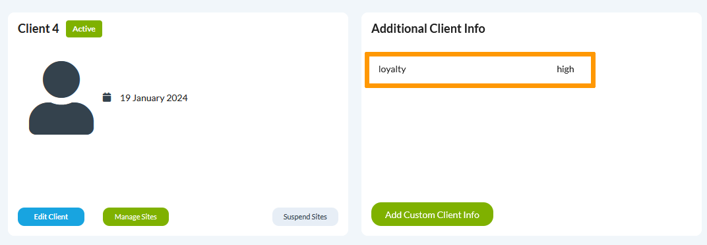

## Objective

Retaining customers is vital to your company’s development. Whether you have one or more websites, it’s important to get to know your customers as well as possible in order to retain and satisfy them. With the WordPress MainWP plugin, you can manage your website customers efficiently. As a CRM (Customer Relationship Management) would offer, you can add, delete and update all your customer information, for free, in just a few clicks.

**This guide will show you how to manage your website’s customers’ data efficiently using MainWP.**

## Requirements

- A [Web Cloud hosting plan](https://www.ovhcloud.com/asia/web-hosting/).
- Access to your MainWP dashboard. For more information, please read our guide on [Managing multiple WordPress websites with the MainWP plugin](/pages/web_cloud/web_hosting/mainwp_general).

> [!warning]
>
> OVHcloud provides services that you are responsible for with regard to their configuration and management. It is therefore your responsibility to ensure that they function properly.
> 
> This tutorial is designed to help you with common tasks. However, we recommend contacting a [specialist provider](/links/partner) or [the publisher of the MainWP plugin](https://mainwp.com/support/){.external} if you experience any difficulties. We will not be able to assist you. More information in the ["Go further"](#go-further) section of this tutorial.
>

## Instructions

In the MainWP main menu, click `Clients`{.action}. On the screen that opens, there are three tabs:

- Customers: displays a list of all your customers
- Add Client : allows you to create new customers
- Client Fields: allows you to create new fields related to your customers

### Add a customer

To get started, add your first customer. In the main menu of MainWP, click `Clients`{.action} then `Add Client`{.action}. In the form that appears, fill in your customer’s details. On the right-hand side of the screen, select the websites on which you want to create your new customer, then click `Add Client`{.action}.

{.thumbnail}

### View your customers

In the main menu of MainWP, click `Clients`{.action} then `Clients`{.action}. A list of all your customers will appear. You can search for a specific customer (in the `Search`{.action} field in the top right-hand corner of the table) by entering the value of one of its fields, such as its name.

{.thumbnail}

You can drag and drop the columns of your choice to highlight the relevant information of your customers, such as the email address (column `Customer Email`{.action}) or the number of websites to which your customer is attached (column `Websites`{.action}).

From this table, you can delete any customer. Select the lines corresponding to the customers you want to delete, click `Bulk actions`{.action}, `Delete`{.action} then `Apply`{.action} to confirm.

{.thumbnail}

Finally, click `Yes, proceed`{.action} to confirm the deletion of the customers.

In the table representing your customers, identify the customer of your choice and click on the `...`{.action}.

{.thumbnail}

You can:

- edit customer information (`Edit`{.action})
- delete the customer (`Delete`{.action})
- see the websites concerned by your customer (`View Sites`{.action})

### Create new fields for your customers

For each customer, many default fields are present, such as name, email, country, number or links to social networks. If you would like to add specific information that is not present by default, you can add the fields of your choice manually.
In the main menu of MainWP, click `Clients`{.action} then `Clients Fields`{.action}. To create a new field, click `New Field`{.action}. In the window that appears, enter the name and description for your new field.

{.thumbnail}

In our example, we create a new “loyalty” field, along with an associated description. To confirm the creation of the new field, click `Save Field`{.action}. Now, when creating a new customer, the new “loyalty” field will be available.

{.thumbnail}

Once you have created your new customer, go to your customers list. Click the customer you just created. The new “loyalty” field and the corresponding value are displayed.

{.thumbnail}

## Go further 

[Manage multiple WordPress websites with the MainWP plugin](/pages/web_cloud/web_hosting/mainwp_general)

[Improve your website's security with MainWP](/pages/web_cloud/web_hosting/mainwp-security)

[Backing up your websites with MainWP](/pages/web_cloud/web_hosting/mainwp-backup)

For specialised services (SEO, development, etc.), contact [OVHcloud partners](/links/partner).

Join our community of users on <https://community.ovh.com/en/>.