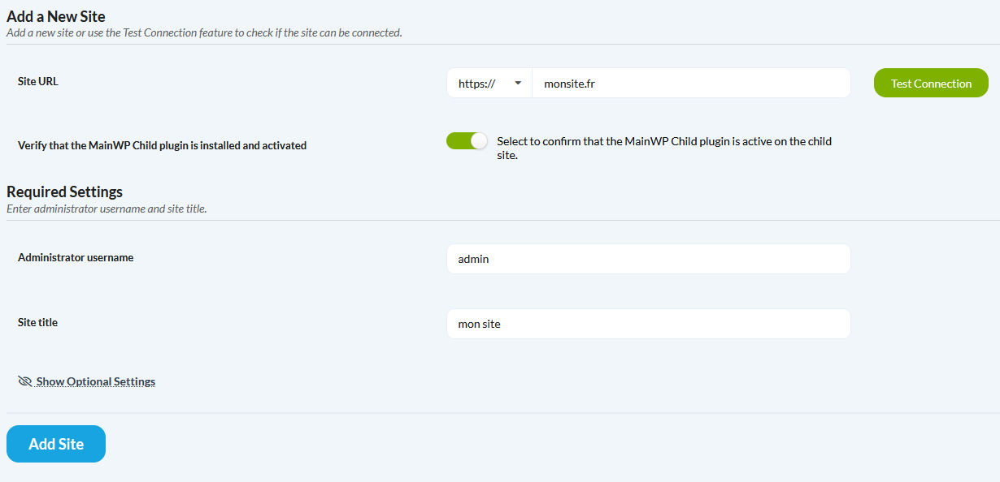
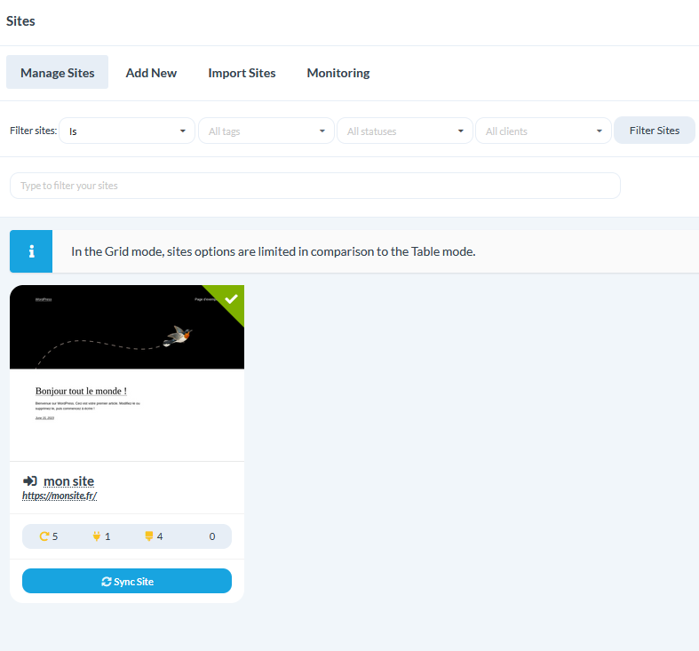

## Objective

Managing multiple websites can be complex and time-consuming. If you manage multiple WordPress websites, you will need to manage the technical maintenance of the websites, plugins and themes updates, or even login credentials. The MainWP plugin for WordPress is an efficient solution for managing multiple WordPress websites from a single dashboard. MainWP allows you to:

- control all your websites from a single dashboard
- update the technical components in one click
- [manage your customer information](/pages/web_cloud/web_hosting/mainwp-client-management)
- download extensions to perform multiple tasks

**Find out how to use the MainWP dashboard to manage multiple WordPress websites.**

> [!primary]
> In this guide, we have chosen the MainWP plugin. Other similar solutions exist, you are of course free to choose the plugin you want.
> 

## Requirements

- A [Web Cloud hosting plan](https://www.ovhcloud.com/asia/web-hosting/).
- Access to the [OVHcloud Control Panel](/links/manager), in the `Web Cloud`{.action} section.
- Access to the WordPress administration interface.

> [!warning]
>
> OVHcloud provides services that you are responsible for with regard to their configuration and management. It is therefore your responsibility to ensure that they function properly.
> 
> This tutorial is designed to help you with common tasks. However, we recommend contacting a [specialist provider](/links/partner) or [the publisher of the MainWP plugin](https://mainwp.com/support/){.external} if you experience any difficulties. We will not be able to assist you. More information in the ["Go further"](#go-further) section of this tutorial.
>

## Instructions

If you are not already logged in, access the administration interface of your one-click module for which you want to install the MainWP dashboard.

{.thumbnail}

Enter your login and password to log in. The WordPress dashboard appears.

### Install the MainWP plugin 

Go to the main WordPress menu, on the left-hand side of the screen, and click `Plugins`{.action} then `Add New Plugin`{.action}.

{.thumbnail}

A list of the most popular WordPress plugins is displayed. In the top right-hand corner of the search bar, type “MainWP”, then confirm. Among the results, several plugins offered by “MainWP” are displayed. Install the following two plugins:

- MainWP Dashboard
- Child MainWP

{.thumbnail}

MainWP Dashboard is the main plugin you can use to manage your websites from a single dashboard. 
MainWP Child enables you to connect your WordPress website (also called a "child site") to the MainWP Dashboard.

> [!warning]
>
> An error may occur if you install MainWP Child first. Make sure to install MainWP Dashboard **before** MainWP Child.
>

Once you have installed both plugins, please remember to enable them in order to use them.
Once the two plugins are installed and enabled, the following warning message will appear at the top of your screen:

{.thumbnail}

This message informs you that you have just activated the MainWP Child plugin, and that you now need to connect your child website to the MainWP Dashboard. For security reasons, disable the MainWP Child plugin if you do not want to connect your child website now. Reactivate the MainWP Child plugin when you are ready to connect your WordPress website to the MainWP dashboard.

### Connect a child site to the MainWP dashboard

In the main menu on the left, click `Sites`{.action}, then `Add New`{.action}. The following screen appears:

{.thumbnail}

Enter the URL of the child site you want to connect to the MainWP dashboard. Just below, select the button to indicate that you have installed and activated the MainWP Child plugin on your child website. The following two new fields are displayed:

- `Administrator username`: log in to your [OVHcloud Control Panel](/links/manager), then go to the `Web Cloud`{.action} section. Select the web hosting plan concerned, and click the `1-click modules`{.action} tab. In the table that pops up, identify the row that corresponds to your 1-click module. Your admin name is in the `Login`{.action} column.
- `Site title`: enter the value you want. If you connect many child websites, remember to enter an explicit site title.

{.thumbnail}

When all the fields of the form are filled in, click the `Add Site`{.action} button below the form to confirm. If there are no errors, you will receive the following confirmation message, confirming that your child site is now connected to the MainWP dashboard:

{.thumbnail}

To check that your child website is available in the MainWP dashboard, click `Sites`{.action} in the main menu on the left-hand side, then `Manage Sites`{.action}.

{.thumbnail}

In our example, the website "my website" will appear in the list of child sites connected to the MainWP dashboard. You can add as many child sites as you want.

{.thumbnail}

> [!primary]
>
> Remember to install the MainWP child plugin on each child site that you want to connect to the MainWP dashboard.
>

### Manage software updates from the MainWP dashboard

If you use several plugins and themes for your websites, you may encounter errors due to the different versions. With the MainWP dashboard, you can manage the following updates in one place:

- WordPress
- Plugins
- Themes
- Translations

In the main menu on the left, click `Sites`{.action} then `Updates`{.action}. The following screen appears:

{.thumbnail}

At the top of the interface, the tabs indicate that a plugin and four themes are available to update. Click on the tab of your choice to view the available updates. In our example, if you click on the `Themes Updates`{.action} tab, you will see a list of the four themes affected by the updates.

{.thumbnail}

If you want to update several themes (or all the themes at the same time), select the corresponding lines (by ticking the box to the left of each line) then click `Update Selected Themes`{.action}.
The following confirmation message appears, indicating the sites where the previously selected themes will be updated.

{.thumbnail}

In our example, the selected themes will be updated for the websites "www.example.fr", "www.example2.ovh", "blog 1", "blog 2" and "blog 3". Click `Yes, proceed`{.action} to confirm. The progress window appears. It will close when the updates are complete.

Do the same to update WordPress, your plugins or your translations.

### Extensions

MainWP offers native features, such as software update management or [customer information management](/pages/web_cloud/web_hosting/mainwp-client-management). However, MainWP becomes even more powerful thanks to its many extensions, offering a wide range of features.

There are different [extension categories](https://mainwp.com/mainwp-extensions/), such as Administrative, Backup, Analytics, Security, etc. For each of the categories, there are three different types of extensions:

- Free: free extensions developed by MainWP
- Professional: premium extensions developed by MainWP
- .Org: free extensions developed by a third-party publisher

Before you can install an extension, go to [MainWP.com](https://mainwp.com/my-account/) to create your account.

#### Order an extension

Once you have created your MainWP account, go to the [MainWP.com extensions section](https://mainwp.com/mainwp-extensions/). For our example, we choose the free UpdraftPlus extension. Click the UpdraftPlus extension.

{.thumbnail}

A page dedicated to the extension will appear. Click `Get the free Bundle`{.action}, then `Proceed to checkout`{.action}. You do not need to enter your payment details as this extension is free. Enter only the required information. Tick the required buttons, then finish by clicking `Place order`{.action}.

You will now need to retrieve the API key corresponding to your MainWP username, which will enable you to log in to the MainWP dashboard to download the extensions of your choice.

#### Enter the API key

Go to [your MainWP account](https://mainwp.com/my-account/my-api-keys/) then copy the API key.

{.thumbnail}

Go back to the MainWP dashboard and click on `Extensions`{.action} in the main menu on the left. In the top right-hand corner of the screen that appears, click `Install and Activate Extensions`{.action}.

{.thumbnail}

In the `Enter your MainWP API Key`{.action} field, paste the API key you have previously copied, tick the `Remember MainWP Main API Key`{.action} box and click `Validate my MainWP Main API Key`{.action}. If there are no errors, the following confirmation message is displayed:

{.thumbnail}

Finally, click `Install Extension`{.action} to install the extensions of your choice.

#### Install an extension

After clicking `Install Extensions`{.action}, a window will appear with a list of available extensions, sorted by category. In our example, we choose the free “UpdraftPlus” extension from the Backups category. After selecting UpdraftPlus, click `Install Selected Extensions`{.action}.

{.thumbnail}

Once the installation is complete, UpdraftPlus is available in the list of extensions for your MainWP dashboard.

{.thumbnail}

Click `Enable`{.action} to enable the extension. If an error message indicates that the license is not activated, simply click the `License`{.action} button.

## Go further 

[Manage your website’s customer information with MainWP](/pages/web_cloud/web_hosting/mainwp-client-management)

[Improve your website's security with MainWP](/pages/web_cloud/web_hosting/mainwp-security)

[Backing up your websites with MainWP](/pages/web_cloud/web_hosting/mainwp-backup)

For specialised services (SEO, development, etc.), contact [OVHcloud partners](/links/partner).

Join our community of users on <https://community.ovh.com/en/>.