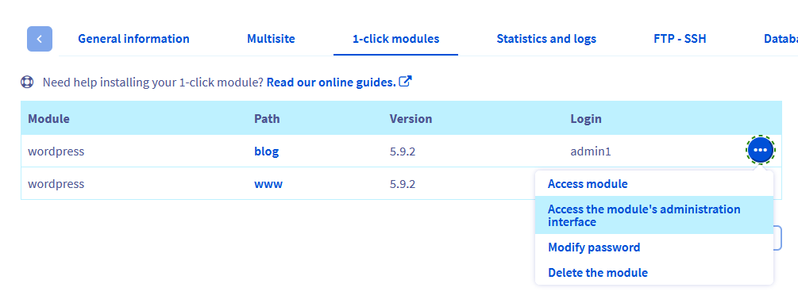
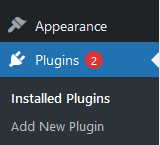
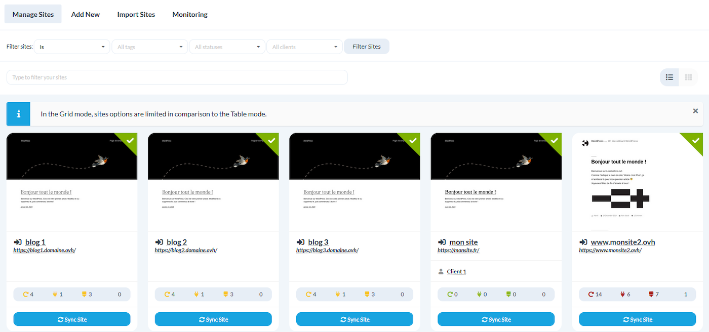
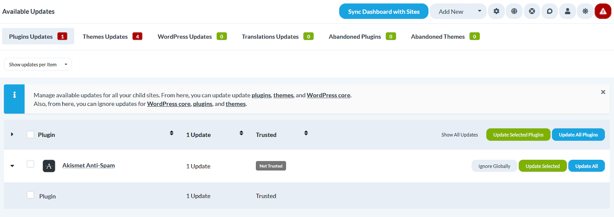

## Objectif

Administrer plusieurs sites web peut s'avérer complexe et chronophage. Si vous gérez plusieurs sites web WordPress, vous devez gérer la maintenance technique des sites, les mises à jour de plugins et de thèmes ou encore la gestion des identifiants de connexion. Le plugin MainWP pour WordPress est une solution efficace pour administrer plusieurs sites web WordPress depuis un seul et même tableau de bord (*dashboard*). MainWP permet entre autres de :

- contrôler l'intégralité de vos sites web depuis un seul dashboard ;
- mettre à jour en un clic les composants techniques ;
- [gérer les informations de vos clients](/pages/web_cloud/web_hosting/mainwp-client-management) ;
- télécharger des extensions pour effectuer de multiples tâches.

**Ce guide vous explique comment utiliser le dashboard MainWP pour administrer plusieurs sites web WordPress.**

> [!primary]
> Dans ce guide, nous avons choisi le plugin MainWP. D'autres solutions analogues existent, vous êtes bein entendu libre de choisir le plugin que vous souhaitez.
> 

## Prérequis

- Disposer d'une [offre d'hébergement Web Cloud](/links/web/hosting).
- Être connecté à votre [espace client OVHcloud](/links/manager), partie `Web Cloud`{.action}.
- Être connecté à l'interface d'administration de WordPress.

> [!warning]
>
> OVHcloud met à votre disposition des services dont la configuration, la gestion et la responsabilité vous incombent. Il vous revient de ce fait d'en assurer le bon fonctionnement.
> 
> Nous mettons à votre disposition ce tutoriel afin de vous accompagner au mieux sur des tâches courantes. Néanmoins, nous vous recommandons de faire appel à un [prestataire spécialisé](/links/partner) ou à [l'éditeur du du plugin MainWP](https://mainwp.com/support/){.external} si vous éprouvez des difficultés. En effet, nous ne serons pas en mesure de vous fournir une assistance. Plus d'informations dans la section [« Aller plus loin »](#go-further) de ce tutoriel.
>

## En pratique

Si vous n'êtes pas déjà connecté, accédez à l'interface d'administration de votre module en un clic sur lequel vous voulez installer le dashboard MainWP.

{.thumbnail}

Entrez votre login et votre mot de passe pour vous connecter. Le dashboard WordPress s'affiche.

### Installer le plugin MainWP 

Dirigez-vous dans le menu principal de WordPress, à gauche de l'écran, et cliquez sur `Plugins`{.action} puis sur `Add New Plugin`{.action}.

{.thumbnail}

La liste des plugins WordPress les plus populaires s'affiche. En haut à droite, dans la barre de recherche, tapez « MainWP » puis validez. Parmi les résultats, plusieurs plugins proposés par « MainWP » s'affichent. Installez les deux plugins suivants :

- MainWP Dashboard
- MainWP Child

{.thumbnail}

MainWP Dashboard correspond au plugin principal, celui vous permettant de gérer vos sites web depuis un seul et même dashboard. 
MainWP Child permet de connecter votre site WordPress (aussi appelé « site enfant ») au MainWP Dashboard.

> [!warning]
>
> Il se peut qu'une erreur survienne si vous installez MainWP Child en premier. Prenez soin d'installer MainWP Dashboard **avant** MainWP Child.
>

Après avoir installé les deux plugins, n'oubliez pas de les activer pour pouvoir les utiliser.
Une fois les deux plugins installés et activés, le message d'avertissement suivant s'affiche en haut de votre écran :

{.thumbnail}

Ce message vous indique que vous venez d'activer le plugin MainWP Child et que vous devez à présent connecter votre site enfant à MainWP Dashboard. Pour des raisons de sécurité, désactivez le plugin MainWP Child si vous ne voulez pas connecter votre site enfant dès maintenant. Réactivez le plugin MainWP Child lorsque vous serez prêt à connecter votre site WordPress au dashboard MainWP.

### Connecter un site enfant au dashboard MainWP

Dans le menu principal à gauche, cliquez sur `Sites`{.action}, puis sur `Add New`{.action}. L'écran suivant s'affiche :

{.thumbnail}

Renseignez l'URL du site enfant que voulez connecter au dashboard MainWP. Juste en dessous, sélectionnez le bouton pour indiquer que vous avez bien installé et activé le plugin MainWP Child sur votre site enfant. Les deux nouveaux champs suivants s'affichent :

- `Administrator username` (nom d'administrateur) : connectez-vous à votre [espace client OVHcloud](/links/manager), puis rendez-vous dans la partie `Web Cloud`{.action}. Sélectionnez l'hébergement web concerné et cliquez sur l'onglet `Modules en 1 clic`{.action}. Dans le tableau qui s'affiche, identifiez la ligne correspondant à votre module en un clic. Votre nom d'administrateur se trouve dans la colonne `Login`{.action}.
- `Site title` (titre du site) : renseignez la valeur que vous souhaitez. Si vous connectez de nombreux sites web enfants, pensez à renseigner un titre de site explicite.

{.thumbnail}

Lorsque tous les champs du formulaire sont remplis, cliquez sur le bouton `Add Site`{.action} en-dessous du formulaire pour valider. S'il n'y a aucune erreur, le message de confirmation suivant s'affiche, vous indiquant que votre site enfant est désormais connecté au dashboard MainWP :

{.thumbnail}

Pour vérifier que votre site enfant est bien disponible dans le dashboard MainWP, cliquez sur `Sites`{.action} dans le menu principal à gauche puis sur `Manage Sites`{.action}.

{.thumbnail}

Dans notre exemple, le site web « mon site » apparait bien dans la liste des sites enfants connectés au dashboard MainWP. Vous pouvez ajouter autant de sites enfants que vous le souhaitez.

{.thumbnail}

> [!primary]
>
> Pensez à installer le plugin MainWP child sur chaque site enfant que vous souhaitez connecter au dashboard MainWP.
>

### Gérer les mises à jour logicielles depuis le dashboard MainWP

Si vous utilisez plusieurs plugins et thèmes pour vos sites web, il se peut que vous rencontriez des erreurs à cause des différentes versions. Grâce au dashboard MainWP, vous pouvez gérer à un seul endroit les mises à jour suivantes :

- WordPress
- Plugins
- Thèmes
- Traductions

Dans le menu principal à gauche, cliquez sur `Sites`{.action} puis sur `Updates`{.action}. L'écran suivant s'affiche :

{.thumbnail}

En haut de l'interface, les onglets indiquent que la mise à jour d'un plugin et de quatre thèmes sont disponibles. Cliquez sur l'onglet de votre choix pour prendre connaissance des mises à jour disponibles. Dans notre exemple, si on clique sur l'onglet `Themes Updates`{.action}, la liste des quatre thèmes concernés par les mises à jour s'affiche.

{.thumbnail}

Si vous souhaitez mettre à jour plusieurs thèmes (ou tous les thèmes en même temps), sélectionnez les lignes correspondantes (en cochant le bouton à gauche de chaque ligne) puis cliquez sur `Update Selected Themes`{.action}.
Le message de confirmation suivant s'affiche, indiquant les sites sur lesquels les thèmes précédemment sélectionnés vont être mis à jour.

{.thumbnail}

Dans notre exemple, les thèmes sélectionnés seront mis à jour pour les sites « www.example.fr », « www.example2.ovh », « blog 1 », « blog 2 » et « blog 3 ». Cliquez sur `Yes, proceed`{.action} pour confirmer. La fenêtre de progression s'affiche et disparaît lorsque les mises à jour sont terminées.

Effectuez la même opération pour mettre à jour WordPress, vos plugins ou vos traductions.

### Extensions

MainWP propose des fonctionnalités natives, telles que la gestion des mises à jour logicielles ou encore la [gestion des informations clients](/pages/web_cloud/web_hosting/mainwp-client-management). Cependant, MainWP devient encore plus puissant grâce à ses nombreuses extensions, proposant un large éventail de fonctionnalités.

Il existe différentes [catégories d'extensions](https://mainwp.com/mainwp-extensions/), comme Administrative, Backups, Analytics, Security, etc. Pour chacune des catégories, trois différents types d'extensions existent :

- Free : extensions gratuites développées par MainWP
- Pro : extensions premium développées par MainWP
- .Org : extensions gratuites développées par un éditeur tiers

Avant de pouvoir installer une extension, rendez-vous sur [MainWP](https://mainwp.com/my-account/) pour créer votre compte.

#### Commander une extension

Après avoir créé votre compte MainWP, rendez-vous sur la rubrique [extensions](https://mainwp.com/mainwp-extensions/) de MainWP. Pour notre exemple, nous choisissons l'extension gratuite UpdraftPlus. Cliquez sur l'extension UpdraftPlus.

{.thumbnail}

Une page dédiée à l'extension s'affiche. Cliquez sur `Get the free Bundle`{.action}, puis sur `Proceed to checkout`{.action}. Vous n'avez pas besoin de renseigner vos informations de paiement car cette extension est gratuite. Entrez uniquement les informations obligatoires. Cochez les boutons requis puis terminez en cliquant sur `Place order`{.action}.

Vous devez maintenant récupérer la clé API correspondant à votre identifiant MainWP, ce qui vous permettra de vous identifier dans le dashboard de MainWP pour télécharger les extensions de votre choix.

#### Renseigner la clé API

Rendez-vous sur [votre compte MainWP](https://mainwp.com/my-account/my-api-keys/) puis copiez la clé API.

{.thumbnail}

Retournez sur le dashboard MainWP et cliquez sur `Extensions`{.action} dans le menu principal à gauche. En haut à droite de l'écran qui s'affiche, cliquez sur `Install and Activate Extensions`{.action}.

{.thumbnail}

Dans le champ `Enter your MainWP API Key`{.action}, collez la clé API que vous avez précédemment copiée, cochez la case `Remember MainWP Main API Key`{.action} et cliquez sur `Validate my MainWP Main API Key`{.action}. S'il n'y a aucune erreur, le message de confirmation suivant s'affiche :

{.thumbnail}

Enfin, cliquez sur `Install Extension`{.action} pour installer les extensions de votre choix.

#### Installer une extension

Après avoir cliqué sur `Install Extensions`{.action}, une fenêtre s'affiche avec la liste des extensions disponibles, classées par catégories. Dans notre exemple, nous choisissons l'extension gratuite « UpdraftPlus » de la catégorie Backups. Après avoir sélectionné UpdraftPlus, cliquez sur `Install Selected Extensions`{.action}.

{.thumbnail}

Une fois l'installation terminée, UpdraftPlus est disponible dans la liste des extensions de votre dashboard MainWP.

{.thumbnail}

Cliquez sur `Enable`{.action} pour activer l’extension. Si un message d’erreur vous indique que la licence n’est pas activée, cliquez simplement sur le bouton `License`{.action}.

## Aller plus loin 

[Gérer les informations des clients de vos sites web avec MainWP](/pages/web_cloud/web_hosting/mainwp-client-management)

[Améliorer la sécurité de son site web avec MainWP](/pages/web_cloud/web_hosting/mainwp-security)

[Sauvegarder ses sites web avec MainWP](/pages/web_cloud/web_hosting/mainwp-backup)

Pour des prestations spécialisées (référencement, développement, etc), contactez les [partenaires OVHcloud](/links/partner).

Échangez avec notre [communauté d'utilisateurs](/links/community).