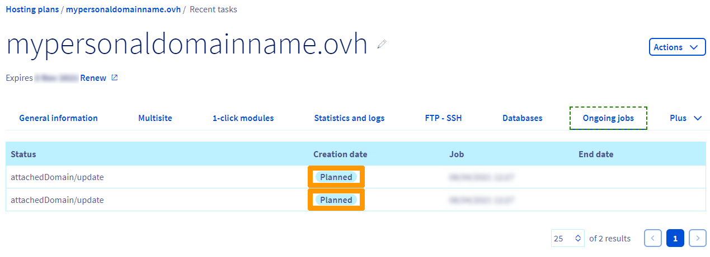

> [!primary]
> Esta traducción ha sido generada de forma automática por nuestro partner SYSTRAN. En algunos casos puede contener términos imprecisos, como en las etiquetas de los botones o los detalles técnicos. En caso de duda, le recomendamos que consulte la versión inglesa o francesa de la guía. Si quiere ayudarnos a mejorar esta traducción, por favor, utilice el botón «Contribuir» de esta página.
>

## Objetivo

*ModSecurity* es un módulo Apache complementario que filtra todas las peticiones entrantes en su servidor web. Refuerza la seguridad contra las vulnerabilidades conocidas interceptando y filtrando las solicitudes antes de que sean tratadas por scripts.

El conjunto preconfigurado de reglas básicas, el "Core Rule Set" (CRS) de nuestra *ModSecurity* protege sus sitios web contra los ataques más habituales, por ejemplo:

- Trojans,
- inyección de correo,
- Fallo de los archivos PDF,
- inyección de archivos en su alojamiento,
- inyección de tipo SQL o XSS,
- la compra de una caja registradora, entre otros.

**Esta guía explica cómo activar el firewall de aplicación desde el área de cliente de OVHcloud para mejorar la protección.**

## Requisitos

- Tener contratado un plan de [hosting de OVHcloud](https://www.ovhcloud.com/es/web-hosting/){.external}.
- Tener al menos un [dominio](https://www.ovhcloud.com/es/domains/){.external} asociado al alojamiento.
- Haber iniciado sesión en el [área de cliente de OVHcloud](https://ca.ovh.com/auth/?action=gotomanager&from=https://www.ovh.com/world/&ovhSubsidiary=ws){.external}.

## Procedimiento

Conéctese al [área de cliente de OVHcloud](https://ca.ovh.com/auth/?action=gotomanager&from=https://www.ovh.com/world/&ovhSubsidiary=ws){.external} y seleccione `Web Cloud`{.action}. Haga clic en `Alojamientos`{.action} y seleccione el alojamiento correspondiente.

### Activar el firewall de aplicación en la configuración de PHP

Por defecto, se abrirá la pestaña `Información general`{.action}. La `versión global` de PHP se muestra en el área de **Configuración**. Haga clic en el botón `...`{.action} y seleccione `Editar configuración`{.action}. En la nueva ventana, seleccione el elemento `Modificar la configuración actual`{.action} y haga clic en el botón `Siguiente`{.action}.

{.thumbnail}

En la nueva ventana, asegúrese de que la **aplicación firewall** esté activada en `Activado`{.action}. Para confirmar la configuración, haga clic en el botón `Confirmar`{.action}.

### Activar el firewall de aplicación para los dominios individuales en un multisitio

Abra la pestaña `Multisitio`{.action} de su plan de hosting. Haga clic en el botón `...`{.action} a la derecha del dominio correspondiente y seleccione la opción `Cambiar el dominio`{.action}.

{.thumbnail}

En la ventana de configuración, marque la casilla `Activar firewall`{.action}. También puede incluir el subdominio `www` en esta configuración marcando la casilla situada en la parte superior.

Haga clic en `Siguiente`{.action} y, a continuación, en `Confirmar`{.action} para cambiar la configuración multisitio.

{.thumbnail}

### Comprobar el estado de la tarea de activación

{.thumbnail}

Las tareas de actualización de su configuración multisitio se mostrarán en la pestaña `Operaciones en curso`{.action} (el estado inicial es "Planificado"). El cortafuegos estará activo desde que su tarea de actualización deje de aparecer en la lista.

### Verificación de los dominios para los que está activado el firewall

En la pestaña `Multisitio`{.action} de su plan de hosting podrá consultar los dominios en los que esté activada la opción de firewall.

{.thumbnail}

La tabla mostrada contiene todos los dominios añadidos al plan de hosting. En la columna "Cortafuegos", se muestra el estado de activación de cada dominio.

## Más información

Para servicios especializados (posicionamiento, desarrollo, etc.), contacte con [partners de OVHcloud](https://partner.ovhcloud.com/es/directory/).

Si quiere disfrutar de ayuda para utilizar y configurar sus soluciones de OVHcloud, puede consultar nuestras distintas soluciones [pestañas de soporte](/links/support).

Interactúe con nuestra comunidad de usuarios en <https://community.ovh.com/en/>.