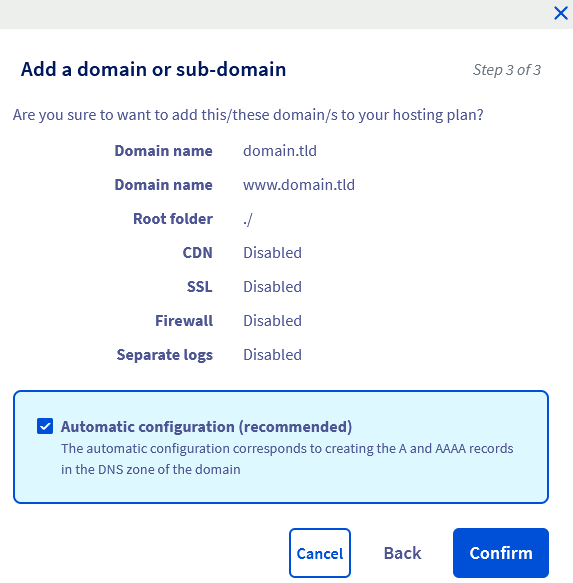
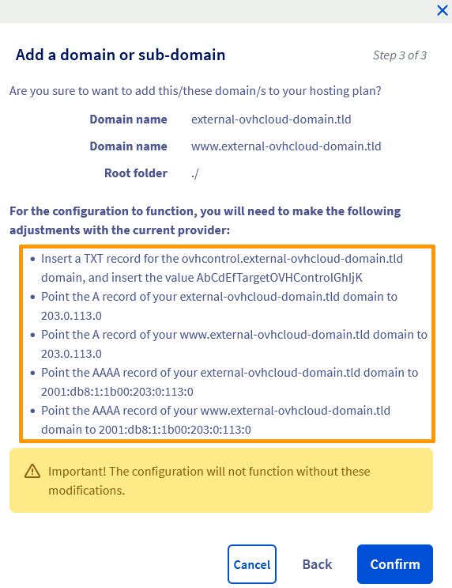

> [!primary]
> Esta traducción ha sido generada de forma automática por nuestro partner SYSTRAN. En algunos casos puede contener términos imprecisos, como en las etiquetas de los botones o los detalles técnicos. En caso de duda, le recomendamos que consulte la versión inglesa o francesa de la guía. Si quiere ayudarnos a mejorar esta traducción, por favor, utilice el botón «Contribuir» de esta página.
> 

## Objetivo

Es posible alojar varios sitios web en un mismo plan de hosting, aunque los dominios no estén registrados en OVHcloud.

**Descubra cómo utilizar un plan de hosting para alojar varios sitios web.**

### Índice

- 1 : [Acceder a la gestión del multisitio](#multisite-menu)
- 2 : [Añadir un dominio o subdominio](#add-domain)
    - 2.1 : [Añadir un dominio registrado con OVHcloud](#add-ovhcloud-domain)
    - 2.2 : [Añadir un dominio externo](#add-external-domain)
- 3 : [Publicar un sitio web en internet](#site-online)

## Requisitos

- Tener contratado un [plan de hosting de OVHcloud](/links/web/hosting){.external} compatible.
- Tener uno o más [dominios](/links/web/domains){.external}.
- Poder modificar la configuración de sus dominios (la [zona DNS](/pages/web_cloud/domains/dns_zone_edit#entender-el-concepto-de-dns)).
- Haber iniciado sesión en el [área de cliente de OVHcloud](/links/manager){.external}.

## Procedimiento

> [!primary]
>
> La mayoría de los [planes de hosting de OVHcloud](/links/web/hosting){.external} incluyen una opción de creación de direcciones de correo personalizadas con su nombre de dominio.
> Esta opción de correo electrónico puede activarse para **un solo** nombre de dominio. Esto significa que si realiza el *multisite* con varios dominios diferentes, solo podrá activar esta opción para uno de sus dominios.
> No dude en consultar nuestra [guide](/pages/web_cloud/web_hosting/activate-email-hosting) para más detalles sobre la activación de esta opción.
>

### 1\. Acceder a la gestión del multisitio 

En primer lugar, conéctese al [área de cliente de OVHcloud](/links/manager){.external} y seleccione `Web Cloud`{.action}. haga clic en `Alojamientos`{.action} y seleccione el alojamiento correspondiente. A continuación, abra la pestaña `Multisitio`{.action}.

Se mostrará una tabla con todos los dominios y subdominios añadidos a su solución de alojamiento web. Algunos de ellos se habrán creado automáticamente al instalarlo.

> [!primary]
>
> Si quiere migrar su sitio web evitando cualquier interrupción del servicio, vaya al [paso 3\. publicar un sitio web en Internet](#site-online).
>

{.thumbnail}

### 2\. Añadir un dominio o subdominio 

Para añadir un nuevo dominio o subdominio al alojamiento, haga clic en el botón `Acciones`{.action} situado a la izquierda de la pantalla y seleccione `Añadir un dominio o subdominio`{.action}.

{.thumbnail}

- **Añadir un dominio registrado con OVHcloud** :

Solo se muestran los dominios de OVHcloud para los que usted es contacto técnico y/o administrador en su área de cliente. Seleccione un dominio de la lista y haga clic en `Siguiente`{.action}. Continúe en el [paso 2.1: Añadir un dominio registrado con OVHcloud](#add-ovhcloud-domain).

- **Añadir un dominio externo**

Para un dominio externo a su cuenta de cliente (otro identificador de cliente) o externo a OVHcloud (proveedor de un dominio externo), seleccione `Añadir un dominio externo`{.action} y haga clic en `Siguiente`{.action}. Continúe en el paso [2.2. Añadir un dominio externo](#add-external-domain).

{.thumbnail}

#### 2.1\. añadir un dominio registrado con OVHcloud 

> [!warning]
> Este paso solo es pertinente si ha seleccionado la opción "Añadir un dominio registrado con OVHcloud". El nombre de dominio o su zona DNS debe estar **en el área de cliente**. Si quiere añadir un dominio externo, vaya al paso [2.2. Añadir un dominio externo](#add-external-domain){.external}.

A continuación, deberá personalizar la adición del dominio o subdominio. Según el [plan de hosting de OVHcloud](/links/web/hosting){.external} contratado, algunas opciones podrían no estar disponibles.

> [!primary]
> Para añadir un subdominio, es necesario seleccionar primero el dominio principal de la lista (por ejemplo: domain.tld). En la siguiente etapa podrá indicar el subdominio (por ejemplo: **blog**.domain.tld).

{.thumbnail}

|Campo|Descripción|
|---|---|
|Dominios|El nombre de dominio seleccionado se autocompletará por defecto. Puede añadir un subdominio (p. ej., **blog**.domain.tld) y crear simultáneamente el subdominio www correspondiente (p. ej., **www.blog**.domain.tld). El dominio que introduzca aquí será la dirección de internet del sitio web una vez publicado.|
|Carpeta raíz|Defina la carpeta, en su espacio de almacenamiento, hacia la que apunta el dominio . Los archivos del sitio web deberán publicarse en este espacio. Por ejemplo, para blog.domain.tld, la carpeta raíz podría ser "blog". Si la carpeta no existe, se creará automáticamente.|
|SSL|Permite disfrutar de una conexión segura (https://) en el dominio seleccionado. Más información en nuestra página sobre [SSL](/links/web/hosting-options-ssl){.external}. Si activa conjuntamente las opciones SSL y CDN (Content Delivery Network), podrá disfrutar también del protocolo **HTTP2** (activo por defecto en nuestro datacenter de Gravelines).|
|Activar la CDN|Permite activar el servicio CDN (almacenamiento en caché de los elementos estáticos del sitio web, como las imágenes) en el dominio seleccionado. Más información en nuestra página sobre [CDN](/links/web/hosting-options-cdn){.external}. Si activa conjuntamente las opciones SSL y CDN, podrá disfrutar también del protocolo **HTTP2** (activo por defecto en nuestro datacenter de Gravelines).|
|IP del país|Permite disfrutar de una dirección IP geolocalizada (a elegir entre diversos países) en el dominio seleccionado. Más información en nuestra página sobre las [IP](https://www.ovhcloud.com/es-es/web-hosting/options/){.external}.|
|Activar el firewall|Permite activar un firewall (análisis de las peticiones) en el dominio seleccionado. Más información en nuestra página sobre [Mod Security](https://www.ovhcloud.com/es-es/web-hosting/options/){.external}.|
|Logs separados|Permite activar un nuevo espacio de logs en el dominio seleccionado. Deberá elegir un dominio de la lista, que determinará el nombre de acceso al nuevo espacio. Más información en [nuestra página sobre estadísticas completas](/links/web/hosting-traffic-analysis){.external}.|

> [!warning]
>
> No podrá activar los logs separados para un dominio externo. Esta opción solo está disponible para los dominios registrados en OVHcloud.
>

Una vez introducidos los datos, haga clic en el botón `Siguiente`{.action}. Compruebe que la información que se muestra en el resumen es correcta.

{.thumbnail}

Al añadir un dominio registrado en OVHcloud, podrá modificar la configuración DNS de forma automática o manual:

- **Para una configuración DNS automática**, marque la casilla `Configuración automática (recomendado)`{.action}.
- **Para una configuración DNS manual**, desmarque la casilla `Configuración automática (recomendado)`{.action}. En este caso, se mostrarán los parámetros que debe modificar.  Si desea realizar esta configuración, consulte nuestra guía ["Editar una zona DNS de OVHcloud"](/pages/web_cloud/domains/dns_zone_edit){.external}.

Haga clic en `Aceptar`{.action} para añadir el dominio. Esta operación puede tardar un máximo de una hora. No obstante, la modificación de la configuración DNS del dominio tarda entre 1 y 24 horas en propagarse y ser efectiva.

Una vez añadido el dominio, vaya al [paso 3\. publicar un sitio web en internet](#site-online).

#### 2.2\. añadir un dominio externo 

 Este paso solo es pertinente si ha seleccionado la opción "Añadir un dominio externo".
 
 Por lo tanto, su dominio no está registrado en OVHcloud **o** no está registrado en **su** cuenta de OVHcloud. 

 > Antes de añadir el registro multisitio, es preferible cambiar la zona DNS del dominio externo.
 >
 > Para modificar la configuración del dominio externo (su zona DNS), conéctese al panel que le ofrezca el proveedor que gestione dicho dominio. Si su proveedor es OVHcloud, consulte nuestra guía ["Editar una zona DNS de OVHcloud"](/pages/web_cloud/domains/dns_zone_edit){.external}. Una vez realizada la operación, los cambios tardarán entre 1 y 24 horas en propagarse y ser plenamente efectivos.
>
> Estos son los 2 elementos que debe modificar en lo relativo a la configuración DNS de su dominio externo:
>
> |Campo|¿Dónde encontrar la información?|Acción a realizar|
> |---|---|---|
> |TXT|En la pestaña `Multisitio`{.action}, haciendo clic en `Configuración del código de verificación ovhcontrol`{.action}|Permite a OVHcloud asegurarse de que la adición de cada dominio externo es legítima. Deberá crear el registro TXT con el subdominio ovhcontrol (p. ej., "ovhcontrol.domain.tld") en la zona DNS autorizada para el dominio que quiera añadir.  Tenga en cuenta que, si quiere añadir `blog.domain.tld`, debe crear el registro para el subdominio `ovhcontrol.domain.tld` y no `ovhcontrol.blog.domain.tld`.  Para consultar la configuración DNS, acceda a los [servidores DNS](/pages/web_cloud/domains/dns_server_general_information) a los que pertenece el dominio. Solo deberá validar el dominio principal, no todos los subdominios.|
>
> {.thumbnail}
>
> |Campo|¿Dónde encontrar la información?|Acción a realizar|
> |---|---|---|
> |A y AAAA|Pestaña `Información general`{.action}, en **IPv4** e **IPv6**|Estos dos registros permiten que su dominio muestre el sitio web que usted haya subido a su alojamiento. Asocie su dominio o subdominio a la dirección IP de su alojamiento.|
>
> {.thumbnail}
>

 Una vez seleccionado el dominio que quiera asociar al alojamiento, deberá personalizar su información. Tenga en cuenta que algunas opciones incluidas en su [plan de hosting de OVHcloud](/links/web/hosting){.external} no pueden activarse durante este proceso. Es necesario añadir el dominio en primer lugar y posteriormente activar dichas opciones modificando la configuración del multisitio.

|Campo|Descripción|
|---|---|
|Dominio|Introduzca el dominio que quiera utilizar. Añada un subdominio (p. ej., **blog**.domain.tld) y cree simultáneamente el subdominio www correspondiente (p. ej., **www.blog**.domain.tld). El dominio que introduzca aquí será la dirección de internet del sitio web, una vez publicado. Recuerde que, para poder añadir el dominio, es necesario tener permisos para modificar su configuración (zona DNS).|
|Carpeta raíz| Defina la carpeta, en su espacio de almacenamiento, hacia la que apunta el dominio . Los archivos del sitio web deberán publicarse en este espacio. Por ejemplo, para blog.domain.tld, la carpeta raíz podría ser "blog". Si la carpeta no existe, se creará automáticamente.|
|Activar IPv6|Permite activar el protocolo IPv6 en el dominio indicado. Más información en nuestra página sobre las [IP](https://www.ovhcloud.com/es-es/web-hosting/options/){.external}.|

Una vez introducidos los datos, haga clic en el botón `Siguiente`{.action}. Compruebe que la información que se muestra en el resumen es correcta.

{.thumbnail}

Para añadir un dominio externo a OVHcloud, es necesario realizar una validación adicional. Esto nos permite asegurarnos de que la adición del dominio externo es legítima. Por lo tanto, aparecerá un mensaje invitándole a modificar la configuración DNS del dominio.

{.thumbnail}

Compruebe que la información que se muestra es correcta y haga clic en `Aceptar`{.action}. A continuación, el dominio se añadirá de forma temporal hasta que pueda modificar su configuración DNS.

> [!warning]
>
> Es necesario realizar estos cambios **rápidamente** para que el dominio se añada correctamente. Si no la realiza, la adición del dominio se anulará.
>
> Los registros DNS de tipo **A** y **TXT** deben estar obligatoriamente situados en la zona DNS activa de su nombre de dominio para que sea añadido a su alojamiento web. Solo los registros DNS de tipo **AAAA** son opcionales. 
>

### 3\. publicar un sitio web en internet 

Una vez añadido el dominio, solo tiene que publicar el sitio web correspondiente. Le recordamos que debe realizar esta operación en la carpeta raíz que haya indicado en el paso anterior.

Si necesita ayuda, puede disfrutar de una infraestructura de sitio web lista para usar gracias a los módulos en 1 clic de OVHcloud. Si utiliza estos módulos, el sitio web se instalará automáticamente en la carpeta raíz configurada anteriormente. Para más información, consulte nuestra guía [Instalar un sitio web con un módulo en un clic](/pages/web_cloud/web_hosting/cms_install_1_click_modules){.external}. 

Si, por el contrario, quiere instalar manualmente su sitio web, deberá subir los archivos a la carpeta raíz adecuada de su espacio de almacenamiento. Para más información, consulte nuestra guía [Publicar un sitio web en internet](/pages/web_cloud/web_hosting/hosting_how_to_get_my_website_online){.external}.

> [!primary]
>
> Si quiere utilizar su hosting para alojar varios sitios web, deberá realizar esta operación tantas veces como sea necesario.
>
> Recuerde que cuantos más sitios web aloje en su hosting, mayor será la demanda de recursos asignados. [En la página de nuestros planes de hosting](/links/web/hosting){.external} puede consultar el número de sitios web recomendados que puede alojar en su espacio.
>

## Más información

[Instalar un sitio web con un módulo en un clic](/pages/web_cloud/web_hosting/cms_install_1_click_modules){.external}

[Editar una zona DNS de OVHcloud](/pages/web_cloud/domains/dns_zone_edit){.external}

[Publicar un sitio web en internet](/pages/web_cloud/web_hosting/hosting_how_to_get_my_website_online){.external}

Si quiere disfrutar de ayuda para utilizar y configurar sus soluciones de OVHcloud, puede consultar nuestros distintos [servicios de soporte](/links/support).

Interactúe con nuestra comunidad de usuarios en <https://community.ovh.com/en/>.