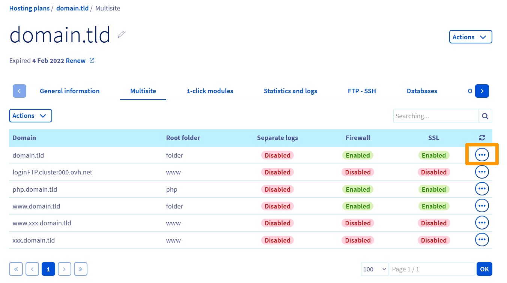

> [!primary]
> Questa traduzione è stata generata automaticamente dal nostro partner SYSTRAN. I contenuti potrebbero presentare imprecisioni, ad esempio la nomenclatura dei pulsanti o alcuni dettagli tecnici. In caso di dubbi consigliamo di fare riferimento alla versione inglese o francese della guida. Per aiutarci a migliorare questa traduzione, utilizza il pulsante "Contribuisci" di questa pagina.
>

  
## Obiettivo

I motori di ricerca (Google, Bing, Yahoo, ...) utilizzano robot di indicizzazione e referenziazione su tutti i siti Web. Indicano in via prioritaria i siti geolocalizzati nel paese dal quale effettui la tua ricerca.

**Esempio**: Se lanciate una ricerca attraverso un motore di ricerca e vi trovate in Inghilterra, i siti web geolocalizzati in Inghilterra appariranno più in alto nei risultati della ricerca rispetto agli altri siti web.

Questa geolocalizzazione è basata sull'indirizzo IP dell'hosting in cui si trova il tuo sito Web.

L'opzione di geolocalizzazione sul tuo hosting può essere utile per l'SEO se il tuo sito Web è principalmente consultato in un Paese diverso da quello in cui si trova il tuo hosting condiviso.

**Questa guida ti mostra come geolocalizzare il tuo sito Web utilizzando i nostri indirizzi IP geolocalizzati.**

## Prerequisiti

- Avere accesso allo [Spazio Cliente OVHcloud](https://www.ovh.com/auth/?action=gotomanager&from=https://www.ovh.it/&ovhSubsidiary=it)
- Disporre di un [hosting condiviso OVHcloud](https://www.ovhcloud.com/it/web-hosting/)
- Disporre di un [dominio](https://www.ovhcloud.com/it/domains/)
  
## Procedura

Per i siti Web consultati principalmente all'estero e ospitati sulla nostra infrastruttura di hosting condivisi OVHcloud, proponiamo un'opzione di geolocalizzazione per indirizzo IP. Permette di indicizzare meglio i siti Web nel Paese in cui si trova l'indirizzo IP scelto con l'opzione.

Per utilizzare l'opzione di geolocalizzazione via IP, accedi al tuo [Spazio Cliente OVHcloud](https://www.ovh.com/auth/?action=gotomanager&from=https://www.ovh.it/&ovhSubsidiary=it){.external}.

Accedi alla sezione `Web Cloud`{.action}, clicca su `Hosting`{.action} e seleziona l'hosting interessato nella lista. 
Clicca sulla scheda `Multisito`{.action} e poi sul pulsante `...`{.action} situato a destra del tuo dominio nella tabella. Infine clicca su `Modifica il dominio`{.action}.

{.thumbnail}

Nella nuova finestra, seleziona `IP del Paese`{.action} e inserisci il menu a tendina.

{.thumbnail}

Scegli l'indirizzo IP del Paese per il quale vuoi geolocalizzare il tuo sito, tra i 12 Paesi proposti: * Repubblica Ceca, Finlandia, Francia, Germania, Irlanda, Italia, Lituania, Paesi Bassi, Polonia, Portogallo, Spagna, Regno Unito*.

Clicca su `Continua`{.action} e poi su `Conferma`{.action} dalla finestra riepilogativa.

>[!primary]
>
> Se la zona DNS attiva del dominio è gestita totalmente dallo [Spazio Cliente OVHcloud](https://www.ovh.com/auth/?action=gotomanager&from=https://www.ovh.it/&ovhSubsidiary=it), l'accesso di tipo A nella zona DNS del dominio si modifica automaticamente. Per verificare che l'indirizzo IP sia stato aggiornato correttamente, consulta la guida su [modifica della zona DNS OVHcloud](/pages/web_cloud/domains/dns_zone_edit).
>
> In caso contrario, sarà necessario effettuare la modifica manualmente presso il provider che gestisce la zona DNS attiva del dominio. Consulta [qui](/pages/web_cloud/web_hosting/clusters_and_shared_hosting_IP) la documentazione che contiene tutti gli indirizzi IP della nostra infrastruttura di hosting condivisi OVHcloud.
>
> In tutti i casi, un periodo di propagazione da **4 a 24 ore** dopo la modifica sarà necessario per renderla pienamente efficace e visibile su Internet.
>

## Per saperne di più

Per prestazioni specializzate (referenziamento, sviluppo, ecc...), contatta i [partner OVHcloud](https://partner.ovhcloud.com/it/directory/).

Per usufruire di un supporto per l'utilizzo e la configurazione delle soluzioni OVHcloud, è possibile consultare le nostre soluzioni [offerte di supporto](https://www.ovhcloud.com/it/support-levels/).

Contatta la nostra Community di utenti all'indirizzo <https://community.ovh.com/en/>.