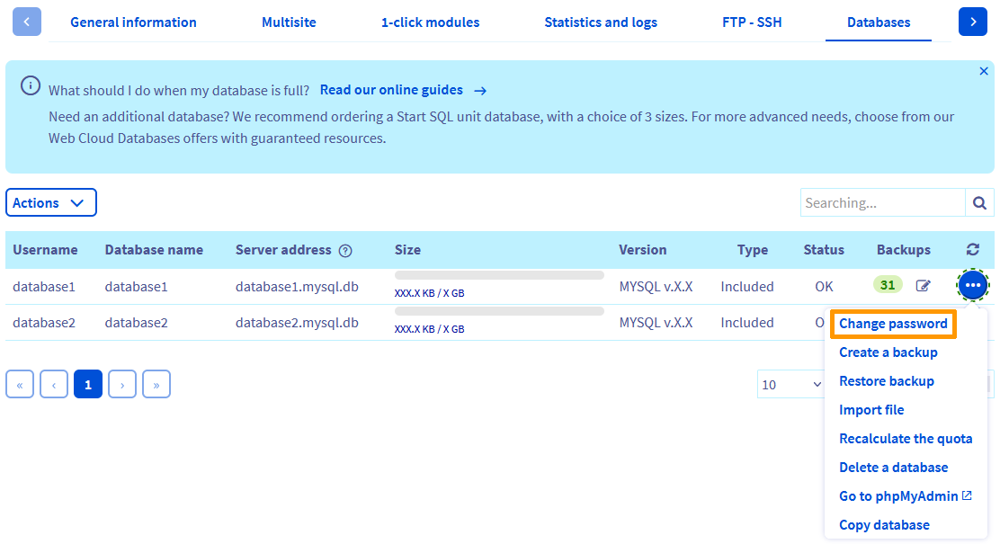
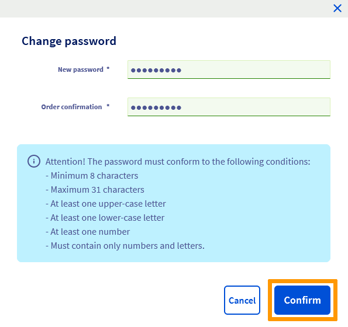

> [!primary]
> Esta tradução foi automaticamente gerada pelo nosso parceiro SYSTRAN. Em certos casos, poderão ocorrer formulações imprecisas, como por exemplo nomes de botões ou detalhes técnicos. Recomendamos que consulte a versão inglesa ou francesa do manual, caso tenha alguma dúvida. Se nos quiser ajudar a melhorar esta tradução, clique em "Contribuir" nesta página.
>

## Objetivo

A maior parte dos websites utiliza uma **base de dados** para armazenar artigos, comentários ou endereços de e-mail dos seus utilizadores.

A ligação a esta base de dados é possível graças a um **ficheiro de configuração** contido no [espaço de armazenamento de ficheiros](/pages/web_cloud/web_hosting/ftp_connection) do seu alojamento. Contém as informações que permitem ao seu site "identificar-se" junto do seu **servidor de base de dados**.

Por isso, a alteração da palavra-passe de uma base de dados deve ser sempre efetuada:

- No [ficheiro de configuração](/pages/web_cloud/web_hosting/cms_manage_1_click_module#etapa-1-identificar-a-base-de-dados-do-modulo) do seu site através do [espaço FTP do seu alojamento](/pages/web_cloud/web_hosting/ftp_connection);

- **E** no servidor que contém a base de dados através da [Área de Cliente OVHcloud](/links/manager).

Enquanto esta alteração não for efetuada **nestes dois locais**, o seu site irá apresentar um "[erro de ligação à base de dados](/pages/web_cloud/web_hosting/diagnosis_database_errors#error-establishing-a-database-connection)".

Assim, para alterar a palavra-passe da base de dados, é imperativo que realize **o conjunto das operações** indicadas neste guia. Se tiver dúvidas sobre as operações a realizar, contacte o seu webmaster ou um [fornecedor especializado](/links/partner).

A alteração da palavra-passe da base de dados do seu site faz-se em quatro etapas:

- [Etapa 1: identificar o ficheiro de configuração do seu site](#step1);
- [Etapa 2: identificar a base de dados do seu site](#step2);
- [Etapa 3: alterar a palavra-passe da base de dados do seu site no seu ficheiro de configuração](#step3);
- [Etapa 4: alterar a palavra-passe da base de dados do seu site para o servidor de bases de dados](#step4).

**Descubra como alterar a palavra-passe de uma base de dados de forma segura.**

> [!warning]
>
> A responsabilidade sobre a configuração e a gestão dos serviços que a OVHcloud disponibiliza recai sobre o utilizador. Assim, deverá certificar-se de que estes funcionam corretamente.
>
> Este manual fornece as instruções necessárias para realizar as operações mais habituais. No entanto, se encontrar dificuldades, recomendamos que recorra a um [prestador de serviços especializado](/links/partner) e/ou que contacte o editor do serviço. Não poderemos proporcionar-lhe assistência técnica. Para mais informações, aceda à secção [Quer saber mais](#go-further)?
>

## Requisitos

- Ter um [plano de alojamento web OVHcloud](https://www.ovhcloud.com/pt/web-hosting/).
- Ter acesso à [Área de Cliente OVHcloud](/links/manager).
- Utilizar uma [base de dados associada à sua oferta de alojamento partilhado](https://www.ovhcloud.com/pt/web-hosting/options/start-sql/) ou a um [Web Cloud Databases](https://www.ovh.pt/cloud/cloud-databases/).
- Ter acesso às credenciais FTP para aceder ao [espaço de armazenamento do alojamento](/pages/web_cloud/web_hosting/ftp_connection).

## Instruções

### Etapa 1: identificar o ficheiro de configuração do seu site <a name="step1"></a>

Na sua [Área de Cliente OVHcloud](/links/manager), clique em `Web Cloud`{.action} e em `Alojamentos`{.action} e, por fim, no alojamento em causa. De seguida, aceda ao separador `Multisite`{.action}. Identifique o nome da `Pasta raiz` do seu site (o diretório no qual se encontram os seus ficheiros e pastas).

{.thumbnail}

A seguir, clique no separador `FTP-SSH`{.action} e aceda ao espaço que contém os ficheiros e as pastas do seu site (*espaço FTP*) clicando no botão `Explorador FTP`{.action}.

> [!primary]
>
> Se pretender alterar a palavra-passe do seu espaço FTP, consulte este [guia](/pages/web_cloud/web_hosting/ftp_change_password).
>
> Para aceder através de outro método, consulte este [guia](/pages/web_cloud/web_hosting/ftp_connection).
>

Abra a `Pasta raiz` identificada acima.

Procure e abra o ficheiro de configuração do seu site:

- Para um website WORDPRESS, trata-se de **"wp-config.php"**;
- Para um site JOOMLA, trata-se de **"configuration.php"**;
- Para um site DRUPAL, clique na pasta **"sites"** e **"default"**. O ficheiro de configuração é **"settings.php"**;
- Para um website PRESTASHOP, clique na pasta **"app"** e **"config"**. O ficheiro de configuração é **"parameters.php"**.

### Etapa 2: identificar a base de dados do seu site <a name="step2"></a>

Existem dois casos possíveis:

- Caso n°1: a base de dados do seu site faz parte da sua oferta de alojamento;
- Caso n°2: está incluída numa oferta *Web Cloud Databases*, caso em que deverá encontrar o **nome do servidor** e o **nome de utilizador** da sua base de dados, de forma a identificar a base de dados sem correr o risco de erro.

Para determinar o caso aplicável ao seu website, no ficheiro de configuração identificado na [Etapa 1](#step1), comece por anotar o nome da sua base de dados:

- Para WORDPRESS: O nome aparece sob a menção **"DB_NAME"**;
- Para JOOMLA: o nome aparece na rubrica **"public $db"**;
- Para o DRUPAL: o nome aparece na rubrica **"database"**;
- Para PRESTASHOP: o nome aparece em **"database_name"**.

De seguida, volte à sua [Área de Cliente OVHcloud](/links/manager) na secção `Web Cloud`{.action}:

- Aceda à secção `Alojamentos`{.action} e, a seguir, ao alojamento correspondente;
- Clique no separador `Bases de dados`{.action} **à direita** do ecrã;
- Verifique o nome da base de dados encontrada anteriormente na coluna `Nome da base`;

Se localizar o nome da base de dados indicado no ficheiro de configuração nesta parte da Área de Cliente, consulte o [Etapa 3](#step3).

Caso contrário, a base de dados do seu site está associada a uma oferta [Web Cloud Databases](https://www.ovh.pt/cloud/cloud-databases/).

Para anotar o *nome do servidor* e o *nome de utilizador* da base de dados, deverá voltar ao ficheiro de configuração do seu site:

- Para WORDPRESS: O *nome do servidor* aparece com a menção **"DB_HOST"** e o *nome de utilizador* com a menção **"DB_USER"**;
- Para JOOMLA: o *nome do servidor* aparece na rubrica **"public $host"** e o *nome do utilizador* na menção **"public $user"**;
- Para o DRUPAL: o *nome do servidor* aparece em **"host"** e o *nome de utilizador* sob a menção **"username"**;
- Para PRESTASHOP: o *nome do servidor* aparece na rubrica **"database_host"** e o *nome de utilizador* na rubrica **"database_user"**.

A seguir, clique na secção `Bases de dados`{.action}, na secção `Web Cloud`{.action}. 

No separador `Informações gerais`{.action}, identifique, nas suas ofertas [Web Cloud Databases](https://www.ovh.pt/cloud/cloud-databases/), a que contém, sob a menção `Nome do host`{.action}, o nome do servidor da sua base de dados encontrado anteriormente.

Ainda nesta parte da sua Área de Cliente, aceda ao separador `Utilizador e permissões`{.action}, para que possa também consultar o `Nome de utilizador`{.action} da sua base de dados.

### Etapa 3: alterar a palavra-passe da base de dados do seu site no seu ficheiro de configuração <a name="step3"></a>

> [!primary]
>
> Para mais informações sobre as boas práticas de gestão de palavras-passe, siga as instruções deste [guia](/pages/account_and_service_management/account_information/manage-ovh-password).
>

Escolha a nova palavra-passe da sua base de dados e anote-a. Deverá respeitar as seguintes condições:

- Mínimo de 8 caracteres;
- Máximo de 30 caracteres;
- Pelo menos uma letra maiúscula;
- Pelo menos uma letra minúscula;
- Pelo menos um número;
- Ser composto unicamente por números e letras.

Da mesma forma que na [Etapa 1](#step1), volte ao espaço de armazenamento de ficheiros do seu alojamento e abra para edição o ficheiro de configuração do seu site.

**Antes de efetuar qualquer modificação**, registe localmente o conteúdo deste ficheiro num documento de texto, de forma a conservar uma cópia em caso de erro de manipulação.

Substitua manualmente a palavra-passe da sua base de dados, **evitando modificar ou eliminar qualquer outro elemento do ficheiro de configuração** (Nos extratos abaixo, apenas a palavra-passe de exemplo "*0VhCloudPa55w0rdDB123*" deve ser substituída):

- No ficheiro de configuração de um website WORDPRESS, altere o **"DB_PASSWORD"**:

```php
// ** MySQL settings - You can get this info from your web host ** //
/** The name of the database for WordPress */
define('DB_NAME', 'dbname123');
 
/** MySQL database username */
define('DB_USER', 'dbname123');
 
/** MySQL database password */
define('DB_PASSWORD', '0VhCloudPa55w0rdDB123');
 
/** MySQL hostname */
define('DB_HOST', 'dbname123.mysql.db:3306');
```

- No ficheiro de configuração de um website JOOMLA, altere o **"public $password"** (no final do ficheiro de configuração):

```php
public $host = 'dbname123.mysql.db:3306';
public $user = 'dbname123';
public $password = '0VhCloudPa55w0rdDB123';
public $db = 'dbname123';
```

- No ficheiro de configuração de um website DRUPAL, altere a **"password"**:

```php
$databases['default']['default'] = array (
  'database' => 'dbname123',
  'username' => 'dbname123',
  'password' => '0VhCloudPa55w0rdDB123',
  'prefix' => 'prefix123_',
  'host' => 'dbname123.mysql.db',
  'porta' => '306',
```

- No ficheiro de configuração de um website PRESTASHOP, altere o **"database_password"**:

```php
'database_host' => 'dbname123.mysql.db',
'database_port' => '3306',
'database_name' => 'dbname123',
'database_user' => 'dbname123',
'database_password' => '0VhCloudPa55w0rdDB123',
```

Guarde esta modificação.

### Etapa 4: alterar a palavra-passe da base de dados do seu site para o servidor de bases de dados <a name="step4"></a>

> [!primary]
>
> Esta operação demorará alguns minutos até ficar efetiva. Depois de o lançar, verifique o seu estado no separador `Tarefas em curso`{.action}.
>

Novamente, dois casos são possíveis: 

- Se a base de dados estiver na parte da [Área de Cliente OVHcloud](/links/manager) dedicada ao seu [alojamento web](https://www.ovhcloud.com/pt/web-hosting/), siga as [instruções](#case1).

- Se a sua base de dados estiver na parte da sua [Área de Cliente OVHcloud](/links/manager) dedicada às suas ofertas [Web Cloud Databases](/products/web-cloud-clouddb), siga as [instruções](#case2).

#### Caso n°1: a base de dados do seu site faz parte da sua oferta de alojamento <a name="case1"></a>

Na secção `Alojamentos`{.action} da Área de Cliente, clique no separador `Bases de dados`{.action} à direita do ecrã:

{.thumbnail}

A seguir, clique nos três pontos situados no final da linha correspondente à base de dados do site e selecione a opção `Alterar palavra-passe`{.action}.

{.thumbnail}

Na nova janela, introduza a nova palavra-passe da base de dados (definida no [Etapa 3](#step3)), confirme que está correta e clique no botão `Validar`{.action}.

{.thumbnail}

#### Caso n°2: a base de dados do seu site faz parte de uma oferta Web Cloud Databases <a name="case2"></a>

Aceda à secção `Bases de dados`{.action} da Área de Cliente e ao servidor em questão, clique no separador `Utilizadores e permissões`{.action}:

{.thumbnail}

Para alterar a palavra-passe da base de dados no servidor, clique nos três pontos à direita do `Nome de utilizador`{.action} identificado na [Etapa 2](#step2) e, a seguir, em `Alterar palavra-passe`{.action}.

{.thumbnail}

Na nova janela, introduza a nova palavra-passe da base de dados (definida no [Etapa 3](#step3)), confirme que está correta e clique no botão `Validar`{.action}.

{.thumbnail}

## Quer saber mais? <a name="go-further"></a>

[Partilhado: Guia de utilização do FileZilla](/pages/web_cloud/web_hosting/ftp_filezilla_user_guide)

[Definir e gerir a palavra-passe da sua conta](/pages/account_and_service_management/account_information/manage-ovh-password)

[Resolver os erros mais frequentes associados às bases de dados](/pages/web_cloud/web_hosting/diagnosis_database_errors)

Para serviços especializados (referenciamento, desenvolvimento, etc.), contacte os [parceiros OVHcloud](/links/partner).

Fale com a nossa comunidade de utilizadores em <https://community.ovh.com/en/>.