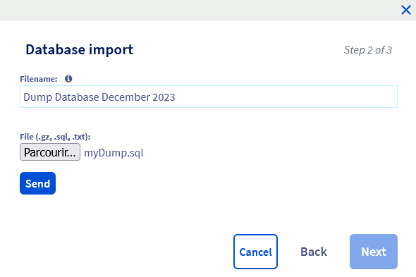
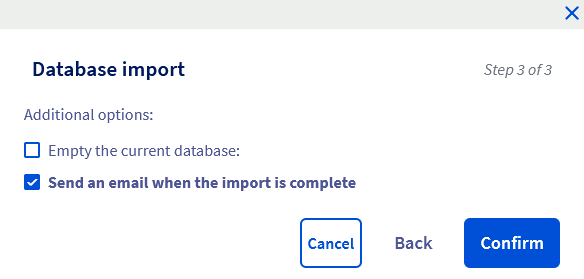

## Wprowadzenie 

Bazy danych, wykorzystywane obecnie przez niemal wszystkie systemy zarządzania treścią ( Content Management System lub CMS), na przykład WordPress czy Joomla!, umożliwiają przechowywanie elementów dynamicznych, takich jak komentarze czy artykuły. Możesz z różnych powodów potrzebować zaimportować dane do jednej z Twoich baz, aby zmodyfikować lub zastąpić jej zawartość.

**Dowiedz się, jak importować kopię zapasową do bazy danych Twojego hostingu WWW OVHcloud.**

## Wymagania początkowe

- Posiadanie [hostingu WWW OVHcloud](https://www.ovhcloud.com/pl/web-hosting/){.external}
- Posiadanie bazy danych utworzonej w ramach [pakietu hostingowego WWW OVHcloud](https://www.ovhcloud.com/pl/web-hosting/){.external}
- Posiadanie kopii zapasowej danych, które chcesz importować do bazy lub które chcesz przywrócić
- W zależności od metody importu, jakiej użyjesz, posiadanie dostępu do interfejsu zarządzania usługą hostingu WWW w [Panelu klienta](/links/manager){.external} lub posiadanie informacji umożliwiających zalogowanie do bazy danych

## W praktyce

Przed rozpoczęciem operacji określ metodę, której użyjesz do importu kopii zapasowej do odpowiedniej bazy danych.  W zależności od Twoich kompetencji technicznych masz do wyboru kilka możliwości.

- **Przywrócenie bazy danych z wcześniejszej daty**: rozwiązanie to umożliwia przywrócenie zawartości Twoich baz danych dzięki kopiom zapasowym zapisanym w narzędziu do tworzenia kopii zapasowych OVHcloud. Rozwiązanie to nie wymaga specjalnych kompetencji technicznych, a operację można przeprowadzić w [Panelu klienta](/links/manager){.external}.

- **Import pliku z kopią zapasową**: rozwiązanie to umożliwia import danych z pliku kopii zapasowej do jednej z Twoich baz danych.  Operacja ta przeprowadzana jest w [Panelu klienta](/links/manager){.external}.

- **Import realizowany w interfejsie phpMyAdmin**: rozwiązanie wymaga zalogowania się do interfejsu phpMyAdmin. Aby skorzystać z tej metody, konieczna jest znajomość interfejsu phpMyAdmin. Ponadto należy pamiętać, że plik kopii zapasowej nie może przekraczać określonego rozmiaru.

- **Import przy użyciu skryptu**: rozwiązanie wymaga utworzenia skryptu służącego do wykonania importu. Skrypt przechowywany jest na Twoim hostingu OVHcloud. W przypadku tej metody konieczna jest odpowiednia wiedza umożliwiająca utworzenie skryptu. 

- **Import przy użyciu komendy SSH**: rozwiązanie to wymaga zalogowania się do przestrzeni dyskowej przez protokół SSH, a następnie zastosowania odpowiednich komend pozwalających połączyć się z bazą danych. Ten typ dostępu możliwy jest, jeśli posiadasz zaawansowane umiejętności oraz masz wykupioną usługę [hostingu OVHcloud](https://www.ovhcloud.com/pl/web-hosting/){.external}.

Niektóre z powyższych metod nie są powiązane z interfejsem OVHcloud. W takich przypadkach wykonaj operację, bazując na własnej wiedzy. Poniżej zamieszczamy kilka pomocnych informacji, nie zastąpią one jednak pomocy technicznej webmastera.

Przejdź do metody importu, która Cię interesuje opisanej w dalszej części dokumentacji.

> [!warning]
>
> OVHcloud udostępnia różnorodne usługi, jednak ich konfiguracja, zarządzanie oraz utrzymanie należy do Ciebie.  Jesteś tym samym odpowiedzialny za ich prawidłowe funkcjonowanie.
>
> Oddajemy w Twojej ręce niniejszy przewodnik, którego celem jest pomoc w jak najlepszym wykonywaniu bieżących zadań. W przypadku trudności zalecamy skorzystanie z pomocy wyspecjalizowanego webmastera lub kontakt z producentem oprogramowania. Niestety firma OVHcloud nie będzie mogła udzielić wsparcia w tym zakresie. Więcej informacji znajduje się w sekcji „Sprawdź również”.
>

### Przywracanie kopii zapasowej w Panelu klienta.

Przed rozpoczęciem operacji zaloguj się do [Panelu klienta](/links/manager){.external}, kliknij `Hosting`{.action}, następnie wybierz nazwę odpowiedniego hostingu. Teraz przejdź do zakładki `Bazy danych`{.action}.

Tabela, która się wyświetla zawiera listę wszystkich baz danych utworzonych w ramach Twojego pakietu hostingowego. Kliknij trzy kropki po prawej stronie bazy danych, którą chcesz przywrócić do wcześniejszej daty, a następnie kliknij `Przywróć kopię zapasową`{.action}. Pamiętaj, że operacja ta spowoduje zastąpienie zawartości aktualnej bazy danych zawartością kopii zapasowej.

{.thumbnail}

Wyświetlą się wówczas wszystkie dostępne kopie zapasowe wybranej bazy danych. Będziesz mógł sprawdzić dokładną datę wykonanych kopii zapasowych, a także datę, w której zostaną one usunięte z narzędzia OVHcloud.

Kliknij trzy kropki po prawej stronie kopii zapasowej, którą chcesz przywrócić, po czym kliknij `Przywróć kopię zapasową`{.action}. Upewnij się, że informacje, które wyświetlają się w oknie są poprawne, a następnie kliknij `Zatwierdź`{.action}. Teraz zaczekaj, aż przywracanie kopii zapasowej się zakończy.

{.thumbnail}

### Import Twojej kopii zapasowej w Panelu klienta.

Przed rozpoczęciem operacji zaloguj się do [Panelu klienta](/links/manager){.external}, kliknij `Hosting`{.action}, następnie wybierz nazwę odpowiedniego hostingu. Teraz przejdź do zakładki `Bazy danych`{.action}.

Tabela, która się wyświetla zawiera listę wszystkich baz danych utworzonych w ramach Twojego pakietu hostingowego. Kliknij trzy kropki po prawej stronie bazy danych, do której chcesz importować dane, a następnie kliknij `Importuj plik`{.action}.

{.thumbnail}

W oknie, które się wyświetli zaznacz kratkę Zaimportuj plik, po czym kliknij Dalej.

> [!primary]
>
> Przycisk `Użyj istniejącego pliku`{.action} umożliwia ponowny import danych już wcześniej wysłanych do narzędzia służącego do importu. 
>

{.thumbnail}

Wprowadź nazwę pliku (która pozwoli Ci zidentyfikować tę kopię zapasową, jeśli będziesz chciał przywrócić ją ponownie w późniejszym terminie), następnie, z listy widniejącej obok pola `Nazwa pliku`, wybierz plik kopii zapasowej bazy danych na Twoim komputerze. Kliknij `Wyślij`{.action}.

Odczekaj, aż interfejs wskaże, że plik został pomyślnie wysłany, następnie kliknij przycisk Dalej.

{.thumbnail}

Następnie zdecyduj, czy chcesz zastosować dodatkowe opcje, które się wyświetlają:

- **usuń aktualną bazę danych**: jeśli zaznaczysz tę kratkę, aktualna zawartość bazy danych zostanie w całości usunięta i zastąpiona zawartością kopii zapasowej.  Jeśli chcesz zastąpić aktualną zawartość bazy danych zawartością pliku kopii zapasowej, zalecamy zaznaczenie tej kratki;

- **wyślij wiadomość e-mail po zakończeniu importu**: jeśli zaznaczysz tę kratkę, otrzymasz powiadomienie e-mail po zakończeniu importu bazy danych. 

Po dokonaniu wyboru, kliknij przycisk `Zatwierdź`{.action}, następnie zaczekaj, aż import zostanie ukończony.  

{.thumbnail}

### Import za pomocą interfejsu phpMyAdmin

W celu przeprowadzenia operacji zaloguj się do phpMyAdmin. Aby uzyskać link dostępowy do phpMyAdmin, zaloguj się do [Panelu klienta](/links/manager){.external}, kliknij `Hosting`{.action}, następnie wybierz nazwę odpowiedniego hostingu. Teraz przejdź do zakładki `Bazy danych`{.action}.

Tabela, która się wyświetla zawiera listę wszystkich baz danych utworzonych w ramach Twojego pakietu hostingowego. Kliknij trzy kropki po prawej stronie odpowiedniej bazy danych, po czym kliknij `Dostęp do phpMyAdmin`{.action}.

{.thumbnail}

Po uzyskaniu dostępu do strony phpMyAdmin wprowadź informacje dotyczące bazy danych, po czym zaznacz na rozwijanym menu opcję dostępu do aktualnych danych bazy, następnie zaloguj się.  Po zalogowaniu przejdź do zakładki `Import`{.action} i uzupełnij dane. Pamiętaj, że plik kopii zapasowej nie może przekraczać określonego rozmiaru.

> [!warning]
>
> Ponieważ interfejs phpMyAdmin nie został utworzony przez OVHcloud, wykonaj operację, bazując na własnej wiedzy. W przypadku  trudności zalecamy skorzystanie z pomocy specjalisty lub kontakt z producentem interfejsu. Niestety firma OVHcloud nie będzie mogła udzielić wsparcia w tym zakresie.
>

### Import kopii zapasowej przy użyciu skryptu

Operacja składa się z kilku etapów.  Upewnij się, czy posiadasz plik kopii zapasowej, którą chcesz importować, jak również informacje potrzebne do zalogowania się do bazy danych, do której kopia zostanie zaimportowana: nazwa użytkownika, hasło, nazwa bazy danych oraz adres serwera. 

> [!warning]
>
> Ten sposób wymaga umiejętności technicznych z zakresu programowania. Poniżej zamieszczamy kilka informacji dotyczących sposobu postępowania. Jednak w przypadku trudności zalecamy skorzystanie z pomocy specjalisty.  Niestety firma OVHcloud nie będzie mogła udzielić wsparcia w tym zakresie.
>

#### Etap 1: utwórz skrypt importu

Pierwszy etap polega na utworzeniu skryptu, dzięki któremu będziesz mógł wykonać import do bazy danych. Poniżej przykład skryptu, który może być pomocny w przeprowadzanej przez Ciebie operacji, nie zastąpi on jednak pomocy technicznej webmastera.

```php
<?php
system("cat nazwa_pliku.sql | mysql --host=adres_serwera --user=uzytkownik --password=haslo_uzytkownika nazwa_bazy_danych");
?>
```

Pamiętaj, aby zastąpić informacje ogólne występujące w skrypcie informacjami dotyczącymi odpowiedniej bazy danych. Pomocne będą poniższe wskazówki. Po utworzeniu skryptu zalecamy nadać mu nazwę „import.php”.

|Informacje|Czym należy zastąpić|
|---|---|
|nazwa_pliku|Nazwa pliku kopii zapasowej, którą chcesz importować.|
|adres_serwera|Adres serwera bazy, do której zaimportujesz dane.|
|uzytkownik|Nazwa użytkownika posiadającego dostęp do wybranej bazy danych.|
|haslo_uzytkownika|Hasło przypisane do uprzednio podanej nazwy użytkownika.|
|nazwa_bazy_danych|Nazwa odpowiedniej bazy danych.|

#### Etap 2: pobierz skrypt oraz kopię zapasową i wykonaj import do przestrzeni dyskowej

Po poprawnym utworzeniu skryptu importu pobierz skrypt oraz plik kopii zapasowej, którą chcesz zaimportować do przestrzeni dyskowej Twojego hostingu. W tym celu zaloguj się do przestrzeni dyskowej. Jeśli nie potrafisz tego zrobić, zapoznaj się z informacjami zawartymi w dokumentacji [Umieszczenie strony WWW w Internecie](/pages/web_cloud/web_hosting/hosting_how_to_get_my_website_online){.external}.

Aby móc przejść od kolejnych etapów, pobierz skrypt importu oraz plik kopii zapasowej do katalogu „WWW”. **Zalecamy szczególną ostrożność podczas nadawania nazwy plikowi skryptu importu.** Sprawdź, czy pobierając skrypt, nie nadpisujesz istniejącego wcześniej na przestrzeni dyskowej pliku noszącego tę samą nazwę. Jeśli pojawi się tego typu komunikat ostrzegawczy, zmieć nazwę nowo utworzonego skryptu, a następnie spróbuj ponownie go pobrać.

#### Etap 3: uruchamianie skryptu

Po zapisaniu skryptu importu oraz pliku kopii zapasowej na przestrzeni dyskowej, rozpocznij operację importu.  W tym celu wywołaj skrypt.

Aby to uczynić, wpisz do przeglądarki internetowej pełny adres URL skryptu (na przykład: mypersonaldomain.ovh/import.php, jeśli nazwałeś skrypt „import.php”). Jeśli informacje podane w skrypcie są poprawne, import się rozpocznie. Należy zaczekać jakiś czas na zakończenie operacji. Jeśli tak się nie stanie, sprawdź informacje zawarte w skrypcie, po czym spróbuj ponownie.

Zalecamy, abyś po zakończeniu importu usunął z katalogu „WWW” pliki kopii zapasowej oraz skryptu.

### Import kopii zapasowej przy użyciu komendy SSH

Aby przeprowadzić tę operację, wpisz odpowiednie komendy w terminalu, aby połączyć się z przestrzenią dyskową.

> [!warning]
>
> Aby korzystać z tego typu dostępu, konieczna jest zaawansowana wiedza techniczna. Poniżej zamieszczamy kilka informacji dotyczących sposobu postępowania, jednak w przypadku trudności zalecamy skorzystanie z pomocy [wyspecjalizowanego usługodawcy](https://partner.ovhcloud.com/pl/directory/). Niestety firma OVHcloud nie będzie mogła udzielić wsparcia w tym zakresie.
>

Po zalogowaniu się do przestrzeni dyskowej przy użyciu SSH wpisz komendę służącą do importu bazy danych. Poniżej przykład komendy, która może być pomocna w przeprowadzanej przez Ciebie operacji. Pamiętaj, że najpierw powinieneś pobrać kopię zapasową, którą chcesz importować do przestrzeni dyskowej oraz wysłać komendę do terminala po uprzednim odnalezieniu jej w odpowiednim katalogu.

```sh
cat nazwa_pliku.sql | mysql --host=adres_serwera --user=uzytkownik --password=haslo_uzytkownika nazwa_bazy_danych");
```

Pamiętaj, aby zastąpić informacje ogólne występujące w komendzie informacjami dotyczącymi odpowiedniej bazy danych.  Zalecamy, abyś po zakończeniu importu usunął plik kopii zapasowej, z katalogu, do którego został wcześniej pobrany. 

## Sprawdź również

W przypadku wyspecjalizowanych usług (pozycjonowanie, rozwój, etc.) skontaktuj się z [partnerami OVHcloud](https://partner.ovhcloud.com/pl/directory/).

Jeśli chcesz otrzymywać wsparcie w zakresie konfiguracji i użytkowania Twoich rozwiązań OVHcloud, zapoznaj się z naszymi [ofertami pomocy](/links/support).

Dołącz do społeczności naszych użytkowników na stronie <https://community.ovh.com/en/>.