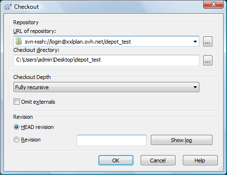

> [!primary]
> Diese Übersetzung wurde durch unseren Partner SYSTRAN automatisch erstellt. In manchen Fällen können ungenaue Formulierungen verwendet worden sein, z.B. bei der Beschriftung von Schaltflächen oder technischen Details. Bitte ziehen Sie im Zweifelsfall die englische oder französische Fassung der Anleitung zu Rate. Möchten Sie mithelfen, diese Übersetzung zu verbessern? Dann nutzen Sie dazu bitte den Button "Beitragen" auf dieser Seite.
>

## Ziel 

SVN, die Abkürzung für "Subversion", ist ein Versionsverwaltungssystem. 

**Diese Anleitung erklärt, wie Sie SVN über eine SSH-Verbindung auf Ihrem Webhosting nutzen können.**

> [!warning]
>
> OVHcloud stellt Ihnen Dienstleistungen zur Verfügung, für deren Konfiguration und Verwaltung Sie die alleinige Verantwortung tragen. Es liegt somit bei Ihnen, sicherzustellen, dass diese ordnungsgemäß funktionieren.
> 
> Wir stellen Ihnen diese Anleitung zur Verfügung, um Ihnen bei der Bewältigung alltäglicher Verwaltungsaufgaben zu helfen. Dennoch empfehlen wir Ihnen, falls Sie Hilfe brauchen, einen [spezialisierten Dienstleister](https://partner.ovhcloud.com/de/directory/) und/oder den Herausgeber des Dienstes zu kontaktieren. Für externe Dienstleistungen bietet OVHcloud leider keine Unterstützung. Genauere Informationen finden Sie im Teil „[Weiterführende Informationen](#go-further)" dieser Anleitung.
> 

## Voraussetzungen

- Sie verfügen über ein [Webhosting Angebot](https://www.ovhcloud.com/de/web-hosting/) mit SSH (**ab dem Pro Angebot**).
- Sie können sich über SSH mit Ihrem Webhosting verbinden (vgl. unsere Anleitung [SSH-Zugang Ihres Webhostings verwenden](/pages/web_cloud/web_hosting/ssh_on_webhosting)).

## In der praktischen Anwendung

### Erstellung des Repository

Wenn Sie via SSH eingeloggt sind, erstellen Sie zuerst das Wurzelverzeichnis Ihrer SVN-Repositorys und dann Sie das Repository:

Geben Sie dazu einfach folgenden Befehl ein:

```bash
mkdir svn
```

```bash
svnadmin create svn/depot_test
```

Überprüfen Sie anschließend, ob die Verzeichnisse korrekt erstellt wurden:

```bash
ls -la
```

Sie sollten die Verzeichnisse wie unten dargestellt erhalten:

{.thumbnail}

### Erstellung öffentlicher/privater Schlüssel

Bevor Sie fortfahren, erstellen Sie ein SSH-Schlüsselpaar von dem Desktop aus, den Sie für die Verbindung mit dem SVN-Repository verwenden.

Um ein Schlüsselpaar zu erstellen, folgen Sie unserer Anleitung zur [SSH-Schlüsselerstellung](/pages/public_cloud/compute/public-cloud-first-steps#schritt-1-ssh-schlussel-erstellen). Sie können hierbei den Schritt zum Import Ihres SSH Schlüssels ins OVHcloud Kundencenter ignorieren.

### Öffentlichen Schlüssel zum Hosting hinzufügen

Wenn Sie den Schlüssel erzeugt haben, fügen Sie ihn in die Datei ".ssh/authorized_keys2" mit folgenden Befehlen ein:

```bash
mkdir .ssh
chmod 700 .ssh
vi .ssh/authorized_keys2
```

Die neue Datei wird zur Bearbeitung geöffnet. Fügen Sie die folgende Zeile ein, gefolgt von dem zuvor erstellten Schlüssel. Stellen Sie sicher, dass sich die gesamte Zeichenfolge in derselben Zeile befindet.

```bash
command="/usr/bin/svnserve --root=/homez.XXX/loginFTP/svn --tunnel --tunnel-user=john",no-port-forwarding,no-agent-forwarding,no-X11-forwarding,no-pty
```

> [!primary]
>
> Ersetzen Sie "/home.XXX/LoginFTP" und "john" mit Ihren SSH-Zugangsdaten.
> Um die zu verwendenden Zahlen in "/home.XXX/LoginFTP"zu erfahren, geben Sie den Befehl "pwd" in der Kommandozeile ein.
>
> Weitere Informationen finden Sie in unserer Anleitung [SSH-Zugang Ihres Webhostings verwenden](/pages/web_cloud/web_hosting/ssh_on_webhosting).
> 

{.thumbnail}

Sie können den Inhalt des Repositorys abrufen, ohne sich direkt über SSH mit dem Hosting zu verbinden.

> [!warning]
>
> Derselbe Schlüssel darf nicht für die SVN- und SSH-Verbindung verwendet werden.
> 

### Beispiele

#### Linux

Sie können einen Test von dem Computer aus durchführen, der sich mit dem SVN-Repository verbindet, indem Sie folgenden Befehl in die Kommandozeile eingeben:

```bash
svn checkout svn+ssh://loginFTP@clusterXXX/depot_test
```

#### Windows mit TortoiseSVN

- Downloaden und Installieren Sie [TortoiseSVN](https://tortoisesvn.net/downloads.html){.external}.
- Klicken Sie mit der rechten Maustaste auf den privaten Schlüssel. Unten rechts erscheint ein Icon, der Schlüssel wird dann in den Authentifizierungsagenten geladen.
- Erstellen Sie ein Verzeichnis, klicken Sie mit der rechten Maustaste darauf und wählen Sie "SVN Checkout". 
- Geben Sie `svn+ssh://loginFTP@xxplan.ovh.net/depot_test` in das Feld "URL of repository" ein und klicken Sie auf `OK`:

{.thumbnail}

Subversion bietet eine sehr gute Dokumentation auf Englisch: [http://svnbook.red-bean.com/en/1.5/index.html](http://svnbook.red-bean.com/en/1.5/index.html){.external}

### Spezielle Anwendungen

#### Mehrere Accounts erstellen

Zuerst müssen Sie für jeden Benutzer SSH-Schlüsselpaare erstellen. Fügen Sie anschließend wie oben erläutert den öffentlichen Schlüssel zum Hosting hinzu:

```bash
command="/usr/bin/svnserve --root=/home.XXX/loginFTP/svn --tunnel --tunnel-user=username",no-port-forwarding,no-agent-forwarding,no-X11-forwarding,no-pty
```

Ersetzen Sie dabei "username" mit Ihren jeweiligen Benutzerkennungen und wiederholen Sie den Befehl, um mehrere Benutzer hinzuzufügen.

Beachten Sie, dass Sie auch Lesezugriff gewähren können, indem Sie folgenden Parameter anfügen:

```bash
--read-only.
```

#### Überprüfung auf dem Server

Wenn Sie eine lokale Überprüfung durchführen möchten, funktionieren die aufgeführten Beispiele nicht. Verwenden Sie stattdessen den Befehl folgendermaßen:

```bash
svn+ssh://login@ftp.ftp.name-of-site.tld/home.XXX/login/svn/depot_test
```

## Weiterführende Informationen <a name="go-further"></a>

[SSH-Zugang Ihres Webhostings verwenden](/pages/web_cloud/web_hosting/ssh_on_webhosting)

Kontaktieren Sie für spezialisierte Dienstleistungen (SEO, Web-Entwicklung etc.) die [OVHcloud Partner](https://partner.ovhcloud.com/de/directory/).

Für den Austausch mit unserer User Community gehen Sie auf <https://community.ovh.com/en/>.