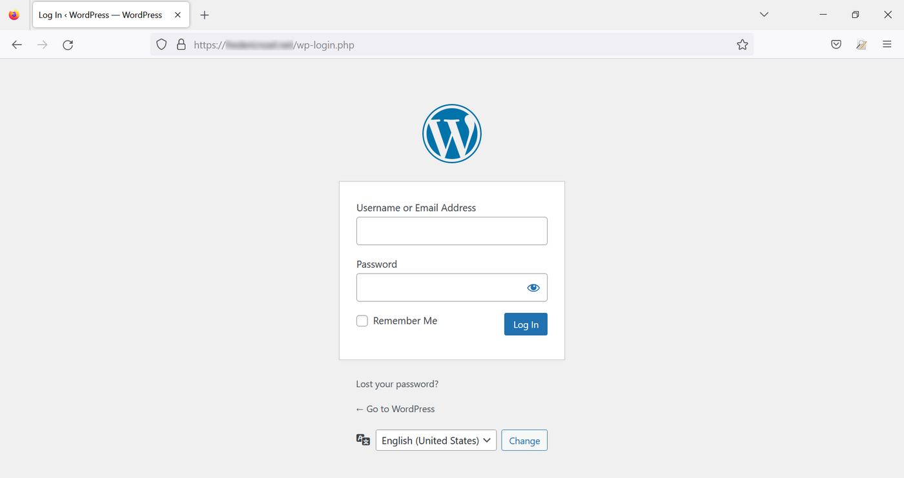
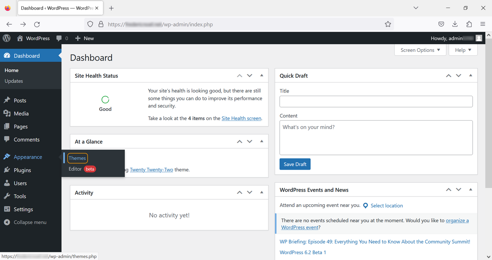
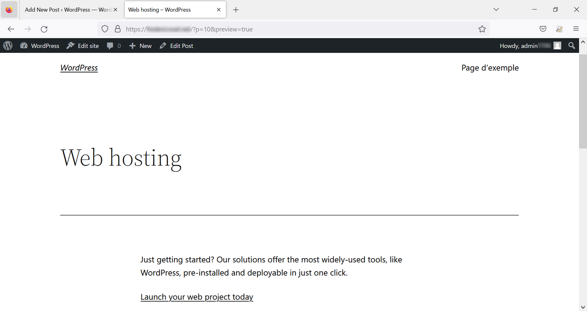
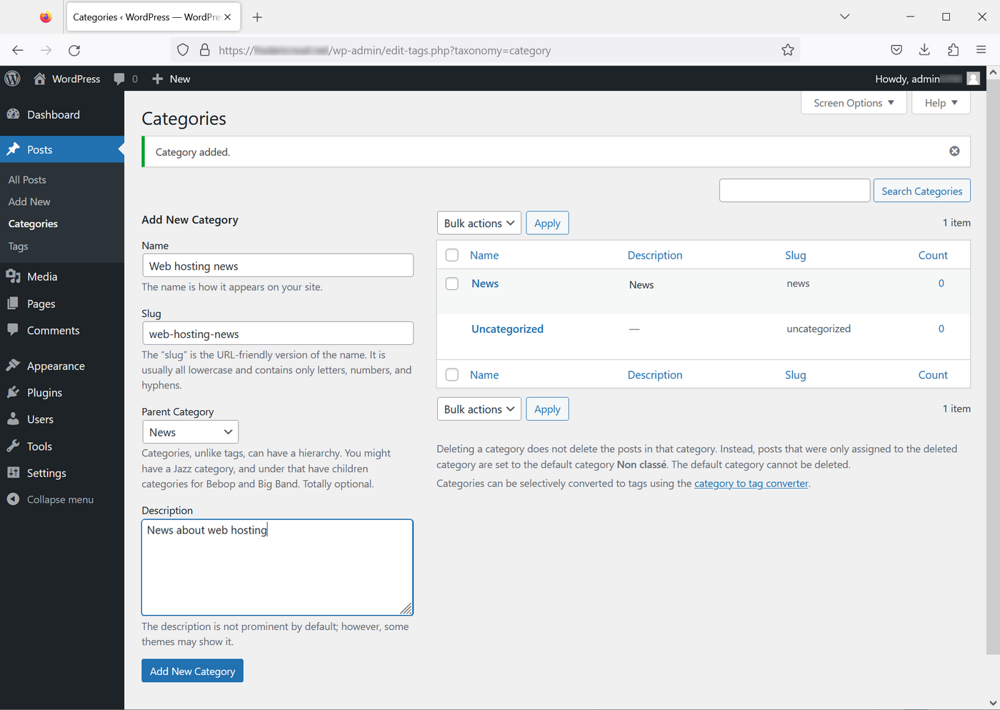
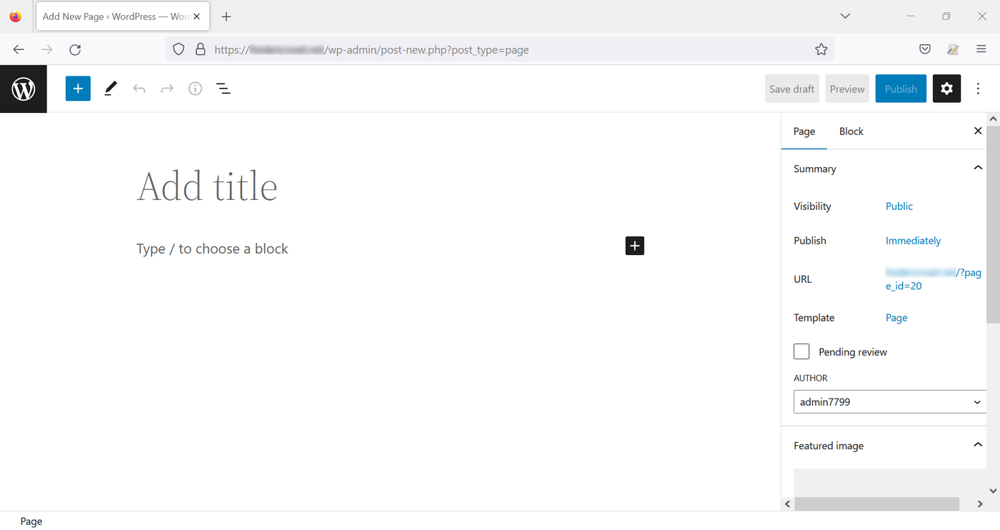

> [!primary]
> Esta traducción ha sido generada de forma automática por nuestro partner SYSTRAN. En algunos casos puede contener términos imprecisos, como en las etiquetas de los botones o los detalles técnicos. En caso de duda, le recomendamos que consulte la versión inglesa o francesa de la guía. Si quiere ayudarnos a mejorar esta traducción, por favor, utilice el botón "Contribuir" de esta página.
>
  
## Objetivo

Este tutorial le permitirá crear sus primeros contenidos, organizarlos, publicarlos y cambiar el tema de su sitio web con el Content Management System (CMS) **WordPress**. Podrá crear su sitio web sin conocimientos de programación específicos, con una gran variedad de temas como un sitio web corporativo, un blog o incluso un sitio web para dar a conocer su actividad o su pasión.

> [!warning]
>
La configuración, la gestión y la responsabilidad de los servicios que OVHcloud pone a su disposición recaen sobre usted. Por lo tanto, usted deberá asegurarse de que estos funcionan correctamente.
> 
> Ponemos a su disposición este tutorial para ayudarle lo mejor posible en tareas habituales. No obstante, si necesita ayuda, le recomendamos que contacte con un [proveedor especializado](/links/partner) o con [el editor del CMS WordPress](https://wordpress.com/support/){.external}. Nosotros no podremos asistirle. Más información en la sección ["Más información"](#go-further) de este tutorial.
>

**Descubra cómo crear un sitio web con el CMS WordPress.**

## Requisitos

- Tener contratado un plan de [hosting de OVHcloud](/links/web/hosting) que contenga al menos una base de datos.
- Disponer de un [dominio](/links/web/domains)
- Haber [instalado WordPress](/pages/web_cloud/web_hosting/cms_install_1_click_modules) en su alojamiento web
- Estar conectado al [área de cliente de OVHcloud](/links/manager){.external}

## Procedimiento

Si todavía no lo ha hecho, [añada un certificado SSL](/pages/web_cloud/web_hosting/ssl-activate-https-website#1-activar-el-certificado-ssl-en-el-alojamiento-web) al nombre de dominio asociado a su sitio web.

Al instalar el CMS en 1-clic, le enviamos por correo electrónico los elementos necesarios para continuar con este tutorial:

- el enlace de acceso al panel de administración
- el nombre del administrador
- un enlace para obtener la contraseña de administrador.

Consulte estos elementos antes de continuar.

### Conectarse al panel de administración

Acceda al enlace de acceso al panel de administración que le enviaremos por correo electrónico al instalar el CMS. Por defecto, la URL termina por `wp-admin`. Si no se ha autentificado en su panel de administración, **WordPress** le redirigirá automáticamente a su URL, que finalizará con `wp-login` :

{.thumbnail}

> [!primary]
> 
> En esta página de inicio puede cambiar el idioma predeterminado de la interfaz de **WordPress**. Acceda al menú desplegable situado al final de la página, seleccione el idioma que desee y haga clic en el botón `Cambiar`{.action}. El idioma puede modificarse más adelante.
> 

Introduzca el usuario (o el "Nombre del administrador") que le haya proporcionado por correo electrónico y la "Contraseña de WordPress" que aparezca en el mismo mensaje de correo electrónico. Se abrirá el panel de control.

{.thumbnail}

### Cambiar el tema de su sitio WordPress

**Temas WordPress** son conjuntos de archivos que permiten modificar la presentación del sitio web sin modificar su contenido. Hay muchos temas disponibles en internet, gratis y de pago, con diferentes temáticas (sitios web, blogs, e-commerce, prensa en línea...).

Para cambiar el tema, sitúese en el menú de la izquierda del panel, haga clic en `Aparienca`{.action} y seleccione `Temas`{.action}.

{.thumbnail}

Elija un tema de los propuestos y haga clic en `Activar`{.action} :

{.thumbnail}

Puede consultar el resultado en su sitio web con su dominio.

### Escribir un artículo

WordPress le permite crear fácilmente contenido sin tener conocimientos de desarrollo web.

Para crear un artículo, acceda a la sección `Entradas`{.action} del menú de la izquierda y haga clic en `Añadir nueva`{.action}.

{.thumbnail}

Desde la versión 5, **WordPress** propone una interfaz para simplificar la redacción y la puesta en forma de los artículos: **Gutenberg**. Se trata de un editor WYSIWYG ("*what you see is what you get*"). Le permite componer directamente su página añadiendo elementos como títulos, párrafos, listas, imágenes, etc. :

{.thumbnail}

Haga clic en `Escribe un título`{.action} para añadir un título a su página:

{.thumbnail}

Para añadir contenido, haga clic en el signo `+`{.action} y seleccione lo que desea insertar:

{.thumbnail}

A la derecha de su página, puede realizar las siguientes acciones:

- `Guardar como borrador`{.action}, una acción que también puede realizar con la combinación de teclas `Ctrl` + `S` (o `cmd` + `S` en macOS).
- `Vista previa`{.action};
- `Publicar`{.action} en su sitio web.

En nuestro **ejemplo**, haga clic en el botón `Vista previa`{.action} y, seguidamente, en `Previsualizar en nueva pestaña`{.action}. Elija el tipo de dispositivo a procesar (PC, tablet o smartphone):

{.thumbnail}

Para volver al panel de administración de **WordPress**, haga clic en el icono superior izquierdo.

### Gestionar las categorías

**WordPress** permite definir categorías y asociar sus artículos con una o más de ellas. Para gestionar las categorías de su sitio web, acceda a la sección `Entradas`{.action} y, seguidamente, a la sección `Categorías`{.action}.

{.thumbnail}

Introduzca el formulario para añadir una nueva categoría:

- **Nombre**: Nombre de su categoría tal y como aparecerá en su sitio web.
- **Slug**: Elemento que aparece al final de la URL (útil para mejorar el posicionamiento).
- **Categoría parente**: permite jerarquizar las categorías (la categoría que se cree puede ser una subcategoría de una categoría existente).
- **Descripción**: la descripción de su categoría, que no es aparente por defecto, puede hacerse visible por algunos temas.

{.thumbnail}

Una vez que haya introducido los datos, haga clic en el botón `Añadir una nueva categoría`{.action}.

{.thumbnail}

Puede administrar la jerarquía de las categorías. Una nueva categoría puede vincularse a una categoría existente:

{.thumbnail}

### Asociar una categoría a un artículo

Para asignar un artículo a una o más categorías, haga clic en `Entradas` (Posts). Tendrá una lista con todos los artículos y sus estados. Vuelva al título del artículo que desea clasificar y haga clic en `Edición rápida`{.action} :

{.thumbnail}

A continuación, puede modificar las categorías marcando o desmarcando los elementos listados en la columna `Categorías`{.action} :

{.thumbnail}

> [!warning]
>
> Seleccionar una subcategoría no conllevará la selección automática de la categoría del padre.
>

### Crear páginas

Las páginas deben distinguirse de los artículos. Sirven básicamente para escribir contenidos que no evolucionarán o poco a lo largo del tiempo como menciones legales, condiciones generales de uso, etc.

Acceda a la página `Pages`{.action} :

{.thumbnail}

> [!primary]
>
> Por defecto, existe una página que se genera al instalar **WordPress**. Por motivos de legibilidad, esta página se ha eliminado del ejemplo.
>

Haga clic en `Añadir nueva`{.action}. El editor Gutenberg publicó lo siguiente:

{.thumbnail}

Cree el contenido de su página y póngala en su cuenta:

{.thumbnail}

Puede volver a la página de inicio de su sitio web, dispondrá de un enlace hacia su nueva página :

{.thumbnail}

## Mejorar los permalienses

Por defecto, los enlaces de sus páginas **WordPress** se escriben con una sintaxis de tipo `parámetro=valor`, puesto que el `valor` es un número entero que no es explícito. La modificación de la escritura de permalienses permite tener URL con un formato más explícito. Sus URL serán más legibles y mejorará el posicionamiento natural de su sitio web.

En la página de inicio del cuadro de mando, acceda a `Ajustes`{.action} y, seguidamente, a `Enlaces permanentes`{.action} :

{.thumbnail}

Puede elegir entre varios tipos de permalienses. Seleccione el "Título de la publicación" y acepte en la parte inferior de la página:

{.thumbnail}

Los enlaces se construirán a partir del slug que haya indicado anteriormente al editar sus artículos y páginas.

## Más información 

- Almacene sus accesos en un gestor de contraseñas como [KeePass](https://keepass.info/){.external}.
- Pruebe online el editor predeterminado [Gutenberg](https://wordpress.org/gutenberg/){.external}.
- Recursos para encontrar temas WordPress:
    - [WordPress Themes](https://wordpress.com/themes){.external}
    - [TemplaMonster](https://www.templatemonster.com/wordpress-themes.php){.external}.
    - [Elegant Themes](https://www.elegantthemes.com/){.external}, editor del fabricante de temas Divi.
    - [Elemor](https://elementor.com/){.external}, otro editor de temas.
- Sitio oficial [WordPress](https://wordpress.org/){.external}.

Para servicios especializados (posicionamiento, desarrollo, etc.), contacte con [partners de OVHcloud](/links/partner).

Si quiere disfrutar de ayuda para utilizar y configurar sus soluciones de OVHcloud, puede consultar nuestras distintas soluciones [pestañas de soporte](/links/support).

Interactúe con nuestra [comunidad de usuarios](/links/community).