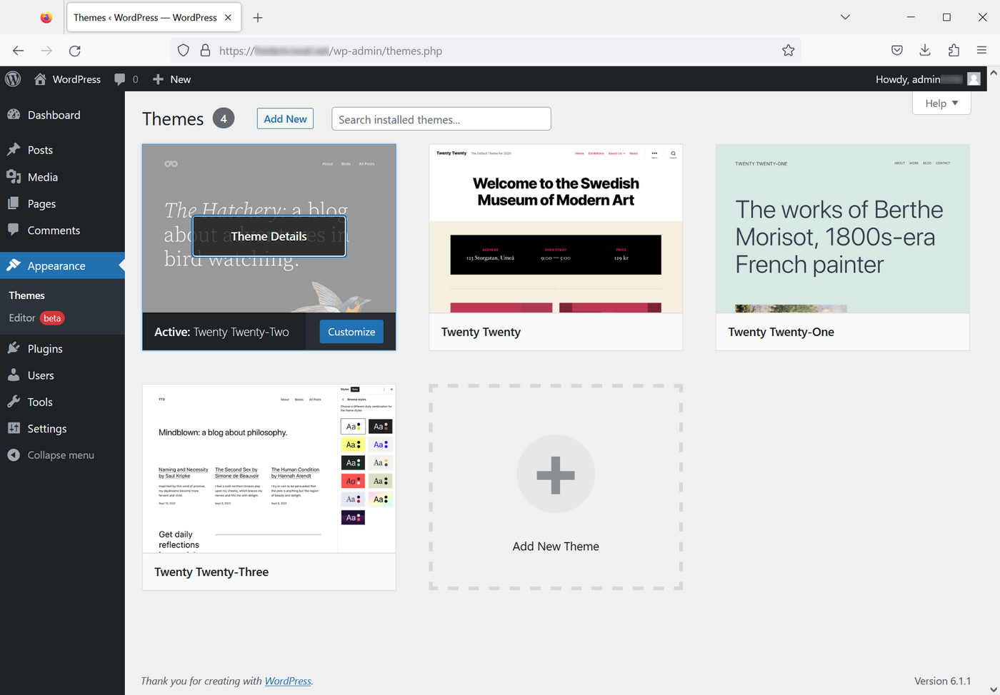
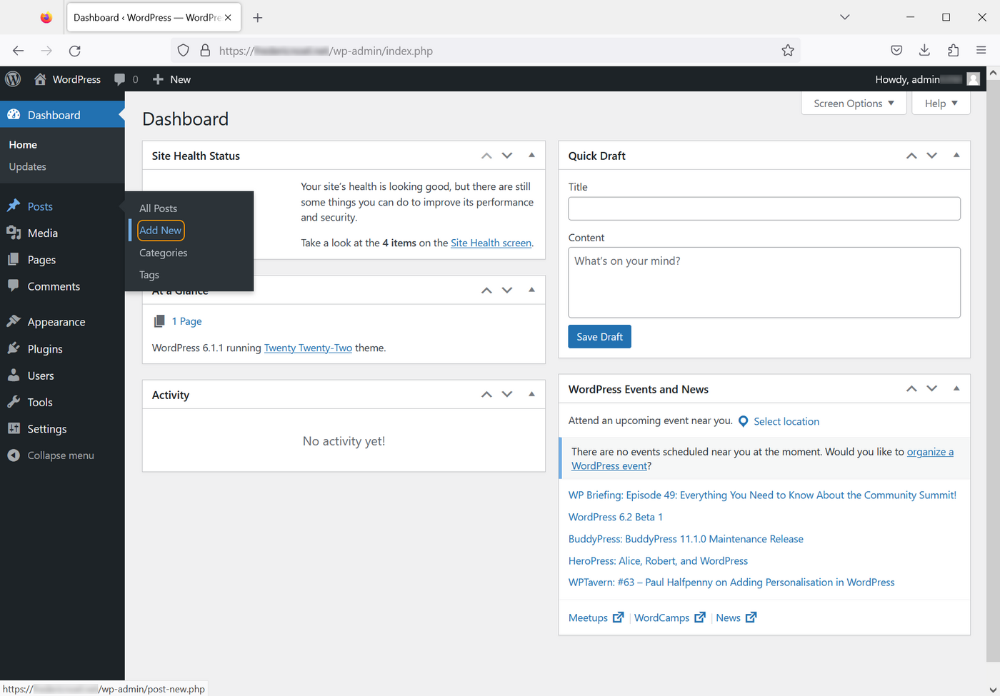
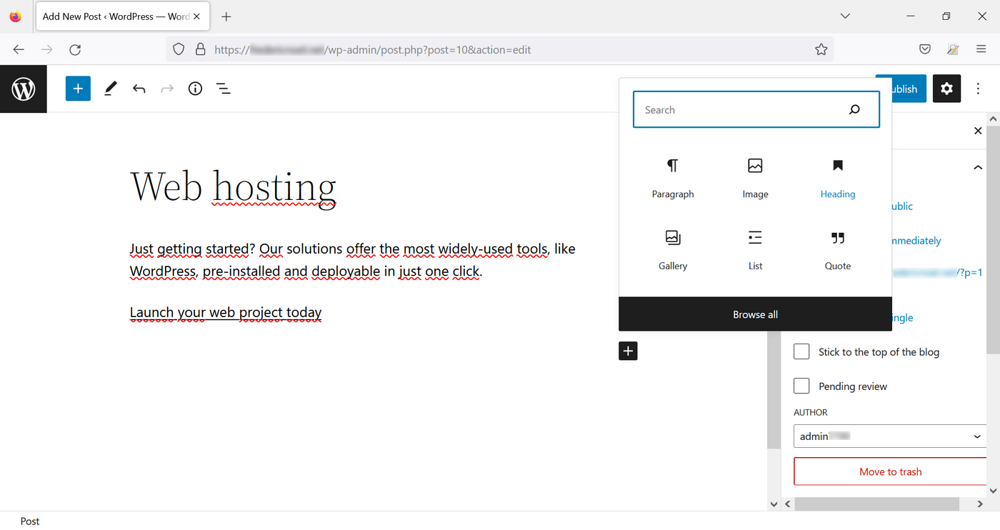
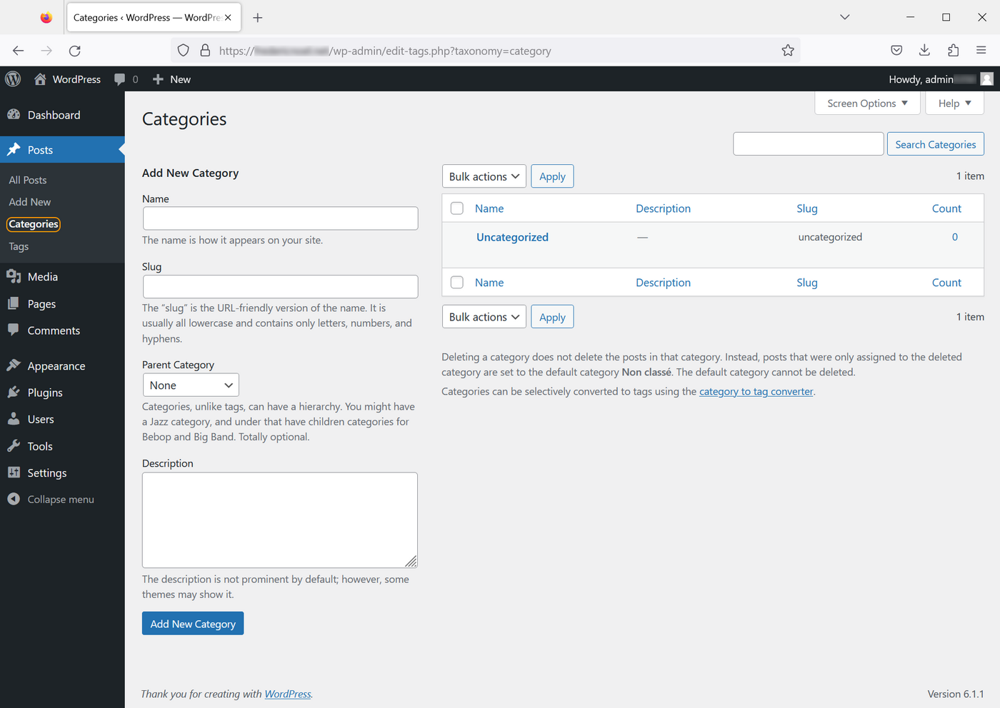
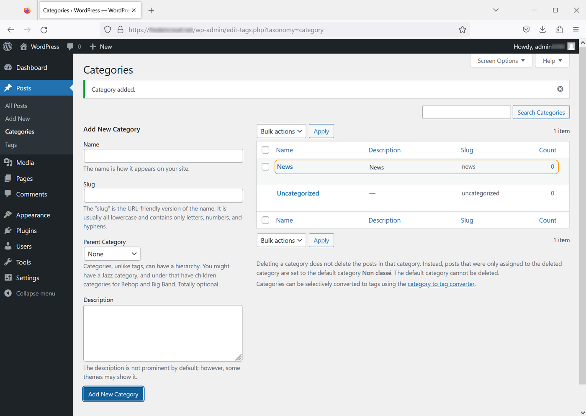
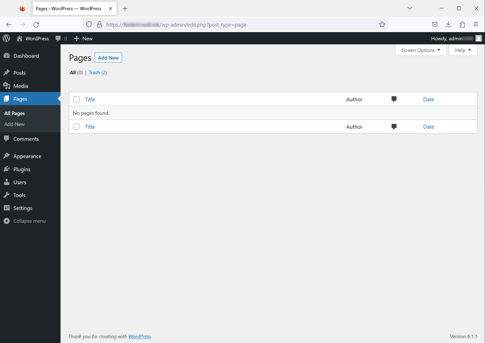
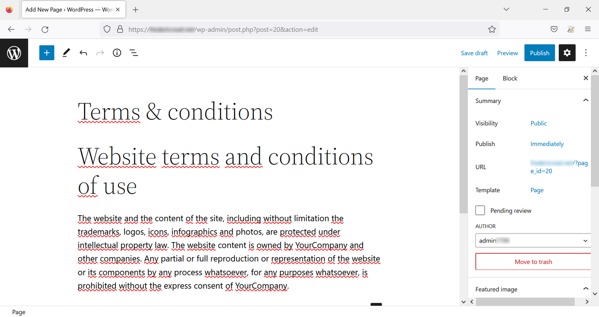
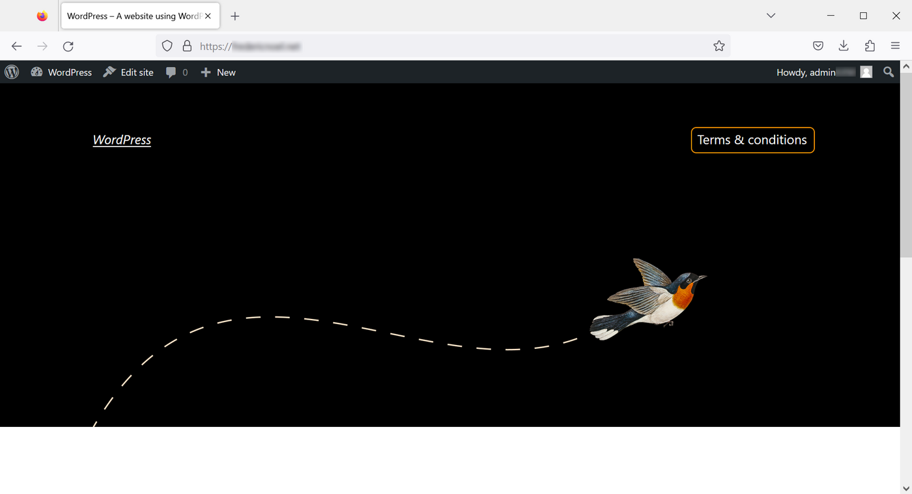

> [!primary]
> Tłumaczenie zostało wygenerowane automatycznie przez system naszego partnera SYSTRAN. W niektórych przypadkach mogą wystąpić nieprecyzyjne sformułowania, na przykład w tłumaczeniu nazw przycisków lub szczegółów technicznych. W przypadku jakichkolwiek wątpliwości zalecamy zapoznanie się z angielską/francuską wersją przewodnika. Jeśli chcesz przyczynić się do ulepszenia tłumaczenia, kliknij przycisk "Zgłoś propozycję modyfikacji" na tej stronie.
>

## Wprowadzenie

Tutorial ten pozwoli Ci na tworzenie pierwszych treści, ich organizację, umieszczenie w Internecie i zmianę motywu Twojej strony WWW za pomocą Content Management System (CMS) **WordPress**. Możesz uruchomić Twoją stronę WWW bez konieczności posiadania wiedzy z zakresu programowania, z szerokim wachlarzem tematów, takich jak firmowa strona WWW, blog czy strona internetowa, która pozwoli Ci poznać Twoją działalność i pasję.

> [!warning]
>
> OVHcloud oddaje do Twojej dyspozycji usługi, których konfiguracja, zarządzanie i odpowiedzialność spoczywa na Ciebie. W związku z tym należy zapewnić ich prawidłowe funkcjonowanie.
> 
> Oddajemy do Twojej dyspozycji niniejszy tutorial, którego celem jest pomoc w jak najlepszym wykonywaniu bieżących zadań. W przypadku trudności zalecamy skorzystanie z pomocy [wyspecjalizowanego usługodawcy](https://partner.ovhcloud.com/pl/directory/) lub [edytora CMS WordPress](https://wordpress.com/support/){.external}. Niestety firma OVH nie będzie mogła udzielić wsparcia w tym zakresie. Więcej informacji znajduje się w sekcji ["Sprawdź również"](#go-further) niniejszego tutoriala.
>

**Dowiedz się, jak utworzyć stronę WWW przy użyciu CMS WordPress.**

## Wymagania

- Posiadanie oferty [hostingu](https://www.ovhcloud.com/pl/web-hosting/), która zawiera przynajmniej jedną bazę danych.
- Posiadanie [domeny](https://www.ovhcloud.com/pl/domains/)
- [Instalacja Wordpress](/pages/web_cloud/web_hosting/cms_install_1_click_modules) na Twoim hostingu
- Zalogowanie do [Panelu klienta OVHcloud](https://www.ovh.com/auth/?action=gotomanager&from=https://www.ovh.pl/&ovhSubsidiary=pl){.external}

## W praktyce

Jeśli tak się nie stało i zanim przejdziesz dalej, [dodaj certyfikat SSL](/pages/web_cloud/web_hosting/ssl-activate-https-website#etap-1-aktywacja-certyfikatu-ssl-na-hostingu) w nazwie domeny przypisanej do Twojej strony WWW.

Podczas instalacji systemu CMS za 1 kliknięciem otrzymałeś e-mail z elementami niezbędnymi do kontynuowania tego tutoriala:

- link dostępowy do interfejsu administracyjnego
- nazwa administratora
- link do uzyskania hasła administratora.

Pobierz te elementy, zanim przejdziesz dalej.

## Zaloguj się do interfejsu administracyjnego

Przejdź do linku dostępowego do interfejsu administracyjnego przesłanego e-mailem podczas instalacji CMS. Domyślnie adres URL kończy się na `wp-admin`. Jeśli nie jesteś autoryzowany w interfejsie administracyjnym, **WordPress** przekieruje automatycznie na adres URL kończący się na `wp-login`:

{.thumbnail}

> [!primary]
> 
> Na tej stronie możesz zmienić domyślny język interfejsu **WordPress**. Przejdź do rozwijanego menu na dole strony, wybierz język, w którym zamierzasz się wybrać i zatwierdź przyciskiem `Change`{.action}. Język może zostać zmieniony w późniejszym terminie.
> 

Wpisz login (lub "Nazwę administratora") dostarczony przez e-mail oraz "Hasło WordPress" wskazane w tym samym e-mailu. Pojawi się wówczas na dashboardzie:

{.thumbnail}

### Zmień temat strony WordPress

**szablony WordPress** to zbiory plików, które umożliwiają zmianę prezentacji strony www bez modyfikowania jej treści. W Internecie dostępne są liczne tematy, bezpłatne i płatne, z różnymi tematami (strony WWW, blogi, sklepy internetowe, prasa online,...).

Aby zmienić hasło, w menu po lewej stronie dashboardu kliknij `Wygląd`{.action} a następnie `Motywy`{.action}:

{.thumbnail}

Wybierz temat spośród zaproponowanych i kliknij na `Włącz`{.action}:

{.thumbnail}

Możesz wyświetlić wynik na stronie WWW z nazwą domeny.

### Napisz artykuł

WordPress pozwala na łatwe tworzenie treści bez posiadania wiedzy z zakresu programowania.

Aby utworzyć artykuł, przejdź do sekcji `Wpisy`{.action} w menu po lewej stronie, następnie kliknij `Dodaj nowy`{.action}:

{.thumbnail}

Od wersji 5 **WordPress** oferuje interfejs umożliwiający prostsze redagowanie i publikację artykułów: **Gutenberg**. Jest to edytor WYSIWYG ("*what you see is what you get*"). Umożliwia tworzenie strony bezpośrednio poprzez dodawanie elementów takich jak tytuły, akapity, listy, obrazy, etc. :

{.thumbnail}

Kliknij polecenie `Dodaj tytuł`{.action}, aby dodać tytuł na swojej stronie:

{.thumbnail}

Aby dodać zawartość, kliknij na znak `+`{.action} i wybierz, co chcesz wstawić:

{.thumbnail}

Z prawej strony Twojej strony możesz wykonać następujące operacje:

- `Zapisz szkic`{.action}, działanie, które możesz również wykonać z kombinezonem klawisza `Ctrl` + `S` (lub `cmd` + `S` z macOS);
- `Podgląd`{.action};
- `Opublikuj`{.action} na Twojej stronie WWW.

W naszym **przykład** kliknij `Podgląd`{.action}, następnie `Podejrzyj w nowej zakladce`{.action}. Wybierz typ urządzenia, na którym wykonasz renderowanie (komputer, tablet lub smartfon):

{.thumbnail}

Aby powrócić do interfejsu administracyjnego **WordPress**, w lewym górnym rogu kliknij ikonę.

### Zarządzaj kategoriami

**WordPress** pozwala na zdefiniowanie kategorii i powiązanie artykułów z jedną lub kilkoma z nich. Aby zarządzać kategoriami Twojej strony WWW, przejdź do sekcji `Wpisy`{.action}, a następnie do sekcji `Kategorie`{.action}:

{.thumbnail}

Wpisz teraz formularz, aby dodać nową kategorię:

- **Nazwa**: nazwa kategorii wyświetlana na Twojej stronie WWW.
- **Slug**: element, który pojawi się na końcu adresu URL (przydatny do ulepszenia pozycjonowania).
- **Kategoria rodzicielska**: pozwala na hierarchizację kategorii (kategoria, którą tworzysz może być podkategorią istniejącej kategorii).
- **Opis**: opis kategorii może być jednak widoczny w niektórych tematach.

{.thumbnail}

Po podaniu tych informacji kliknij przycisk `Utwórz kategorię`{.action}:

{.thumbnail}

Masz możliwość zarządzania hierarchią swoich kategorii. Nowa kategoria może być powiązana z istniejącą kategorią:

{.thumbnail}

### przypisanie kategorii do artykułu

Aby przypisać artykuł do jednej lub kilku kategorii, kliknij na `Wpisy` (Posty). Będziesz mieć listę zawierającą wszystkie artykuły i ich statusy. Przejdź do tematu artykułu, który chcesz sklasyfikować i kliknij na `Szybka edycja`{.action}:

{.thumbnail}

Możesz zmienić kategorie zaznaczając lub usuwając elementy wymienione w kolumnie `Kategorie`{.action}:

{.thumbnail}

> [!warning]
>
> Wybranie podkategorii nie wiąże się z automatycznym wybraniem kategorii macierzystej.
>

### Tworzenie stron

Strony należy odróżnić od artykułów. Zasadniczo są one wykorzystywane do zapisywania treści, które nie będą się zmieniać lub w krótkim czasie, jako informacji prawnych, ogólnych warunków użytkowania, itp.

Przejdź do strony `Strony`{.action}:

{.thumbnail}

> [!primary]
>
> Domyślnie istnieje strona, która jest generowana podczas instalacji **WordPress**. Ze względu na czytelność tej strony usunięto ją z przykładu.
>

Kliknij na `Dodaj nowy`{.action}. Wówczas pojawił się redaktor Gutenberg:

{.thumbnail}

Stwórz zawartość swojej strony i publikuj:

{.thumbnail}

Możesz powrócić na stronę główną Twojej strony WWW, otrzymasz link do nowej strony:

{.thumbnail}

### Popraw permalię

Domyślnie linki na Twoich stronach **WordPress** są napisane z składnią typu `parametr=wartość`, `która` jest liczbą całkowitą, która nie jest wyraźna. Modyfikacja zapisu permalinki pozwala na posiadanie adresów URL o bardziej wyraźnym formacie. Adresy URL będą łatwiejsze do odczytania, co poprawi pozycjonowanie Twojej strony www.

Na stronie głównej dashboardu przejdź do `Ustawienia`{.action}, a następnie kliknij `Bezpośrednie odnośniki`{.action}:

{.thumbnail}

Masz wybór między kilkoma rodzajami permalinków. Wybierz "Tytuł publikacji" i zatwierdź na dole strony:

{.thumbnail}

Twoje linki zostaną zbudowane na podstawie wcześniej podanego sluga podczas edycji artykułów i stron.

## Sprawdź również 

- Przechowuj dostęp w menedżerze haseł, takich jak [KeePass](https://keepass.info/){.external}.
- Przetestuj domyślny edytor [Gutenberg](https://wordpress.org/gutenberg/){.external}.
- Niektóre zasoby, w których można znaleźć szablony WordPress:
    - [WordPress Themes](https://wordpress.com/themes){.external}
    - [TemplaMonster](https://www.templatemonster.com/wordpress-themes.php){.external}.
    - [Elegant Themes](https://www.elegantthemes.com/){.external}, producent szablonu Divi.
    - [Elementor](https://elementor.com/){.external}, inny edytor tematów.
- Oficjalna strona [WordPress](https://wordpress.org/){.external}.

W przypadku wyspecjalizowanych usług (pozycjonowanie, rozwój, etc.) skontaktuj się z [partnerami OVHcloud](https://partner.ovhcloud.com/pl/directory/).

Jeśli chcesz otrzymywać wsparcie w zakresie konfiguracji i użytkowania Twoich rozwiązań OVHcloud, zapoznaj się z naszymi [ofertami pomocy](https://www.ovhcloud.com/pl/support-levels/).

Dołącz do społeczności naszych użytkowników na stronie <https://community.ovh.com/en/>.