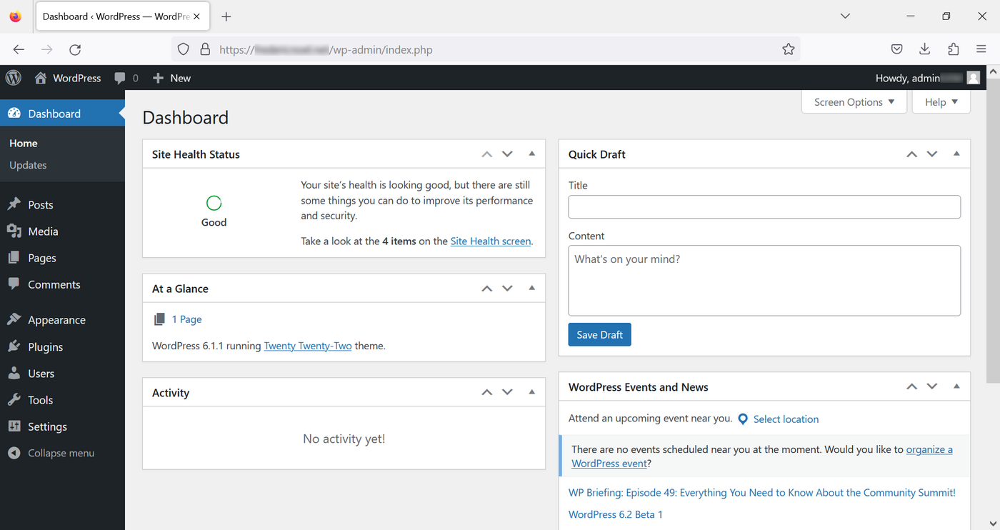
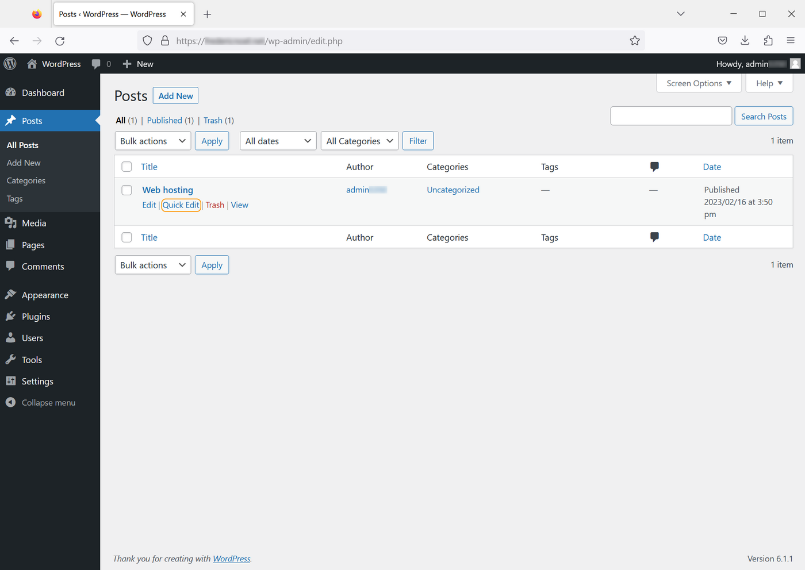

> [!primary]
> Esta tradução foi automaticamente gerada pelo nosso parceiro SYSTRAN. Em certos casos, poderão ocorrer formulações imprecisas, como por exemplo nomes de botões ou detalhes técnicos. Recomendamos que consulte a versão inglesa ou francesa do manual, caso tenha alguma dúvida. Se nos quiser ajudar a melhorar esta tradução, clique em "Contribuir" nesta página.
>
  
## Objetivo

Este tutorial vai permitir-lhe criar os seus primeiros conteúdos, organizá-los, publicá-los e alterar o tema do seu website com o Content Management System (CMS) **WordPress**. Poderá realizar o seu website sem conhecimentos específicos em programação, com uma vasta escolha de temas como um website de empresa, um blogue ou ainda um site para dar a conhecer a sua atividade ou paixão.

> [!warning]
>
> A OVHcloud disponibiliza serviços cuja configuração, gestão e responsabilidade lhe incumbem. Assim, deverá certificar-se de que estes funcionam corretamente.
> 
> Colocamos à sua disposição este tutorial para o acompanhar o melhor possível em tarefas comuns. No entanto, se encontrar dificuldades, recomendamos que recorra a um [fornecedor especializado](https://partner.ovhcloud.com/pt/directory/) ou ao [editor do CMS WordPress](https://wordpress.com/support/){.external}. Não poderemos proporcionar-lhe assistência técnica. Para mais informações, aceda à secção ["Quer saber mais?"](#go-further) deste tutorial.
>

**Descubra como criar um website com o CMS WordPress.**

## Requisitos

- Ter um plano de [alojamento web](https://www.ovhcloud.com/pt/web-hosting/) que contenha, pelo menos, uma base de dados.
- Dispor de um [nome de domínio](https://www.ovhcloud.com/pt/domains/)
- Ter [instalado Wordpress](/pages/web_cloud/web_hosting/cms_install_1_click_modules) no seu alojamento web.
- Ter acesso à [Área de Cliente OVHcloud](https://www.ovh.com/auth/?action=gotomanager&from=https://www.ovh.pt/&ovhSubsidiary=pt){.external}

## Instruções

Se ainda não o fez, e antes de continuar, [adicione um certificado SSL](/pages/web_cloud/web_hosting/ssl-activate-https-website#1-ativar-o-certificado-ssl-no-alojamento) no domínio associado ao seu website.

Aquando da instalação do seu CMS em 1 clique, recebeu um e-mail com os elementos necessários para a prossecução deste tutorial:

- a ligação de acesso à interface de administração
- o nome do administrador
- um link para obter a password do administrador.

Obtenha estes elementos antes de continuar.

### Aceder à interface de administração

Aceda ao link de acesso à interface de administração comunicado por e-mail aquando da instalação do CMS. Por predefinição, o URL termina em `wp-admin`. Se não se autenticou na sua interface de administração, **WordPress** irá redirecioná-lo automaticamente para o seu URL que termina por `wp-login`:

{.thumbnail}

> [!primary]
> 
> Nesta página inicial, pode alterar a linguagem predefinida da interface de **WordPress**. Aceda ao menu pendente no final da página, selecione o idioma à sua escolha e valide com o botão `Change`{.action}. A língua pode ser alterada posteriormente.
> 

Introduza o login (ou o "nome do administrador") que lhe foi fornecido por e-mail, bem como a palavra-passe WordPress indicada no mesmo e-mail. De seguida, irá aceder ao painel de controlo:

{.thumbnail}

### Alterar o tema do seu site WordPress

Os **temas WordPress** são conjuntos de ficheiros que permitem alterar a apresentação do seu website sem alterar o seu conteúdo. Existem muitos temas disponíveis na Internet, gratuitos e pagos, com diferentes temas (websites, blogs, e-commerce, imprensa online, etc.).

Para modificar o tema, clique no menu à esquerda do painel de controlo, clique em `Apresentação`{.action} e, a seguir, em `Temas`{.action}:

{.thumbnail}

Escolha um tema entre os propostos e clique em `Activar`{.action}:

{.thumbnail}

Pode visualizar o resultado acedendo ao seu website com o seu domínio.

### Escrita um artigo

O WordPress permite-lhe criar facilmente conteúdos sem ter conhecimentos de desenvolvimento web.

Para criar um artigo, aceda à secção `Artigos`{.action}, apresentada no menu à esquerda, e clique em `Novo Artigo`{.action}:

{.thumbnail}

Desde a versão 5, **WordPress** propõe uma interface para simplificar a redação e a forma dos artigos: **Gutenberg**. Trata-se de um editor WYSIWYG ("*what you see is what you get*"). Permite-lhe compor diretamente a sua página adicionando elementos como títulos, parágrafos, listas, imagens, etc. :

{.thumbnail}

Clique em `Adicionar título`{.action} para adicionar um título à sua página :

{.thumbnail}

Para adicionar conteúdo, clique no sinal `+`{.action} e escolha o que deseja inserir:

{.thumbnail}

À direita da sua página, existem três ligações que lhe permitem efetuar as seguintes ações:

- `Guardar rescunho`{.action}, uma ação que também pode realizar através da combinação de teclas `Ctrl` + `S` (ou `cmd` + `s`, ou ainda através de um macOS);
- `Pré-visualizar`{.action};
- `Publicar`{.action} no seu website.

No nosso **exemplo**, clique em `Pré-visualizar`{.action} e depois em `Pré-vizualizar num novo separador`{.action}. Escolha o tipo de dispositivo no qual deve ser entregue (PC, tablet ou smartphone):

{.thumbnail}

Para voltar à interface de administração de **WordPress**, clique no ícone no canto superior esquerdo.

### Gerir as categorias

**WordPress** permite definir categorias e associar os seus artigos a uma ou várias delas. Para gerir as categorias do seu website, aceda à secção `Artigos`{.action} e à secção `Categorias`{.action}:

{.thumbnail}

Introduza o formulário para adicionar uma nova categoria:

- **Nome**: nome da sua categoria tal como aparecerá no seu website.
- **Slug**: elemento que aparecerá no final do seu URL (útil para melhorar o seu referenciamento).
- **Categoria parente**: permite hierarquizar as suas categorias (a categoria que criar pode ser uma subcategoria de uma categoria existente).
- **Descrição**: não aparente por defeito, a descrição da sua categoria pode ser visível por certos temas.

{.thumbnail}

Depois de inserir estas informações, clique no botão `Adicionar nova categoria`{.action}:

{.thumbnail}

Tem a possibilidade de gerir a hierarquia das suas categorias. Uma nova categoria pode estar ligada a uma categoria existente:

{.thumbnail}

### atribuir uma categoria a um artigo

Para afetar um artigo a uma ou várias categorias, clique em `Artigos`. Disporá da lista que contém todos os artigos e respetivos estatutos. Ultrapasse o título do artigo que deseja classificar e clique em `Edição rápida`{.action}:

{.thumbnail}

Pode então modificar as categorias assinalando ou descodificando os elementos listados na coluna `Categorias`{.action}:

{.thumbnail}

> [!warning]
>
> Selecionar uma subcategoria não implica a seleção automática da categoria parental.
>

### Criar páginas

As páginas devem distinguir-se dos artigos. Servem essencialmente para escrever conteúdos que não evoluem ou evoluem pouco tempo como menções legais, condições gerais de utilização, etc.

Aceda à página `Páginas`{.action}:

{.thumbnail}

> [!primary]
>
> Por predefinição, existe uma página gerada com a instalação de **WordPress**. Por razões de legibilidade, esta página foi retirada do exemplo.
>

Clique em `Novo`{.action}. Encontra o editor Gutenberg:

{.thumbnail}

Crie o conteúdo da sua página e publique :

{.thumbnail}

Pode voltar à página inicial do seu website, disporá de um link para a sua nova página :

{.thumbnail}

### Melhorar as permaias

Por predefinição, os links das suas páginas **WordPress** são escritos com um sintaxe de tipo `parametros=valor`, sendo que o `valor` é número inteiro que não é explícito. A modificação da escrita dos desmaios permite ter URLs com um formato mais explícito. Os seus URLs serão mais legíveis e o referenciamento natural do seu website será melhorado.

Na página inicial do painel de controlo, aceda a `Opções`{.action} e depois `Ligações permanentes`{.action}:

{.thumbnail}

Então, pode escolher entre vários tipos de permalianos. Selecione o "Título da publicação" e valide na parte inferior da página:

{.thumbnail}

Os seus links serão construídos a partir do slug indicado anteriormente aquando da edição dos seus artigos e das suas páginas.

## Quer saber mais? 

- Armazene os seus acessos num gestor de palavras-passe como [KeePass](https://keepass.info/){.external}.
- Teste online o editor predefinido [Gutenberg](https://wordpress.org/gutenberg/){.external}.
- Alguns recursos onde encontrar temas WordPress:
    - [WordPress Themes](https://wordpress.com/themes){.external}
    - [TemplaMonster](https://www.templatemonster.com/wordpress-themes.php){.external}.
    - [Elegant Themes](https://www.elegantthemes.com/){.external}, editor do projeto temático Divi.
    - [Elementor](https://elementor.com/){.external}, outro editor de temas.
- O site oficial [WordPress](https://wordpress.org/){.external}.

Para serviços especializados (referenciamento, desenvolvimento, etc), contacte os [parceiros OVHcloud](https://partner.ovhcloud.com/pt/directory/).

Se pretender usufruir de uma assistência na utilização e na configuração das suas soluções OVHcloud, consulte as nossas diferentes [ofertas de suporte](https://www.ovhcloud.com/pt/support-levels/).

Fale com nossa comunidade de utilizadores: <https://community.ovh.com/en/>. 